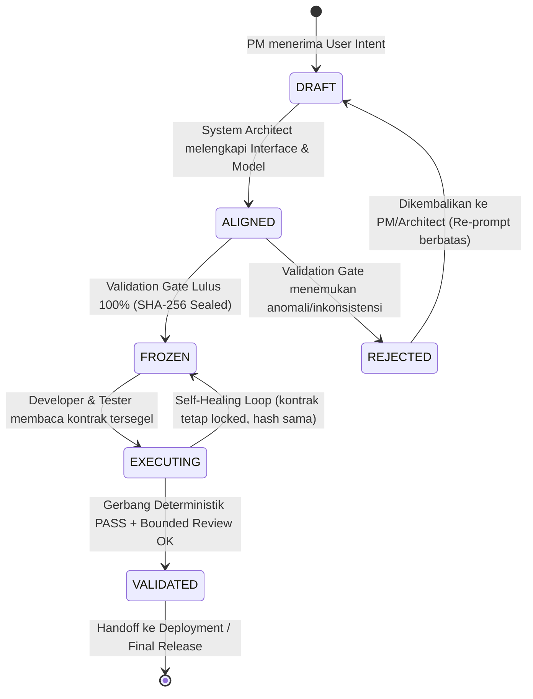

# Desain Arsitektur P0-2: Machine-Readable Contract

**Status Dokumen:** DESIGN ONLY — PENDING IA VALIDATION  
**Versi:** 1.0.1  
**Tanggal:** 2026-09-09  
**Komponen:** Cross-Agent Semantic Contract & Deterministic Validation Gate  
**Inisiatif:** P0-2 (Prioritas Tertinggi Pasca-Phase 2)  
**Dokumen Rujukan:**
- [`dokumentasi-pengembangan/architecture/improvement_direction_after_phase2.md`](file:///D:/Pekerjaan/Antigravity/reindev_studio/dokumentasi-pengembangan/architecture/improvement_direction_after_phase2.md)
- [`dokumentasi-pengembangan/architecture/structured_diagnostic_parser_design.md`](file:///D:/Pekerjaan/Antigravity/reindev_studio/dokumentasi-pengembangan/architecture/structured_diagnostic_parser_design.md)
- [`dokumentasi-pengembangan/implementation/structured_diagnostic_parser_implementation.md`](file:///D:/Pekerjaan/Antigravity/reindev_studio/dokumentasi-pengembangan/implementation/structured_diagnostic_parser_implementation.md)
- [`backend/agents/pm.py`](file:///D:/Pekerjaan/Antigravity/reindev_studio/backend/agents/pm.py)
- [`backend/agents/architect.py`](file:///D:/Pekerjaan/Antigravity/reindev_studio/backend/agents/architect.py)
- [`backend/agents/developer.py`](file:///D:/Pekerjaan/Antigravity/reindev_studio/backend/agents/developer.py)
- [`backend/agents/tester.py`](file:///D:/Pekerjaan/Antigravity/reindev_studio/backend/agents/tester.py)
- [`backend/agents/reviewer.py`](file:///D:/Pekerjaan/Antigravity/reindev_studio/backend/agents/reviewer.py)

---

## 0. IA Revision Response (R1–R5 Mapping)

Dokumen versi 1.0.1 ini merupakan pemutakhiran formal berdasarkan hasil review kritis dari Intent Architect (IA) terhadap draf awal v1.0.0. Tabel berikut memetakan lima perbaikan substantif ke bagian dokumen terkait:

| ID Review | Temuan & Arahan Intent Architect | Tindakan Perbaikan Desain v1.0.1 | Bagian Dokumen |
|:---:|---|---|:---:|
| **R1** | **Anti-Circular Canonical Hashing**<br>Eliminasi circular hashing pada `contract_sha256`. Definisikan proses kanonikalisasi, field exclusion, titik hitung, titik verifikasi, dan penanganan mismatch. | Mengadopsi kanonikalisasi RFC 8785 (JCS), mengeluarkan field `provenance.contract_sha256` dari payload hash, menetapkan titik segel pada transisi `ALIGNED` $\rightarrow$ `FROZEN`, dan mendesain abort instan saat mismatch. | **Bagian 2.1 & 7.6** |
| **R2** | **Eliminasi Asumsi HTTP Hard-coded**<br>Hapus aturan kaku `GET -> 200` atau `POST -> 201`. Validator harus memeriksa konsistensi internal terhadap kontrak yang dideklarasikan, bukan menggantikan kontrak dengan asumsi domain. | Mengubah `FM-C-02` dan aturan gate menjadi **Internal Contract Consistency Check**. Validator memverifikasi kesesuaian deklarasi endpoint dengan assertion. Konvensi REST diklasifikasikan sebagai *domain advisory warning*. | **Bagian 7.4 & 10** |
| **R3** | **Pemisahan 3 Lapis: Contract vs Acceptance Semantics vs Oracle**<br>Tegaskan pemisahan konsep: Contract (apa yang dibangun), Acceptance Semantics (kriteria outcome terverifikasi), dan Oracle (evaluator eksekutabel ground truth). | Merumuskan model konseptual $\text{Contract} \rightarrow \text{Acceptance Semantics} \rightarrow \text{Test/Oracle Materialization}$. Menegaskan Frozen Oracle sebagai otoritas tertinggi benchmark yang tidak dapat digantikan kontrak. | **Bagian 4** |
| **R4** | **Integritas Referensial & Validasi Cakupan**<br>Perkuat validasi deterministik: keunikan ID, relasi silang valid, nol requirement tanpa assertion, nol orphan assertion, dan diferensiasi 4 pilar validasi. | Menambahkan skema relasi `linked_interface_id`, aturan keunikan ID, pelarangan referensi dangling, serta membedakan secara eksplisit: *Schema Validity $\neq$ Referential Integrity $\neq$ Requirement Coverage $\neq$ Assertion Verifiability*. | **Bagian 3 & 7.2–7.5** |
| **R5** | **Batas Determinisme Reviewer**<br>Jangan mengklaim Reviewer otomatis deterministik. Bedakan *Deterministic Evidence Gates* dari *Bounded LLM Review*. Tegaskan $\text{AST presence} \neq \text{semantic compliance}$ dan $\text{test PASS} \neq \text{complete contract compliance}$. | Merancang arsitektur Reviewer hibrida 2-lapis: Gerbang Bukti Deterministik (mesin) + Penalaran LLM Terbatas (kualitas/idiom). Menetapkan aksioma batas bukti pada putusan review. | **Bagian 6.6 & 9** |

---

## 1. Problem Definition (Definisi Masalah: Formal Contract Vacuum)

Berdasarkan audit komprehensif pada Phase 1 Controlled Pilot dan Phase 2 Main Controlled Experiment, kegagalan tim rekayasa otonom ReinDev Studio tidak hanya bersumber dari kebisingan terminal (*terminal noise dumping* yang telah diselesaikan oleh P0-1), melainkan juga dari **ketiadaan kontrak formal yang dapat dikonsumsi mesin (*formal contract vacuum*)**.

### 1.1. Gejala dan Bukti Empiris Kausalitas
Saat ini, pertukaran informasi antar agen berjalan menggunakan teks bebas atau Markdown naratif tidak terstruktur:
1. **PM Agent** menghasilkan string narasi maksimal 100 kata (`state["specifications"]`).
2. **System Architect Agent** menghasilkan string narasi arsitektur (`state["architecture_plan"]`).
3. **Developer Agent** membaca narasi tersebut dan menginterpretasikan antarmuka secara bebas ke dalam kode produksi (`state["code_files"]`).
4. **QA Tester Agent** membaca `specifications` dan `code_files` (bahkan **tidak membaca `architecture_plan`!**), lalu mengarang ekspektasi pengujian sendiri ke dalam `state["test_files"]`.
5. **Reviewer Agent** membaca seluruh narasi dan kode, lalu memberikan penilaian subjektif berbasis inferensi LLM tanpa tolok ukur kepatuhan terukur.

Rantai naratif ini memicu fenomena **Semantic Drift Multi-Agen**:

```
[User Intent] 
     │ (Informal: "Buat CRUD produk FastAPI")
     ▼
[PM Specifications] 
     │ (Narasi: "Pengguna dapat melihat daftar produk")
     ▼
[Architect Plan] 
     │ (Teks bebas: merancang fungsi `get_products()`)
     ▼
[Developer Implementation] 
     │ (Menginterpretasikan: @app.post("/products") atau @app.get("/items"))
     ▼
[QA Tester Assertion] 
     │ (Mengarang sendiri: client.get("/products/") dengan trailing slash, status 200)
     ▼
[Reviewer Audit] 
     │ (Subjective Hallucination: menyatakan kode modular walau endpoint mismatch)
     ▼
[FAIL / REPAIR LOOP STAGNATION]
```

### 1.2. Mengapa Ini Berbeda dari Sekadar Masalah Prompt Engineering?
Banyak pendekatan rekayasa prompt mencoba menyelesaikan masalah ini dengan menambahkan instruksi seperti: *"Pastikan nama endpoint sama"* atau *"Gunakan metode HTTP yang benar"*. Namun, bukti empiris membuktikan bahwa prompt naratif gagal mengatasi masalah ini karena:
- **Ketiadaan Validasi Sintaksis & Skema:** Model bahasa 7B (`qwen2.5-coder:7b`) memiliki batas kepatuhan atensi (*attention decay*). Prompt teks tidak memiliki mekanisme kompilasi atau validasi otomatis; jika model melompat atau salah mengeja field, sistem runtime tidak dapat mendeteksinya sebelum pengujian gagal di sandbox.
- **Ketiadaan Deterministic Semantic Anchor:** Tanpa skema data tunggal, setiap agen melakukan *stochastic sampling* secara independen. Akibatnya, pemahaman Developer mengenai tipe data (`id: int` vs `id: str`) dapat berbeda dengan pemahaman Tester, memicu konflik assertion buatan yang tidak pernah diminta pengguna.
- **Ketiadaan Bukti Kepatuhan Obyektif (*Provenance*):** Reviewer tidak dapat memverifikasi secara matematis apakah setiap kriteria penerimaan tertutup oleh kode dan tes, karena kriteria tersebut hanya berupa paragraf bahasa alami.

**Kesimpulan Masalah:**  
ReinDev Studio membutuhkan **Machine-Readable Contract** formal yang bertindak sebagai *single shared semantic anchor* deterministik. LLM berperan sebagai mesin penalaran untuk mengisi isi kontrak, namun struktur, validasi, dan integritas referensial kontrak dikunci oleh aturan mesin.

---

## 2. Contract Boundary & Canonical Hashing (Batasan Kewenangan & Immutability)

Untuk mencegah mutasi diam-diam (*stealth requirement mutation*) dan menetapkan akuntabilitas peran, batasan kewenangan kontrak ditetapkan secara tegas:

| Peran / Komponen | Hak Baca (Read) | Hak Buat / Tulis (Write) | Hak Ubah / Amandemen (Mutate) | Status Akses |
|---|:---:|:---:|:---:|---|
| **Product Manager (PM)** | ✅ Penuh | ✅ Membuat Draft Awal | ✅ Amandemen Sebelum Freeze | Produser Persyaratan Fungsional |
| **System Architect** | ✅ Penuh | ✅ Melengkapi Skema Teknis | ✅ Amandemen Sebelum Freeze | Produser Antarmuka & Model Data |
| **Contract Validation Gate** | ✅ Penuh | ❌ Tidak Menulis Bisnis | ❌ Tidak Mengubah Isi | Penguji Kelayakan & Penyegel Hash |
| **Developer Agent** | ✅ Penuh | ❌ DILARANG | ❌ **DILARANG KERAS** | Konsumen Implementasi Murni |
| **QA Tester Agent** | ✅ Penuh | ❌ DILARANG | ❌ **DILARANG KERAS** | Konsumen Pembangkit Uji Murni |
| **Sandbox Executor** | ✅ Penuh | ❌ DILARANG | ❌ DILARANG | Eksekutor Lingkungan Sandbox |
| **Diagnostic Parser (P0-1)**| ✅ Penuh | ❌ DILARANG | ❌ DILARANG | Penerjemah Bukti Kegagalan |
| **Code Reviewer** | ✅ Penuh | ❌ DILARANG | ❌ DILARANG | Auditor Kepatuhan Dual-Layer |

### 2.1. Spesifikasi Anti-Circular Canonical Hashing (R1)
Untuk mengamankan kontrak dari mutasi tanpa menimbulkan dependensi melingkar (*circular hashing*):

1. **Standar Kanonikalisasi:**  
   Mengadopsi prinsip **RFC 8785 (JSON Canonicalization Scheme - JCS)**:
   - Seluruh kunci kamus diurutkan secara leksikografis (alphabetical ascending).
   - Menghapus karakter spasi/indentasi non-esensial (separators `,` dan `:` rapat).
   - Pengkodean karakter menggunakan UTF-8 deterministik.
   - Representasi angka floating-point mengikuti aturan kanonikal standar.
2. **Pengecualian Field (*Field Exclusion*):**  
   Atribut `provenance.contract_sha256` **wajib dikeluarkan (*stripped/omitted*)** dari payload saat perhitungan hash dilakukan. Payload kanonikal yang dihitung hash-nya adalah $C_{\text{stripped}} = C \setminus \{\text{"provenance.contract_sha256"}\}$.
3. **Kapan Hash Dihitung:**  
   Hash dihitung satu kali oleh simpul **Contract Validation Gate** tepat saat kontrak dinyatakan lulus 100% dari seluruh pemeriksaan validasi dan bertransisi dari `ALIGNED` menjadi `FROZEN`. Nilai hash heksadesimal 64 karakter kemudian disimpan pada field `provenance.contract_sha256`.
4. **Kapan Hash Diverifikasi:**  
   Hash diverifikasi ulang pada empat titik kritis pipeline:
   - Sesaat sebelum simpul **Developer** membaca kontrak untuk menghasilkan kode.
   - Sesaat sebelum simpul **QA Tester** membaca kontrak untuk menghasilkan tes.
   - Pada setiap awal putaran **Self-Healing Loop** (memastikan Developer tidak menerima kontrak yang terkorupsi).
   - Sesaat sebelum simpul **Code Reviewer** memulai audit kepatuhan.
5. **Penanganan Mismatch (*Tamper Handling*):**  
   Jika verifikasi $\text{SHA256}(C_{\text{stripped}}) \neq \text{provenance.contract_sha256}$:
   - Pipeline eksekusi **seketika dihentikan (*fail-fast hard abort*)**.
   - Sistem melempar sinyal `SecurityViolationError: Contract integrity tamper detected`.
   - Event `contract_tamper_detected` dicatat ke `run_trace.jsonl` memuat expected hash vs actual hash.
   - Tidak ada kode yang boleh dieksekusi atau diuji dalam kondisi kontrak tidak sah.

### 2.2. Protokol Amandemen Terkendali (*Controlled Amendment*)
Developer atau Tester dilarang melakukan penyesuaian kebutuhan sepihak. Jika ditemukan ketidakmungkinan teknis:
- Developer hanya boleh menandai flag `contract_change_requested = True` disertai alasan teknis.
- Alur kerja dialihkan kembali ke PM dan Architect untuk merilis versi baru (`contract_version += 1`).
- Kontrak baru wajib melalui Contract Validation Gate dan perhitungan segel SHA-256 baru.

---

## 3. Machine-Readable Contract Schema (Spesifikasi Skema Mesin)

Schema formal dirancang berbasis JSON Schema Draft 2020-12 / Pydantic contract specification tanpa atribut dekoratif:

```json
{
  "$schema": "https://json-schema.org/draft/2020-12/schema",
  "title": "MachineReadableContract",
  "type": "object",
  "required": [
    "contract_version",
    "contract_id",
    "status",
    "provenance",
    "task_intent",
    "target_ecosystem",
    "data_models",
    "interface_contracts",
    "functional_requirements",
    "testable_assertions",
    "constraints"
  ],
  "properties": {
    "contract_version": { "type": "string", "pattern": "^\\d+\\.\\d+\\.\\d+$" },
    "contract_id": { "type": "string" },
    "status": {
      "type": "string",
      "enum": ["DRAFT", "ALIGNED", "FROZEN", "EXECUTING", "VALIDATED", "REJECTED"]
    },
    "provenance": {
      "type": "object",
      "required": ["parent_intent_sha256", "created_by", "created_at", "contract_sha256"],
      "properties": {
        "parent_intent_sha256": { "type": "string" },
        "created_by": { "type": "string" },
        "created_at": { "type": "string", "format": "date-time" },
        "contract_sha256": { 
          "type": "string",
          "description": "Canonical SHA-256 of this document excluding this field itself."
        }
      }
    },
    "task_intent": {
      "type": "object",
      "required": ["raw_intent", "domain", "goal_summary"],
      "properties": {
        "raw_intent": { "type": "string" },
        "domain": { "type": "string", "enum": ["REST_API", "FLUTTER_WIDGET", "CLI_TOOL", "ALGORITHM"] },
        "goal_summary": { "type": "string" }
      }
    },
    "target_ecosystem": {
      "type": "object",
      "required": ["language", "framework", "test_framework", "entrypoint"],
      "properties": {
        "language": { "type": "string", "enum": ["python", "dart"] },
        "language_version": { "type": "string" },
        "framework": { "type": "string" },
        "test_framework": { "type": "string", "enum": ["pytest", "flutter_test", "dart_test"] },
        "entrypoint": { "type": "string" }
      }
    },
    "data_models": {
      "type": "array",
      "items": {
        "type": "object",
        "required": ["model_name", "target_file", "fields"],
        "properties": {
          "model_name": { "type": "string" },
          "target_file": { "type": "string" },
          "fields": {
            "type": "array",
            "items": {
              "type": "object",
              "required": ["field_name", "field_type", "is_required"],
              "properties": {
                "field_name": { "type": "string" },
                "field_type": { "type": "string" },
                "is_required": { "type": "boolean" },
                "constraints": { "type": "string" },
                "description": { "type": "string" }
              }
            }
          }
        }
      }
    },
    "interface_contracts": {
      "type": "array",
      "items": {
        "type": "object",
        "required": ["interface_id", "interface_type", "identifier", "target_file"],
        "properties": {
          "interface_id": { "type": "string" },
          "interface_type": { "type": "string", "enum": ["HTTP_ENDPOINT", "FUNCTION", "CLASS_METHOD", "WIDGET"] },
          "identifier": { "type": "string" },
          "http_method": { "type": ["string", "null"], "enum": ["GET", "POST", "PUT", "DELETE", "PATCH", null] },
          "target_file": { "type": "string" },
          "parameters": {
            "type": "array",
            "items": {
              "type": "object",
              "required": ["param_name", "param_type", "param_location"],
              "properties": {
                "param_name": { "type": "string" },
                "param_type": { "type": "string" },
                "param_location": { "type": "string", "enum": ["PATH", "QUERY", "BODY", "ARGUMENT", "PROP"] },
                "is_required": { "type": "boolean" }
              }
            }
          },
          "expected_return": {
            "type": "object",
            "required": ["return_type"],
            "properties": {
              "return_type": { "type": "string" },
              "status_code_success": { "type": ["integer", "null"] },
              "status_code_errors": {
                "type": "array",
                "items": {
                  "type": "object",
                  "required": ["code", "condition"],
                  "properties": {
                    "code": { "type": "integer" },
                    "condition": { "type": "string" }
                  }
                }
              }
            }
          }
        }
      }
    },
    "functional_requirements": {
      "type": "array",
      "items": {
        "type": "object",
        "required": ["req_id", "description", "acceptance_semantics"],
        "properties": {
          "req_id": { "type": "string" },
          "description": { "type": "string" },
          "acceptance_semantics": {
            "type": "array",
            "items": { "type": "string" },
            "description": "Declarative description of verifiable outcomes (Acceptance Semantics)."
          }
        }
      }
    },
    "testable_assertions": {
      "type": "array",
      "items": {
        "type": "object",
        "required": [
          "assertion_id",
          "linked_req_id",
          "test_scenario",
          "target_symbol",
          "expected_outcome"
        ],
        "properties": {
          "assertion_id": { "type": "string" },
          "linked_req_id": { "type": "string" },
          "linked_interface_id": { "type": ["string", "null"] },
          "test_scenario": { "type": "string" },
          "target_symbol": { "type": "string" },
          "input_fixture": { "type": "string" },
          "expected_outcome": {
            "type": "object",
            "required": ["outcome_type"],
            "properties": {
              "outcome_type": { 
                "type": "string", 
                "enum": ["VALUE_EQUALS", "HTTP_STATUS", "EXCEPTION_THROWN", "WIDGET_FOUND"] 
              },
              "expected_value": { "type": ["string", "null"] },
              "expected_status": { "type": ["integer", "null"] },
              "expected_exception": { "type": ["string", "null"] }
            }
          }
        }
      }
    },
    "constraints": {
      "type": "object",
      "required": ["max_files", "allowed_directories", "forbidden_patterns"],
      "properties": {
        "max_files": { "type": "integer" },
        "allowed_directories": { "type": "array", "items": { "type": "string" } },
        "forbidden_patterns": { "type": "array", "items": { "type": "string" } }
      }
    },
    "unresolved_ambiguities": {
      "type": "array",
      "items": {
        "type": "object",
        "required": ["ambiguity_id", "description", "resolution_strategy"],
        "properties": {
          "ambiguity_id": { "type": "string" },
          "description": { "type": "string" },
          "resolution_strategy": { "type": "string", "enum": ["DEFAULT_CONVENTION", "BLOCK_FOR_CLARIFICATION"] }
        }
      }
    }
  }
}
```

### 3.1. Justifikasi Operasional Lapangan (Field Rationale)

| Nama Field | Alasan Operasional Wajib (Bukan Dekorasi) |
|---|---|
| `contract_id` & `contract_version` | Menghindari *version race condition* saat perbaikan multi-loop; mencegah agen membaca kontrak usang. |
| `provenance.contract_sha256` | Memastikan immutabilitas: canonical hash tanpa circularity untuk verifikasi integritas instan. |
| `task_intent.domain` | Mengonfigurasi guardrail ekosistem (misal: domain REST_API melarang impor pustaka GUI). |
| `target_ecosystem.test_framework` | Memandu runner sandbox dan diagnostik parser untuk memilih engine mapping yang tepat (`pytest` vs `flutter test`). |
| `data_models[].fields` | **Mengeliminasi Bug ID Injection Run 10**: DTO request dipisahkan secara formal dari entitas data persistensi. |
| `interface_contracts[].identifier` | Menetapkan path dan nama fungsi pasti (mencegah perselisihan `/products` vs `/products/`). |
| `interface_contracts[].expected_return.status_code_success` | Mendeklarasikan status sukses yang disepakati (misal: 200, 201, atau 204), menjadi acuan konsistensi internal. |
| `testable_assertions[].linked_interface_id` | **Integritas Referensial**: Mengaitkan assertion pengujian langsung ke antarmuka teknis terkait. |
| `testable_assertions[].expected_outcome` | Mengharuskan bentuk outcome terukur (bukan teks bebas ambigu), mencegah QA Tester menguji hal non-verifiable. |
| `constraints.max_files` | Menjaga kode tetap modular dan kohesif; mencegah Developer membuat folder dalam yang memicu `ImportError`. |
| `unresolved_ambiguities` | Menangkap ketidakjelasan sejak awal; menolak eksekusi jika terdapat ambiguitas berkategori `BLOCK_FOR_CLARIFICATION`. |

---

## 4. Contract vs Acceptance Semantics vs Oracle (Pemisahan 3 Lapis Otoritas)

Untuk menuntaskan ambiguitas evaluasi perangkat lunak otonom, sistem membedakan secara tegas tiga entitas otoritas konseptual:

```
┌─────────────────────────────────────────────────────────────────────────────────────────┐
│              MODEL TIGA LAPIS: CONTRACT -> ACCEPTANCE SEMANTICS -> ORACLE               │
├─────────────────────────────────────────────────────────────────────────────────────────┤
│                                                                                         │
│   1. KONTRAK REKAYASA (CONTRACT)                                                        │
│   "APA YANG HARUS DIBANGUN"                                                             │
│   - Ditulis oleh: Product Manager & System Architect                                    │
│   - Karakter: Normatif, deklaratif, terstruktur secara mesin (JSON)                     │
│   - Cakupan: Model data, tanda tangan antarmuka, rute, batasan arsitektur               │
│                                │                                                        │
│                                ▼                                                        │
│   2. ACCEPTANCE SEMANTICS                                                               │
│   "BAGAIMANA REQUIREMENT DINYATAKAN SEBAGAI OUTCOME TERVERIFIKASI"                      │
│   - Dideklarasikan dalam: functional_requirements.acceptance_semantics                 │
│   - Karakter: Kriteria semantik deklaratif (kondisi awal, input, hasil teramati)        │
│   - Cakupan: Skenario bisnis yang harus dapat diobservasi secara empiris                │
│                                │                                                        │
│                                ▼ (Materialisasi Pengujian)                              │
│   3. ORAKEL PENGUJIAN (EXECUTABLE ORACLE)                                               │
│   "GROUND-TRUTH EKSEKUSI PENENTU PASS / FAIL"                                           │
│   - Dijalankan oleh: Sandbox Runner (pytest / dart test)                                │
│   - Karakter: Kode program pengujian fisik yang dieksekusi di OS sandbox                │
│   - Cakupan: Baris assertion aktual, kode status subproses, exit code, durasi           │
│                                                                                         │
└─────────────────────────────────────────────────────────────────────────────────────────┘
```

### 4.1. Batas Kewenangan Operasional
1. **Dynamic Run (Pengembangan Mandiri / Greenfield):**
   - Acceptance Semantics pada kontrak dimaterialisasikan oleh QA Tester menjadi kode pengujian unit fisik (*executable oracle*).
   - **Kontrak BUKAN Oracle:** Kontrak adalah spesifikasi deklaratif, sedangkan Oracle adalah program pengujian executable yang mengeksekusi kode di sandbox. Keduanya tidak boleh disamakan.
2. **Controlled Benchmark (Eksperimen Terkontrol / Frozen Oracle):**
   - **Frozen Oracle > Contract:** Frozen Oracle memegang otoritas evaluasi absolut dan tertinggi.
   - Berkas test suite pada `dokumentasi-pengembangan/experiments/frozen_oracle/` bersifat **100% strictly immutable**.
   - Kontrak yang dirancang oleh squad otonom dibandingkan terhadap Frozen Oracle sebagai **Contract Alignment Check**. Jika kontrak bertentangan dengan Frozen Oracle, maka Frozen Oracle yang menang; kegagalan tersebut dicatat sebagai cacat perumusan kontrak (*Contract Misalignment*).
   - Desain P0-2 ini **tidak mengubah berkas Frozen Oracle apapun**.

---

## 5. Contract Lifecycle (Siklus Hidup Kontrak)

Kontrak bertransformasi melalui state machine deterministik:



### 5.1. Aturan Transisi State (State Transition Rules)

| State Awal | State Tujuan | Pemicu (Trigger) | Kondisi Wajib (Pre-conditions) | Otoritas Pelaksana |
|---|---|---|---|---|
| `[*]` | `DRAFT` | Node PM aktif | User Intent tersedia di `state["task"]` | PM Agent |
| `DRAFT` | `ALIGNED` | Node Architect aktif | `functional_requirements` & draf `data_models` terisi | System Architect Agent |
| `ALIGNED` | `FROZEN` | Validation Gate Sukses | Lolos 4 pilar: skema, referensial, cakupan, & konsistensi | Deterministic Contract Validator |
| `ALIGNED` | `REJECTED` | Validation Gate Gagal | Ditemukan cacat integritas referensial atau inkonsistensi | Deterministic Contract Validator |
| `REJECTED` | `DRAFT` | Re-align event | Log detail penolakan disuntikkan kembali ke PM | Orchestrator LangGraph |
| `FROZEN` | `EXECUTING` | Node Dev/Tester jalan | Verifikasi $\text{SHA256}(C_{\text{stripped}})$ cocok 100% | Orchestrator LangGraph |
| `EXECUTING` | `FROZEN` | Retest gagal (loop < max) | Kontrak tetap locked; hash segel tidak boleh berubah | Sandbox Executor Node |
| `EXECUTING` | `VALIDATED` | Evaluasi Sukses Penuh | Gerbang Bukti Deterministik PASS + Review LLM Terbatas OK | Code Reviewer Node |

*Catatan Kritis:* Status `VALIDATED` **tidak semata-mata berarti seluruh test lulus di sandbox**. Jika test lulus namun masih terdapat aspek kepatuhan kontrak (misal: parameter wajib tidak diimplementasikan tetapi luput diuji), status tidak boleh menjadi `VALIDATED`.

---

## 6. Agent Responsibilities (Batasan Formal Tanggung Jawab)

### 6.1. Product Manager (PM) Agent
- **Input:** `state["task"]` (User Intent) dan `state["target_language"]`.
- **Tanggung Jawab:** Merumuskan domain tugas, kebutuhan fungsional (`req_id`), entitas data awal, dan kriteria penerimaan semantik (`acceptance_semantics`).
- **Output:** Bagian 1 Kontrak (Status: `DRAFT`).
- **DILARANG:** Menentukan sintaks pustaka tingkat rendah atau menulis kode program.

### 6.2. System Architect Agent
- **Input:** Bagian 1 Kontrak (Status: `DRAFT`) dari PM.
- **Tanggung Jawab:** Menyelesaikan skema teknis, interface contracts, identifier endpoint, parameter types & locations, status code sukses/galat, batasan berkas, dan menyusun `testable_assertions` lengkap dengan relasi `linked_req_id` dan `linked_interface_id`.
- **Output:** Kontrak Lengkap (Status: `ALIGNED`).
- **DILARANG:** Menghapus kebutuhan fungsional PM; hanya boleh menyempurnakan struktur teknis.

### 6.3. Contract Validation Gate (Deterministic Node)
- **Input:** Kontrak Lengkap (Status: `ALIGNED`).
- **Tanggung Jawab:** Mengeksekusi 4 pilar pemeriksaan (Skema, Integritas Referensial, Cakupan Persyaratan, dan Konsistensi Internal), menghitung canonical SHA-256 anti-circular, dan menyegel status menjadi `FROZEN`.
- **Output:** Kontrak Tersegel (`FROZEN`) atau Laporan Penolakan (`REJECTED`).
- **DILARANG:** Melakukan inferensi probabilistik; murni aturan kode deterministik.

### 6.4. Developer Agent
- **Input:** Kontrak Tersegel (`FROZEN`), `code_files` sebelumnya (jika loop > 0), dan `developer_feedback` (P0-1).
- **Tanggung Jawab:** Menghasilkan kode implementasi produksi yang 100% mematuhi nama berkas, tipe data, rute, dan tanda tangan fungsi pada kontrak.
- **Output:** `state["code_files"]`.
- **DILARANG:** Mengubah isi kontrak atau menambah antarmuka di luar kontrak.

### 6.5. QA Tester Agent (Jika Modus Non-Frozen Oracle)
- **Input:** Kontrak Tersegel (`FROZEN`) dan `state["code_files"]`.
- **Tanggung Jawab:** Menghasilkan berkas pengujian unit yang memvalidasi setiap item pada `testable_assertions` secara langsung.
- **Output:** `state["test_files"]`.
- **DILARANG:** Mengarang kriteria uji yang tidak tercantum dalam `testable_assertions` atau menguji variabel privat internal.

### 6.6. Code Reviewer Agent (Dual-Layer Architecture)
- **Input:** Kontrak Tersegel (`FROZEN`), `code_files`, `test_files`, `test_results`, dan `diagnostic_evidence`.
- **Tanggung Jawab:** Memverifikasi Gerbang Bukti Deterministik terlebih dahulu, kemudian menjalankan penalaran LLM terbatas (*bounded review*) untuk aspek kualitas semantik.
- **Output:** Laporan Audit Kepatuhan Kontrak Terstruktur.

---

## 7. Contract Validation Gate: Empat Pilar Validasi Deterministik (R2 & R4)

Untuk menjamin bahwa semantic drift tidak sekadar berpindah dari Markdown naratif ke dokumen JSON yang rusak, gerbang validasi membedakan secara tegas empat pilar pengujian independen:

$$\text{Validitas Kontrak} = \text{Skema} \land \text{Integritas Referensial} \land \text{Cakupan Persyaratan} \land \text{Konsistensi Internal}$$

```
┌─────────────────────────────────────────────────────────────────────────────┐
│                    EMPAT PILAR VALIDASI DETERMINISTIK                       │
├─────────────────────────────────────────────────────────────────────────────┤
│                                                                             │
│  PILAR 1: SCHEMA VALIDITY CHECK                                             │
│  - Sintaks JSON valid dan mematuhi JSON Schema Draft 2020-12.               │
│  - Seluruh field wajib terisi dengan tipe data yang sesuai.                 │
│                                                                             │
│  PILAR 2: REFERENTIAL INTEGRITY CHECK                                       │
│  - Seluruh identifier (req_id, assertion_id, interface_id) bersifat unik.   │
│  - Tidak ada referensi dangling: linked_req_id merujuk ke req_id yang ada.  │
│  - linked_interface_id merujuk ke interface_id yang ada.                   │
│  - target_symbol merujuk ke model_name atau interface.identifier yang ada.  │
│                                                                             │
│  PILAR 3: REQUIREMENT COVERAGE CHECK                                        │
│  - 100% Cakupan: setiap req_id memiliki minimal 1 relasi assertion.        │
│  - Nol Orphan: tidak ada assertion yang mengambang tanpa linked_req_id.     │
│  - Verifiability: expected_outcome memiliki outcome_type terukur.          │
│                                                                             │
│  PILAR 4: INTERNAL CONSISTENCY CHECK (NON-PRESCRIPTIVE)                     │
│  - Konsistensi internal terhadap apa yang dideklarasikan kontrak.           │
│  - return_type endpoint cocok dengan data_models yang dideklarasikan.       │
│  - expected_status pada assertion cocok dengan status_code_success kontrak. │
│  - Konvensi REST diuji sebagai *domain advisory*, bukan penolakan kaku.     │
│                                                                             │
└─────────────────────────────────────────────────────────────────────────────┘
```

### 7.1. Aturan Validasi Integritas Referensial (R4)
1. **Keunikan ID:** `req_id` dalam `functional_requirements` dan `assertion_id` dalam `testable_assertions` wajib unik (tidak boleh ada duplikasi).
2. **Pemberantasan Referensi Dangling:** Setiap `linked_req_id` wajib ada di set `known_req_ids`. Jika ditemukan `linked_req_id = "REQ-99"` yang tidak terdaftar, kontrak ditolak.
3. **Pemberantasan Orphan Assertions:** Setiap assertion wajib tertaut ke satu requirement bisnis yang sah.
4. **Keterlacakan Simbol (*Symbol Traceability*):** Nilai `target_symbol` pada assertion wajib cocok dengan salah satu `interface.identifier` atau `data_models.model_name`.

### 7.2. Eliminasi Asumsi HTTP Hard-coded (R2)
Validator **dilarang menolak kontrak hanya berdasarkan asumsi universal seperti GET wajib 200 atau POST wajib 201**.
- Jika kontrak menyatakan `GET /products` sukses dengan status `200`, validator memeriksa bahwa assertion terkait juga menguji status `200`.
- Jika kontrak menyatakan `POST /orders` sukses dengan status `200` atau `202 Accepted`, validator menerima deklarasi tersebut selama konsisten dengan assertion-nya.
- Pelanggaran terhadap *RFC HTTP conventions* hanya dicatat sebagai peringatan penasehat (*advisory warning*), bukan kegagalan gate yang memblokir eksekusi, kecuali dinyatakan sebagai aturan domain eksplisit.

### 7.3. Algoritma Pemeriksaan Deterministik (Spesifikasi Kode Desain):

```python
def validate_contract_gate(contract_dict: dict) -> Tuple[bool, List[str], List[str]]:
    """
    Memvalidasi kontrak secara deterministik melalui empat pilar pengujian.
    Mengembalikan: (is_valid, blocking_errors, advisory_warnings).
    """
    errors = []
    warnings = []
    
    # -----------------------------------------------------------------------
    # PILAR 1: SCHEMA VALIDITY
    # -----------------------------------------------------------------------
    if not isinstance(contract_dict, dict):
        return False, ["Kontrak bukan merupakan dictionary JSON yang valid."], []

    required_sections = [
        "contract_version", "contract_id", "status", "provenance",
        "task_intent", "target_ecosystem", "data_models",
        "interface_contracts", "functional_requirements",
        "testable_assertions", "constraints"
    ]
    for sec in required_sections:
        if sec not in contract_dict:
            errors.append(f"Pilar 1 (Skema): Bagian wajib '{sec}' hilang dari kontrak.")

    if errors:
        return False, errors, warnings

    # -----------------------------------------------------------------------
    # PILAR 2: REFERENTIAL INTEGRITY
    # -----------------------------------------------------------------------
    # Keunikan req_id
    req_ids = []
    for r in contract_dict.get("functional_requirements", []):
        rid = r.get("req_id")
        if rid in req_ids:
            errors.append(f"Pilar 2 (Integritas): Duplikasi req_id terdeteksi: '{rid}'.")
        req_ids.append(rid)
    set_req_ids = set(req_ids)

    # Keunikan assertion_id & validitas tautan
    assertion_ids = []
    linked_req_seen = set()
    known_interfaces = {i.get("interface_id"): i for i in contract_dict.get("interface_contracts", [])}
    known_symbols = {i.get("identifier") for i in contract_dict.get("interface_contracts", [])}
    known_symbols.update({m.get("model_name") for m in contract_dict.get("data_models", [])})

    for a in contract_dict.get("testable_assertions", []):
        aid = a.get("assertion_id")
        if aid in assertion_ids:
            errors.append(f"Pilar 2 (Integritas): Duplikasi assertion_id terdeteksi: '{aid}'.")
        assertion_ids.append(aid)

        # Cek linked_req_id
        lrid = a.get("linked_req_id")
        if lrid not in set_req_ids:
            errors.append(f"Pilar 2 (Integritas): Assertion '{aid}' merujuk ke linked_req_id fiktif: '{lrid}'.")
        else:
            linked_req_seen.add(lrid)

        # Cek linked_interface_id jika didefinisikan
        liface = a.get("linked_interface_id")
        if liface and liface not in known_interfaces:
            errors.append(f"Pilar 2 (Integritas): Assertion '{aid}' merujuk ke linked_interface_id fiktif: '{liface}'.")

        # Cek keterlacakan target_symbol
        tsym = a.get("target_symbol")
        if tsym and tsym not in known_symbols:
            warnings.append(f"Pilar 2 (Advisory): target_symbol '{tsym}' tidak terdaftar pada antarmuka atau model.")

    # -----------------------------------------------------------------------
    # PILAR 3: REQUIREMENT COVERAGE & ASSERTION VERIFIABILITY
    # -----------------------------------------------------------------------
    untested_reqs = set_req_ids - linked_req_seen
    if untested_reqs:
        errors.append(f"Pilar 3 (Cakupan): Persyaratan fungsional tanpa assertion pengujian: {sorted(untested_reqs)}.")

    for a in contract_dict.get("testable_assertions", []):
        outcome = a.get("expected_outcome", {})
        otype = outcome.get("outcome_type")
        if not otype:
            errors.append(f"Pilar 3 (Verifiability): Assertion '{a.get('assertion_id')}' tidak memiliki outcome_type.")

    # -----------------------------------------------------------------------
    # PILAR 4: INTERNAL CONSISTENCY (NON-PRESCRIPTIVE)
    # -----------------------------------------------------------------------
    known_models = {m.get("model_name") for m in contract_dict.get("data_models", [])}
    for iface in contract_dict.get("interface_contracts", []):
        ret_type = iface.get("expected_return", {}).get("return_type", "")
        # Bersihkan pembungkus generic seperti List[Product]
        core_type = ret_type.replace("List[", "").replace("]", "").strip()
        if core_type in ("dict", "list", "str", "int", "float", "bool", "None"):
            pass
        elif core_type and core_type not in known_models:
            warnings.append(f"Pilar 4 (Konsistensi): return_type '{ret_type}' pada '{iface.get('identifier')}' tidak merujuk ke model data yang terdaftar.")

    is_valid = (len(errors) == 0)
    return is_valid, errors, warnings
```

---

## 8. Contract $\rightarrow$ Tester Integration (Pembangkitan Pengujian Terarah)

Saat ini pada alur lama, QA Tester melihat kode Developer terlebih dahulu lalu mengarang tes berdasarkan apa yang dilihatnya, sering kali memvalidasi implementasi yang salah (*circular confirmation bias*) atau memicu *over-testing*.

### 8.1. Paradigma Pembangkitan Berbasis Kontrak
1. **Tester Menguji Kontrak, Bukan Menguji Opini Developer:**
   - QA Tester menerima `contract["testable_assertions"]` sebagai satu-satunya acuan evaluasi.
   - Setiap fungsi uji yang dihasilkan diwajibkan memiliki anotasi yang merujuk pada `assertion_id` (contoh: `# Test for: AST-01 (linked to REQ-01)`).
2. **Larangan Mengarang Asumsi Tanpa Dasar Kontrak:**
   - Jika kontrak menetapkan endpoint `/products` dengan status `200`, Tester **dilarang** menguji status `201` untuk endpoint tersebut.
   - Jika kontrak menetapkan model `Product` hanya memiliki field `id`, `name`, `quantity`, Tester **dilarang** menuntut keberadaan field `price` atau `description`.
3. **Kesesuaian dengan Frozen Oracle:**
   - Pada pengujian eksperimen yang menggunakan Frozen Oracle (`state["frozen_oracle_path"]`), node Tester tetap dilewati secara deterministik (*bypassed*). Kontrak bertindak sebagai instrumen audit untuk menilai apakah Architect berhasil menyelaraskan diri dengan Frozen Oracle.

---

## 9. Contract $\rightarrow$ Reviewer Integration: Batas Determinisme (R5)

Klaim bahwa Code Reviewer menjadi "otomatis deterministik" hanya karena membaca Contract Compliance Matrix adalah keliru secara metodologis. Reviewer dirancang sebagai arsitektur hibrida dua lapis:

$$\text{Reviewer Decision} = \text{Deterministic Evidence Gates} \land \text{Bounded LLM Review}$$

```
┌─────────────────────────────────────────────────────────────────────────────┐
│                  ARSITEKTUR DUAL-LAYER REVIEWER AUDIT                       │
├─────────────────────────────────────────────────────────────────────────────┤
│                                                                             │
│  LAPIS 1: DETERMINISTIC EVIDENCE GATES (ATURAN MESIN 100%)                  │
│  - Verifikasi segel integritas SHA-256 kontrak.                             │
│  - Verifikasi kelulusan subproses sandbox runner (Exit Code == 0).          │
│  - AST Structural Check: memindai keberadaan simbol kelas, metode, rute.    │
│  - Constraint Check: jumlah berkas <= max_files, ketiadaan modul terlarang. │
│  - Matriks Cakupan Kontrak: menghitung persentase assertion yang PASS.      │
│                                                                             │
│                 │ (Hanya jika Lapis 1 LULUS 100%)                           │
│                 ▼                                                           │
│  LAPIS 2: BOUNDED LLM REVIEW (PENALARAN TERBATAS)                           │
│  - Interpretasi semantik terhadap logika bisnis yang kompleks.              │
│  - Evaluasi penanganan kasus batas (edge-case robustness).                  │
│  - Pemeriksaan standar gaya kode idiomatik dan kebersihan arsitektur.       │
│  - Verifikasi aspek non-fungsional yang tidak terjangkau test runner.       │
│                                                                             │
└─────────────────────────────────────────────────────────────────────────────┘
```

### 9.1. Batasan Bukti Deterministik (*Axioms of Evidence Limits*)
Dokumen desain ini menetapkan dua aksioma batas bukti:
1. **$\text{AST Presence} \neq \text{Semantic Compliance}$:**  
   Keberadaan definisi fungsi `def get_products():` di dalam AST kode sumber membuktikan kepatuhan struktural, namun **TIDAK MEMBUKTIKAN** bahwa fungsi tersebut mengembalikan data produk dengan benar.
2. **$\text{Test PASS} \neq \text{Complete Contract Compliance}$:**  
   Kelulusan seluruh unit test hanya membuktikan bahwa kode lolos pada skenario yang diuji oleh suite pengujian. Jika terdapat klausul kontrak atau invariant bisnis yang luput dimasukkan ke dalam test suite, kode belum tentu patuh 100% terhadap kontrak.

Oleh karena itu, status **`[APPROVED]`** hanya dapat diterbitkan jika Lapis 1 (Gerbang Deterministik) berstatus **LULUS 100%** DAN Lapis 2 (Bounded Review) tidak menemukan cacat semantik kritis.

---

## 10. Failure Modes & Deterministic Safeguards (Mitigasi Anomali Kontrak)

Penerapan kontrak formal memunculkan potensi kegagalan baru yang dimitigasi melalui safeguard deterministik:

| ID Failure Mode | Modus Kegagalan | Akar Penyebab | Safeguard Deterministik |
|---|---|---|---|
| **FM-C-01** | `Contract Underspecification` | PM merumuskan kontrak tanpa mendefinisikan tipe data field model. | Pilar 1 Gate menolak jika `field_type` bernilai kosong atau `"any"`. |
| **FM-C-02** | `Internal Inconsistency` | Kontrak mendeklarasikan status sukses 200, tetapi assertion menuntut 201. | Pilar 4 Gate mendeteksi ketidakcocokan antara `interface.expected_return` dan `assertion.expected_status`. |
| **FM-C-03** | `Malformed Schema Output` | Model 7B menghasilkan format JSON yang cacat secara sintaksis. | Sanitizer JSON berbasis regex strip markdown + parser fail-safe; jika gagal, re-prompt berbatas (max 2x). |
| **FM-C-04** | `Contract Drift / Stealth Mutation` | Developer atau Tester memodifikasi file kontrak di disk. | Canonical SHA-256 integrity check memicu *instant abort* sebelum eksekusi dimulai. |
| **FM-C-05** | `Stale Contract Version` | Developer membaca kontrak iterasi lama pada siklus perbaikan. | Orchestrator LangGraph mengunci kontrak sebagai *immutable snapshot* berlabel versi aktif. |
| **FM-C-06** | `Untestable Assertion` | Kriteria uji menyatakan hal abstrak (contoh: "harus cepat"). | Pilar 3 Gate mewajibkan tipe outcome terukur (`VALUE_EQUALS`, `HTTP_STATUS`, dll.). |
| **FM-C-07** | `Referential Integrity Defect` | Assertion merujuk ke `req_id` atau `interface_id` fiktif. | Pilar 2 Gate menolak seluruh referensi dangling atau duplikasi ID. |

---

## 11. Architectural Compatibility (Kompatibilitas dengan P0-1 & Executor v2)

Desain P0-2 dirancang kompatibel secara konseptual dan saling memperkuat komponen sistem yang telah diimplementasikan:

### 11.1. Sinergi dengan Executor v2 (Mode SAFE)
- Pada [`backend/executor_v2.py`](file:///D:/Pekerjaan/Antigravity/reindev_studio/backend/executor_v2.py), mode SAFE melakukan validasi sintaksis AST dan resolusi impor aman.
- Dengan adanya Machine-Readable Contract, mode SAFE dapat membaca daftar simbol pada `data_models` dan `interface_contracts` untuk memverifikasi struktur AST tanpa resiko menyentuh *business logic*.

### 11.2. Sinergi dengan Structured Diagnostic Parser (P0-1)
- Pada [`backend/diagnostic_parser.py`](file:///D:/Pekerjaan/Antigravity/reindev_studio/backend/diagnostic_parser.py), output kegagalan terminal dipetakan ke dalam taksonomi standar.
- Dengan adanya Machine-Readable Contract, *Targeted Developer Feedback* dapat langsung menautkan bukti error ke klausul kontrak:
  ```markdown
  1. [ASSERTION FAILURE] dalam test: test_get_all_products
     - Pemetaan Kontrak: Assertion AST-01 (Klausul REQ-01: Pembacaan Inventaris)
     - Antarmuka Kontrak: GET /products -> Status 200
     - Bukti Terminal: assert 405 == 200
  ```
  Developer 7B langsung menerima anchor semantik yang jelas tanpa interpretasi kabur.

---

## 12. Phased Migration Strategy (Strategi Migrasi Bertahap)

Adopsi Machine-Readable Contract dirancang dalam 3 fase evolusi tanpa merombak sistem secara radikal (*no big-bang rewrite*):

```
┌─────────────────────────────────────────────────────────────────────────────┐
│                    STRATEGI MIGRASI BERTAHAP (3 FASE)                       │
├─────────────────────────────────────────────────────────────────────────────┤
│                                                                             │
│  FASE 1: SHADOW CONTRACT & DUAL-WRITE (TRANSISI AMAN)                       │
│  - PM & Architect menghasilkan teks naratif legasi dan blok JSON kontrak    │
│    secara berdampingan (dual-write).                                        │
│  - Contract Validation Gate berjalan dalam mode 'warn-only' (mencatat log   │
│    ke tracer tanpa memblokir eksekusi).                                     │
│                                                                             │
│  FASE 2: ACTIVE ENFORCEMENT & DEVELOPER GROUNDING (P0-2 UTAMA)              │
│  - Validation Gate diaktifkan dalam mode 'blocking' (menolak anomali).     │
│  - Developer dan Tester mengonsumsi data JSON terstruktur kontrak sebagai   │
│    acuan utama perancangan kode dan uji.                                    │
│                                                                             │
│  FASE 3: CONTRACT-DRIVEN AUDIT & BENCHMARK EVALUATION                       │
│  - Reviewer mengeksekusi Gerbang Bukti Deterministik Lapis 1 secara penuh.  │
│  - Metrik Contract Compliance Rate (CCR) dicatat pada observabilitas trace. │
│                                                                             │
└─────────────────────────────────────────────────────────────────────────────┘
```

---

## 13. Kesimpulan & Status Kesiapan Desain

Revisi dokumen desain arsitektur P0-2 v1.0.1 telah memetakan seluruh dimensi struktural yang diinstruksikan oleh Intent Architect:
1. **Anti-Circular Hashing:** Canonical SHA-256 RFC 8785 tanpa rekursi diri.
2. **Kepatuhan Non-Preskriptif:** Eliminasi asumsi kaku status HTTP; validasi fokus pada konsistensi internal kontrak.
3. **Pemisahan 3 Lapis:** Diferensiasi tegas Contract vs Acceptance Semantics vs Executable Oracle (Frozen Oracle tetap otoritas tertinggi).
4. **Validasi 4 Pilar:** Pemisahan Skema, Integritas Referensial, Cakupan Persyaratan, dan Konsistensi Internal.
5. **Batas Realistis Reviewer:** Arsitektur Dual-Layer menggabungkan gerbang mesin deterministik dengan penalaran LLM terbatas.

### **DESIGN VERDICT:** **`DESIGN ONLY — PENDING IA VALIDATION`**  
*(Dokumen ini telah selesai direvisi dan siap dievaluasi kembali oleh Intent Architect sebelum melangkah ke tahap implementasi).*
