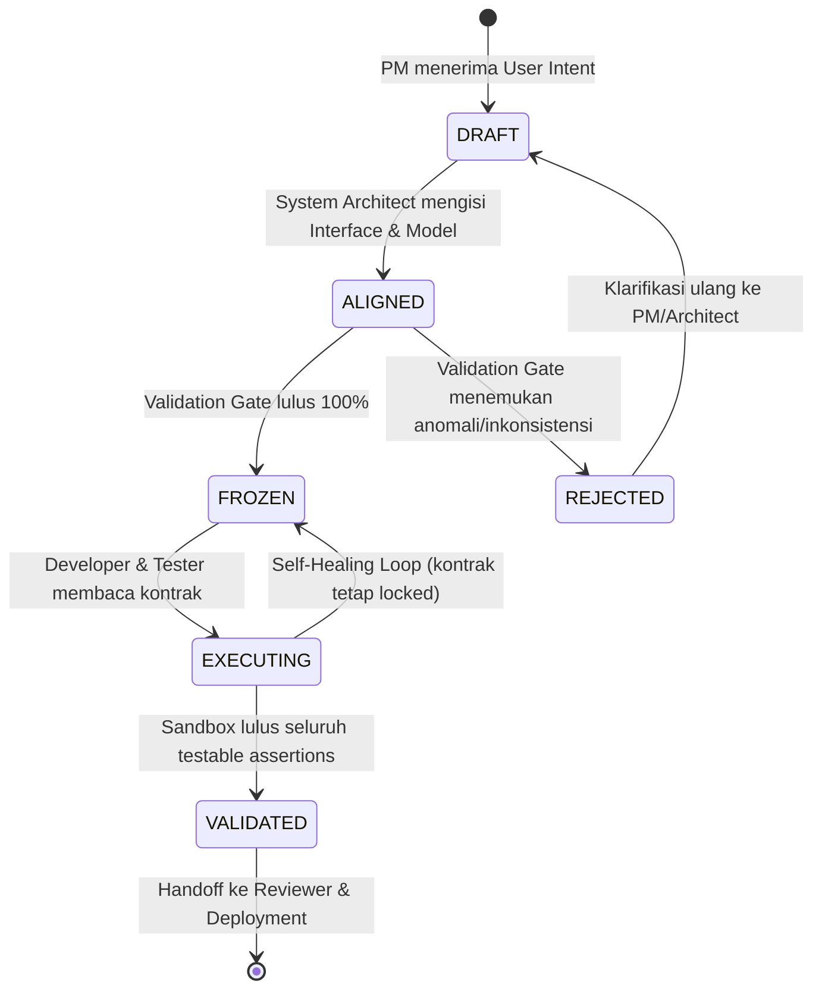

# Desain Arsitektur P0-2: Machine-Readable Contract

**Status Dokumen:** DESIGN ONLY — PENDING IA VALIDATION  
**Versi:** 1.0.0  
**Tanggal:** 2026-09-09  
**Komponen:** Cross-Agent Semantic Contract & Deterministic Validation Gate  
**Inisiatif:** P0-2 (Prioritas Tertinggi Pasca-Phase 2)  
**Dokumen Rujukan:**
- [`dokumentasi-pengembangan/architecture/improvement_direction_after_phase2.md`](file:///D:/Pekerjaan/Antigravity/reindev_studio/dokumentasi-pengembangan/architecture/improvement_direction_after_phase2.md)
- [`dokumentasi-pengembangan/architecture/structured_diagnostic_parser_design.md`](file:///D:/Pekerjaan/Antigravity/reindev_studio/dokumentasi-pengembangan/architecture/structured_diagnostic_parser_design.md)
- [`dokumentasi-pengembangan/implementation/structured_diagnostic_parser_implementation.md`](file:///D:/Pekerjaan/Antigravity/reindev_studio/dokumentasi-pengembangan/implementation/structured_diagnostic_parser_implementation.md)
- [`backend/agents/pm.py`](file:///D:/Pekerjaan/Antigravity/reindev_studio/backend/agents/pm.py)
- [`backend/agents/architect.py`](file:///D:/Pekerjaan/Antigravity/reindev_studio/backend/agents/architect.py)
- [`backend/agents/developer.py`](file:///D:/Pekerjaan/Antigravity/reindev_studio/backend/agents/developer.py)
- [`backend/agents/tester.py`](file:///D:/Pekerjaan/Antigravity/reindev_studio/backend/agents/tester.py)
- [`backend/agents/reviewer.py`](file:///D:/Pekerjaan/Antigravity/reindev_studio/backend/agents/reviewer.py)

---

## 1. Problem Definition (Definisi Masalah: Formal Contract Vacuum)

Berdasarkan audit komprehensif pada Phase 1 Controlled Pilot dan Phase 2 Main Controlled Experiment, kegagalan tim rekayasa otonom ReinDev Studio tidak hanya bersumber dari kebisingan terminal (*noise dumping* yang telah diselesaikan oleh P0-1), melainkan juga dari **ketiadaan kontrak formal yang dapat dikonsumsi mesin (*formal contract vacuum*)**.

### 1.1. Gejala dan Bukti Empiris Kausalitas
Saat ini, pertukaran informasi antar agen berjalan menggunakan teks bebas atau Markdown naratif tidak terstruktur:
1. **PM Agent** menghasilkan string narasi maksimal 100 kata (`state["specifications"]`).
2. **System Architect Agent** menghasilkan string narasi arsitektur (`state["architecture_plan"]`).
3. **Developer Agent** membaca narasi tersebut dan menginterpretasikan antarmuka secara bebas ke dalam kode produksi (`state["code_files"]`).
4. **QA Tester Agent** membaca `specifications` dan `code_files` (bahkan **tidak membaca `architecture_plan`!**), lalu mengarang ekspektasi pengujian sendiri ke dalam `state["test_files"]`.
5. **Reviewer Agent** membaca seluruh narasi dan kode, lalu memberikan penilaian subjektif berbasis inferensi LLM tanpa tolok ukur kepatuhan terukur.

Rantai naratif ini memicu fenomena **Semantic Drift Multi-Agen**:

```
[User Intent] 
     │ (Informal: "Buat CRUD produk FastAPI")
     ▼
[PM Specifications] 
     │ (Narasi: "Pengguna dapat melihat daftar produk")
     ▼
[Architect Plan] 
     │ (Teks bebas: merancang fungsi `get_products()`)
     ▼
[Developer Implementation] 
     │ (Menginterpretasikan: @app.post("/products") atau @app.get("/items"))
     ▼
[QA Tester Assertion] 
     │ (Mengarang sendiri: client.get("/products/") dengan trailing slash, status 200)
     ▼
[Reviewer Audit] 
     │ (Subjective Hallucination: menyatakan kode modular walau endpoint mismatch)
     ▼
[FAIL / REPAIR LOOP STAGNATION]
```

### 1.2. Mengapa Ini Bukan Sekadar Masalah Prompt Engineering?
Banyak pendekatan rekayasa prompt mencoba menyelesaikan masalah ini dengan menambahkan instruksi seperti: *"Pastikan nama endpoint sama"* atau *"Gunakan metode HTTP yang benar"*. Namun, bukti empiris membuktikan bahwa prompt naratif gagal mengatasi masalah ini karena:
- **Ketiadaan Validasi Sintaksis & Skema:** Model bahasa 7B (`qwen2.5-coder:7b`) memiliki batas kepatuhan atensi (*attention decay*). Prompt teks tidak memiliki mekanisme kompilasi atau validasi otomatis; jika model melompat atau salah mengeja field, sistem runtime tidak dapat mendeteksinya sebelum pengujian gagal di sandbox.
- **Ketiadaan Deterministic Semantic Anchor:** Tanpa skema JSON/Pydantic tunggal, setiap agen melakukan *stochastic sampling* secara independen. Akibatnya, pemahaman Developer mengenai tipe data (`id: int` vs `id: str`) dapat berbeda dengan pemahaman Tester, memicu konflik assertion buatan yang tidak pernah diminta pengguna.
- **Ketiadaan Bukti Kepatuhan Obyektif (*Provenance*):** Reviewer tidak dapat memverifikasi secara matematis apakah setiap kriteria penerimaan tertutup oleh kode dan tes, karena kriteria tersebut hanya berupa paragraf bahasa alami.

**Kesimpulan Masalah:**  
ReinDev Studio membutuhkan **Machine-Readable Contract** formal yang bertindak sebagai *single shared source of truth* deterministik. LLM berperan sebagai mesin penalaran untuk mengisi isi kontrak, namun struktur, validasi, dan kepatuhan kontrak dikunci oleh aturan mesin.

---

## 2. Contract Boundary (Batasan Kewenangan & Immutability)

Untuk mencegah mutasi diam-diam (*stealth requirement mutation*) dan menetapkan akuntabilitas peran, batasan kewenangan kontrak ditetapkan secara tegas:

| Peran / Komponen | Hak Baca (Read) | Hak Buat / Tulis (Write) | Hak Ubah / Amandemen (Mutate) | Status Akses |
|---|:---:|:---:|:---:|---|
| **Product Manager (PM)** | ✅ Penuh | ✅ Membuat Draft Awal | ✅ Amandemen Sebelum Freeze | Produser Persyaratan Fungsional |
| **System Architect** | ✅ Penuh | ✅ Melengkapi Skema Teknis | ✅ Amandemen Sebelum Freeze | Produser Antarmuka & Model Data |
| **Contract Validation Gate** | ✅ Penuh | ❌ Tidak Menulis | ❌ Tidak Mengubah | Penguji Kelayakan Deterministik |
| **Developer Agent** | ✅ Penuh | ❌ DILARANG | ❌ **DILARANG KERAS** | Konsumen Implementasi Murni |
| **QA Tester Agent** | ✅ Penuh | ❌ DILARANG | ❌ **DILARANG KERAS** | Konsumen Pembangkit Uji Murni |
| **Sandbox Executor** | ✅ Penuh | ❌ DILARANG | ❌ DILARANG | Eksekutor Lingkungan Sandbox |
| **Structured Diagnostic Parser**| ✅ Penuh | ❌ DILARANG | ❌ DILARANG | Penerjemah Bukti Kegagalan |
| **Code Reviewer** | ✅ Penuh | ❌ DILARANG | ❌ DILARANG | Auditor Kepatuhan Kontrak |

### 2.1. Titik Pembekuan Kontrak (*Contract Freezing Point*)
Kontrak dinyatakan **IMMUTABLE (FROZEN)** segera setelah melalui **Contract Validation Gate** secara sukses dan sebelum simpul Developer atau Tester dieksekusi:
- Begitu berstatus `FROZEN`, berkas data kontrak disegel menggunakan *cryptographic checksum* (SHA-256).
- Jika Developer atau Tester mencoba menulis ulang berkas kontrak atau mengubah requirement di dalam state, sistem orkestrasi LangGraph akan mendeteksi perbedaan hash dan menolak eksekusi dengan `SecurityViolationError`.

### 2.2. Protokol Amandemen Terkendali (*Controlled Amendment*)
Jika dalam iterasi perbaikan Developer menemukan bahwa kontrak mengandung ambiguitas atau kontradiksi yang mustahil diimplementasikan:
- Developer **TIDAK BOLEH** mengubah kontrak secara sepihak.
- Developer hanya boleh menandai flag `contract_change_requested = True` dengan alasan logis.
- Alur kerja secara formal dialihkan kembali ke PM dan Architect untuk merilis versi kontrak baru (`contract_version += 1`) melalui siklus re-validation gate.

---

## 3. Machine-Readable Contract Schema (Spesifikasi Kontrak Mesin)

Kontrak dirancang sebagai dokumen JSON terstruktur yang memuat definisi operasional lengkap tanpa atribut dekoratif yang tidak perlu.

```json
{
  "$schema": "https://json-schema.org/draft/2020-12/schema",
  "title": "MachineReadableContract",
  "type": "object",
  "required": [
    "contract_version",
    "contract_id",
    "status",
    "provenance",
    "task_intent",
    "target_ecosystem",
    "data_models",
    "interface_contracts",
    "functional_requirements",
    "testable_assertions",
    "constraints"
  ],
  "properties": {
    "contract_version": { "type": "string", "pattern": "^\\d+\\.\\d+\\.\\d+$" },
    "contract_id": { "type": "string" },
    "status": {
      "type": "string",
      "enum": ["DRAFT", "ALIGNED", "FROZEN", "EXECUTING", "VALIDATED", "REJECTED"]
    },
    "provenance": {
      "type": "object",
      "required": ["parent_intent_sha256", "created_by", "created_at", "contract_sha256"],
      "properties": {
        "parent_intent_sha256": { "type": "string" },
        "created_by": { "type": "string" },
        "created_at": { "type": "string", "format": "date-time" },
        "contract_sha256": { "type": "string" }
      }
    },
    "task_intent": {
      "type": "object",
      "required": ["raw_intent", "domain", "goal_summary"],
      "properties": {
        "raw_intent": { "type": "string" },
        "domain": { "type": "string", "enum": ["REST_API", "FLUTTER_WIDGET", "CLI_TOOL", "ALGORITHM"] },
        "goal_summary": { "type": "string" }
      }
    },
    "target_ecosystem": {
      "type": "object",
      "required": ["language", "framework", "test_framework", "entrypoint"],
      "properties": {
        "language": { "type": "string", "enum": ["python", "dart"] },
        "language_version": { "type": "string" },
        "framework": { "type": "string" },
        "test_framework": { "type": "string", "enum": ["pytest", "flutter_test", "dart_test"] },
        "entrypoint": { "type": "string" }
      }
    },
    "data_models": {
      "type": "array",
      "items": {
        "type": "object",
        "required": ["model_name", "target_file", "fields"],
        "properties": {
          "model_name": { "type": "string" },
          "target_file": { "type": "string" },
          "fields": {
            "type": "array",
            "items": {
              "type": "object",
              "required": ["field_name", "field_type", "is_required"],
              "properties": {
                "field_name": { "type": "string" },
                "field_type": { "type": "string" },
                "is_required": { "type": "boolean" },
                "constraints": { "type": "string" },
                "description": { "type": "string" }
              }
            }
          }
        }
      }
    },
    "interface_contracts": {
      "type": "array",
      "items": {
        "type": "object",
        "required": ["interface_id", "interface_type", "identifier", "target_file"],
        "properties": {
          "interface_id": { "type": "string" },
          "interface_type": { "type": "string", "enum": ["HTTP_ENDPOINT", "FUNCTION", "CLASS_METHOD", "WIDGET"] },
          "identifier": { "type": "string" },
          "http_method": { "type": "string", "enum": ["GET", "POST", "PUT", "DELETE", "PATCH", null] },
          "target_file": { "type": "string" },
          "parameters": {
            "type": "array",
            "items": {
              "type": "object",
              "required": ["param_name", "param_type", "param_location"],
              "properties": {
                "param_name": { "type": "string" },
                "param_type": { "type": "string" },
                "param_location": { "type": "string", "enum": ["PATH", "QUERY", "BODY", "ARGUMENT", "PROP"] },
                "is_required": { "type": "boolean" }
              }
            }
          },
          "expected_return": {
            "type": "object",
            "required": ["return_type"],
            "properties": {
              "return_type": { "type": "string" },
              "http_status_success": { "type": ["integer", "null"] },
              "http_status_errors": {
                "type": "array",
                "items": {
                  "type": "object",
                  "properties": {
                    "code": { "type": "integer" },
                    "condition": { "type": "string" }
                  }
                }
              }
            }
          }
        }
      }
    },
    "functional_requirements": {
      "type": "array",
      "items": {
        "type": "object",
        "required": ["req_id", "description", "acceptance_criteria"],
        "properties": {
          "req_id": { "type": "string" },
          "description": { "type": "string" },
          "acceptance_criteria": {
            "type": "array",
            "items": { "type": "string" }
          }
        }
      }
    },
    "testable_assertions": {
      "type": "array",
      "items": {
        "type": "object",
        "required": ["assertion_id", "linked_req_id", "test_scenario", "target_symbol", "expected_outcome"],
        "properties": {
          "assertion_id": { "type": "string" },
          "linked_req_id": { "type": "string" },
          "test_scenario": { "type": "string" },
          "target_symbol": { "type": "string" },
          "input_fixture": { "type": "string" },
          "expected_outcome": {
            "type": "object",
            "required": ["outcome_type"],
            "properties": {
              "outcome_type": { "type": "string", "enum": ["VALUE_EQUALS", "HTTP_STATUS", "EXCEPTION_THROWN", "WIDGET_FOUND"] },
              "expected_value": { "type": "string" },
              "expected_status": { "type": ["integer", "null"] },
              "expected_exception": { "type": ["string", "null"] }
            }
          }
        }
      }
    },
    "constraints": {
      "type": "object",
      "required": ["max_files", "allowed_directories", "forbidden_patterns"],
      "properties": {
        "max_files": { "type": "integer" },
        "allowed_directories": { "type": "array", "items": { "type": "string" } },
        "forbidden_patterns": { "type": "array", "items": { "type": "string" } }
      }
    },
    "unresolved_ambiguities": {
      "type": "array",
      "items": {
        "type": "object",
        "required": ["ambiguity_id", "description", "resolution_strategy"],
        "properties": {
          "ambiguity_id": { "type": "string" },
          "description": { "type": "string" },
          "resolution_strategy": { "type": "string", "enum": ["DEFAULT_CONVENTION", "BLOCK_FOR_CLARIFICATION"] }
        }
      }
    }
  }
}
```

### 3.1. Justifikasi Operasional Lapangan (Field Rationale)

| Nama Field | Alasan Operasional Wajib (Bukan Dekorasi) |
|---|---|
| `contract_id` & `contract_version` | Menghindari *version race condition* saat perbaikan multi-loop; mencegah agen membaca kontrak lama. |
| `provenance.contract_sha256` | Memastikan immutabilitas: jika hash tidak cocok saat Developer membaca kontrak, eksekusi diblokir. |
| `task_intent.domain` | Mengonfigurasi guardrail ekosistem (misal: REST_API melarang impor tkinter atau GUI). |
| `target_ecosystem.test_framework` | Memandu runner sandbox dan diagnostik parser untuk memilih engine mapping yang tepat (`pytest` vs `flutter test`). |
| `data_models[].fields` | **Mengeliminasi Bug ID Injection Run 10**: model DTO request (`ProductCreate`) dipisahkan secara formal dari model persistensi (`Product`), sehingga Developer tahu apakah field `id` dihasilkan sistem atau dikirim klien. |
| `interface_contracts[].http_method` | **Mengeliminasi Bug HTTP 405 Phase 2**: mendefinisikan secara kaku apakah endpoint `/products` menggunakan `GET` atau `POST`. |
| `interface_contracts[].expected_return` | Menghilangkan friksi status code: secara eksplisit menyatakan status sukses adalah `200 OK` atau `201 Created`, dan `204 No Content` untuk DELETE. |
| `testable_assertions[]` | Menghubungkan setiap kriteria penerimaan ke assert terukur, mencegah QA Tester menguji string exception internal atau variabel privat. |
| `constraints.max_files` | Menjaga kode tetap modular dan kohesif; mencegah Developer membuat folder dalam yang memicu `ImportError`. |
| `unresolved_ambiguities` | Menangkap ketidakjelasan tugas sejak awal; jika terdapat ambiguitas kritis berstatus `BLOCK_FOR_CLARIFICATION`, kontrak ditolak sebelum membuang token LLM Developer. |

---

## 4. Contract vs Oracle (Pemisahan Batas Otoritas)

Sangat penting untuk membedakan antara **Kontrak Rekayasa (*Contract*)** dan **Orakel Pengujian (*Oracle*)**:

```
┌─────────────────────────────────────────────────────────────────────────────────────────┐
│                           CONTRACT VS ORACLE SEPARATION                                 │
├─────────────────────────────────────────────────────────────────────────────────────────┤
│                                                                                         │
│   KONTRAK REKAYASA (CONTRACT)               ORAKEL PENGUJIAN (ORACLE)                   │
│   ---------------------------               -------------------------                   │
│   "APA YANG HARUS DIBANGUN"                 "BAGAIMANA KEBERHASILAN DIEVALUASI"         │
│                                                                                         │
│   - Ditulis oleh: PM + Architect            - Ditetapkan oleh: Suite Test / Evaluator   │
│   - Bersifat: Normatif & Deklaratif         - Bersifat: Eksekusi Ground-Truth           │
│   - Target: Panduan Developer & Tester      - Target: Pengadil Lolos / Gagal Sandbox    │
│   - Mengikat pada: Desain Sistem            - Mengikat pada: Penilaian Ilmiah           │
│                                                                                         │
└─────────────────────────────────────────────────────────────────────────────────────────┘
```

### 4.1. Hubungan & Batas Kewenangan
1. **Pada Modus Otonom Dinamis (*Dynamic Run / Greenfield*):**  
   Kontrak menjadi induk (*parent authority*). QA Tester menghasilkan test suite executable yang diturunkan 1-ke-1 dari `testable_assertions` pada kontrak. Orakel pengujian dalam skenario ini adalah materialisasi dari kontrak itu sendiri.
2. **Pada Modus Tolok Ukur Terkendali (*Controlled Benchmark / Frozen Oracle*):**  
   **Frozen Oracle tetap memegang otoritas absolut evaluasi.**
   - Berkas test suite pada `dokumentasi-pengembangan/experiments/frozen_oracle/` bersifat **100% strictly immutable**.
   - Jika terjadi diskrepansi antara Kontrak yang dirancang dengan Frozen Oracle, maka Frozen Oracle **selalu menang**, dan kegagalan tersebut dicatat sebagai *Contract Alignment Defect* (kesalahan desain arsitektur PM/Architect), bukan kesalahan orakel.
   - Desain P0-2 ini **tidak mengubah berkas Frozen Oracle apapun**.

---

## 5. Contract Lifecycle (Siklus Hidup Kontrak)

Kontrak bertransformasi melalui state machine deterministik berikut:



### 5.1. Aturan Transisi State (State Transition Rules)

| State Awal | State Tujuan | Pemicu (Trigger) | Kondisi Wajib (Pre-condition) | Otoritas Pelaksana |
|---|---|---|---|---|
| `[*]` | `DRAFT` | Node PM dieksekusi | User Intent tersedia di state | PM Agent |
| `DRAFT` | `ALIGNED` | Node Architect dieksekusi | `functional_requirements` & `data_models` awal terisi | System Architect Agent |
| `ALIGNED` | `FROZEN` | Validation Gate Sukses | 100% lulus uji skema, konsistensi tipe, & testability | Deterministic Contract Validator |
| `ALIGNED` | `REJECTED` | Validation Gate Gagal | Ditemukan kontradiksi tipe, field kosong, atau ambiguitas | Deterministic Contract Validator |
| `REJECTED` | `DRAFT` | Re-prompt / Re-align | Catatan error validasi disuntikkan ke PM | Orchestrator LangGraph |
| `FROZEN` | `EXECUTING` | Developer / Tester jalan | SHA-256 kontrak terverifikasi, file terkunci | Orchestrator LangGraph |
| `EXECUTING` | `VALIDATED` | Evaluasi Sandbox PASS | Seluruh testable assertions terbukti lulus di sandbox | Reviewer / Verification Gate |

---

## 6. Agent Responsibilities (Batasan Formal Tanggung Jawab)

Mendefinisikan kontrak input/output formal untuk setiap agen, membebaskan sistem dari ambiguitas prompt:

### 6.1. Product Manager (PM) Agent
- **Input:** `state["task"]` (User Intent) dan `state["target_language"]`.
- **Tanggung Jawab:** Merumuskan domain tugas, kebutuhan fungsional (`functional_requirements`), entitas data tingkat tinggi, dan kriteria penerimaan.
- **Output:** Bagian 1 Kontrak (Status: `DRAFT`):
  `task_intent`, `functional_requirements`, dan draf awal `data_models`.
- **DILARANG:** Menentukan sintaks pustaka tingkat rendah atau menulis kode Python/Dart.

### 6.2. System Architect Agent
- **Input:** Bagian 1 Kontrak (Status: `DRAFT`) dari PM.
- **Tanggung Jawab:** Menyelesaikan skema teknis, interface contracts, HTTP methods, path endpoint, parameter types, status codes, file tree constraints, dan merumuskan `testable_assertions`.
- **Output:** Kontrak Lengkap (Status: `ALIGNED`).
- **DILARANG:** Menghapus kebutuhan fungsional PM; hanya boleh menyempurnakan struktur teknis.

### 6.3. Contract Validation Gate (Deterministic Node)
- **Input:** Kontrak Lengkap (Status: `ALIGNED`).
- **Tanggung Jawab:** Memeriksa integritas struktural, tipe data, ketiadaan kontradiksi, dan menghitung SHA-256 segel.
- **Output:** Kontrak Tersegel (Status: `FROZEN`) jika lolos, atau status `REJECTED` jika gagal.
- **DILARANG:** Melakukan inferensi probabilistik; murni aturan kode deterministik.

### 6.4. Developer Agent
- **Input:** Kontrak Tersegel (Status: `FROZEN`), `code_files` sebelumnya (jika loop > 0), dan `developer_feedback` (P0-1).
- **Tanggung Jawab:** Menghasilkan kode implementasi produksi yang 100% mematuhi nama file, nama fungsi, model Pydantic/Dart, dan tanda tangan endpoint pada kontrak.
- **Output:** `state["code_files"]`.
- **DILARANG:** Mengubah isi kontrak atau menambah endpoint di luar kontrak.

### 6.5. QA Tester Agent (Jika Modus Non-Frozen Oracle)
- **Input:** Kontrak Tersegel (Status: `FROZEN`) dan `state["code_files"]`.
- **Tanggung Jawab:** Menghasilkan berkas pengujian unit yang memvalidasi setiap item pada `testable_assertions` secara langsung.
- **Output:** `state["test_files"]`.
- **DILARANG:** Mengarang kriteria uji yang tidak tercantum dalam `testable_assertions` atau menguji variabel privat.

### 6.6. Code Reviewer Agent
- **Input:** Kontrak Tersegel (`FROZEN`), `code_files`, `test_files`, `test_results`, dan `diagnostic_evidence`.
- **Tanggung Jawab:** Menghitung matriks cakupan kepatuhan objektif (*Contract Compliance Matrix*) dan memberikan putusan akhir `[APPROVED]` atau `[NEEDS_REVISION]`.
- **Output:** Laporan audit terstruktur berbasis bukti matematis.

---

## 7. Contract Validation Gate (Gerbang Validasi Deterministik)

Sebelum sebuah kontrak dapat dikonsumsi oleh Developer LLM, kontrak wajib melalui gerbang validasi deterministik tanpa toleransi halusinasi:

```
┌─────────────────────────────────────────────────────────────────────────────┐
│                    DETERMINISTIC CONTRACT VALIDATION GATE                   │
├─────────────────────────────────────────────────────────────────────────────┤
│                                                                             │
│  [ Input: Contract (Status: ALIGNED) ]                                      │
│                     │                                                       │
│                     ▼                                                       │
│  1. Schema Validity Check:                                                  │
│     - Validasi terhadap JSON Schema formal v1.0.0.                          │
│     - Memastikan seluruh required fields terisi tanpa nilai null ilegal.    │
│                     │                                                       │
│                     ▼                                                       │
│  2. Internal Consistency Check:                                             │
│     - Setiap 'return_type' pada endpoint merujuk ke data_models yang valid. │
│     - Tidak ada duplikasi endpoint path dengan HTTP method yang sama.       │
│     - Format nama file mematuhi konvensi ekosistem (misal: .py atau .dart). │
│                     │                                                       │
│                     ▼                                                       │
│  3. Acceptance Criteria Testability Check:                                  │
│     - Setiap item 'functional_requirements' memiliki minimal 1 relasi ke    │
│       'testable_assertions' via 'linked_req_id'.                            │
│     - Assertions memiliki 'expected_outcome' terukur (bukan teks kosong).   │
│                     │                                                       │
│                     ▼                                                       │
│  4. Ambiguity Resolution Check:                                             │
│     - 'unresolved_ambiguities' tidak memuat item berkategori BLOCKING.      │
│                     │                                                       │
│                     ▼                                                       │
│  5. Checksum Sealing:                                                       │
│     - Menghitung SHA-256 dari representasi JSON terurut kanonikal.          │
│     - Menyimpan hash pada provenance.contract_sha256.                       │
│     - Mengubah status menjadi 'FROZEN'.                                     │
│                                                                             │
│  [ Hasil: LULUS -> Lanjut ke Developer | GAGAL -> Reject ke PM/Architect ]  │
│                                                                             │
└─────────────────────────────────────────────────────────────────────────────┘
```

### Algoritma Pemeriksaan Gate (Spesifikasi Logika):
```python
def validate_contract_gate(contract_dict: dict) -> Tuple[bool, List[str]]:
    errors = []
    
    # 1. Validasi Skema Dasar
    if not isinstance(contract_dict, dict):
        return False, ["Kontrak bukan merupakan dictionary JSON yang valid."]
        
    required_sections = [
        "contract_version", "task_intent", "target_ecosystem",
        "data_models", "interface_contracts", "functional_requirements",
        "testable_assertions", "constraints"
    ]
    for section in required_sections:
        if section not in contract_dict:
            errors.append(f"Bagian wajib kontrak hilang: '{section}'")

    # 2. Validasi Konsistensi Model dan Endpoint
    known_models = {m.get("model_name") for m in contract_dict.get("data_models", [])}
    endpoints_seen = set()
    for iface in contract_dict.get("interface_contracts", []):
        method = iface.get("http_method")
        path = iface.get("identifier")
        if method and path:
            ep_key = f"{method} {path}"
            if ep_key in endpoints_seen:
                errors.append(f"Duplikasi endpoint terdeteksi: '{ep_key}'")
            endpoints_seen.add(ep_key)

    # 3. Validasi Testability
    req_ids = {r.get("req_id") for r in contract_dict.get("functional_requirements", [])}
    linked_req_ids = {a.get("linked_req_id") for a in contract_dict.get("testable_assertions", [])}
    untested_reqs = req_ids - linked_req_ids
    if untested_reqs:
        errors.append(f"Kebutuhan fungsional tanpa skenario uji terukur: {list(untested_reqs)}")

    # 4. Validasi Ambiguitas
    for amb in contract_dict.get("unresolved_ambiguities", []):
        if amb.get("resolution_strategy") == "BLOCK_FOR_CLARIFICATION":
            errors.append(f"Terdapat ambiguitas kritis tak terselesaikan: {amb.get('description')}")

    is_valid = (len(errors) == 0)
    return is_valid, errors
```

---

## 8. Contract $\rightarrow$ Tester Integration (Derivasi Pengujian Terarah)

Saat ini pada alur lama, QA Tester melihat kode Developer terlebih dahulu lalu mengarang tes berdasarkan apa yang dilihatnya, sering kali memvalidasi implementasi yang salah atau memicu *over-testing*.

### 8.1. Paradigma Baru Berbasis Kontrak
1. **Tester Menguji Kontrak, Bukan Menguji Opini Developer:**
   - QA Tester menerima `contract["testable_assertions"]` sebagai acuan tunggal.
   - Setiap fungsi uji yang dihasilkan diwajibkan memiliki anotasi atau komentar yang merujuk pada `assertion_id` (contoh: `# Validates: AST-01 (REQ-01)`).
2. **Larangan Mengarang Asumsi Tanpa Dasar Kontrak:**
   - Jika kontrak menetapkan endpoint `/products` dengan status `200`, Tester **dilarang** menguji status `201` untuk endpoint tersebut.
   - Jika kontrak menetapkan model `Product` hanya memiliki field `id`, `name`, `quantity`, Tester **dilarang** menuntut keberadaan field `price` atau `description`.
3. **Kesesuaian dengan Frozen Oracle:**
   - Pada pengujian eksperimen yang menggunakan Frozen Oracle (`state["frozen_oracle_path"]`), node Tester tetap dilewati secara deterministik (*bypassed*). Kontrak bertindak sebagai cermin pembanding untuk menilai apakah Architect berhasil menyelaraskan diri dengan Frozen Oracle.

---

## 9. Contract $\rightarrow$ Reviewer Integration (Audit Kepatuhan Obyektif)

Sebelum inisiatif P0-2, Code Reviewer bekerja secara probabilistik: LLM membaca kode dan memberikan persetujuan atau catatan secara subjektif.

### 9.1. Paradigma Baru: Evaluasi Matriks 3 Dimensi
Reviewer memvalidasi artefak perangkat lunak dengan membandingkan tiga pilar secara deterministik:

$$\text{Verdict} = f(\text{Frozen Contract}, \text{Sandbox Test Results}, \text{Source Artifacts})$$

```
┌─────────────────────────────────────────────────────────────────────────────┐
│                    MATRIKS KEPATUHAN REVIEWER (3-WAY AUDIT)                 │
├─────────────────────────────────────────────────────────────────────────────┤
│                                                                             │
│  Dimensi 1: Contract Coverage                                               │
│  - Apakah seluruh interface_contracts terdefinisi di AST code_files?        │
│  - Apakah seluruh data_models terdefinisi di AST code_files?                │
│                                                                             │
│  Dimensi 2: Test Verification Evidence                                      │
│  - Apakah sandbox test runner mengembalikan exit code 0?                    │
│  - Apakah seluruh testable_assertions berstatus PASS?                       │
│                                                                             │
│  Dimensi 3: Constraint Compliance                                           │
│  - Apakah jumlah berkas kode <= constraints.max_files?                      │
│  - Apakah ada modul pihak ketiga ilegal yang diimpor?                       │
│                                                                             │
│  PUTUSAN REVIEWER:                                                          │
│  - [APPROVED]       : Dimensi 1 (100%) + Dimensi 2 (PASS) + Dimensi 3 (OK) │
│  - [NEEDS_REVISION] : Jika salah satu dimensi gagal, sertakan bukti deviasi │
│                                                                             │
└─────────────────────────────────────────────────────────────────────────────┘
```

Dengan pendekatan ini, Reviewer tidak lagi menghasilkan basa-basi ulasan umum, melainkan tabel kepatuhan kontrak terukur (*Contract Compliance Table*).

---

## 10. Failure Modes & Deterministic Safeguards (Mitigasi Anomali Kontrak)

Penerapan kontrak formal memunculkan potensi kegagalan baru yang harus dimitigasi secara deterministik:

| Failure Mode ID | Gejala / Modus Kegagalan | Akar Penyebab | Safeguard Deterministik |
|---|---|---|---|
| **FM-C-01** | `Contract Underspecification` | PM merumuskan kontrak terlalu ringkas tanpa mendefinisikan tipe data field. | Validation Gate memeriksa keberadaan `field_type` untuk setiap model; menolak jika bernilai kosong atau `"any"`. |
| **FM-C-02** | `Contradictory Requirements` | Architect mendefinisikan endpoint GET tetapi menetapkan status sukses 201 Created. | Validation Gate memvalidasi kesesuaian standar HTTP (GET sukses wajib 200; 201 hanya untuk POST). |
| **FM-C-03** | `Malformed Schema Output` | Model 7B menghasilkan JSON yang rusak atau tidak valid secara sintaksis. | Sanitizer JSON berbasis regex strip markdown + parser fail-safe; jika tetap gagal, fallback ke perulangan re-prompt berbatas (max 2x). |
| **FM-C-04** | `Contract Drift / Stealth Edit` | Developer LLM mencoba mengubah berkas kontrak di direktori kode. | State integrity scanner membandingkan SHA-256 kontrak; setiap mutasi sepihak memicu *instant abort*. |
| **FM-C-05** | `Stale Contract Version` | Pada iterasi ke-2, Developer membaca variabel kontrak iterasi 0 yang sudah usang. | Orkestrator LangGraph memuat kontrak secara immutably bertipe `read-only snapshot` berlabel versi aktif. |
| **FM-C-06** | `Untestable Assertion` | Kriteria uji menyatakan hal abstrak (contoh: "Kode harus berjalan cepat"). | Validator mengharuskan tipe assertion terdefinisi (`HTTP_STATUS`, `VALUE_EQUALS`, atau `EXCEPTION_THROWN`). |

---

## 11. Architectural Compatibility (Kompatibilitas dengan P0-1 & Executor v2)

Desain P0-2 dirancang kompatibel 100% dan saling memperkuat komponen arsitektur yang telah diimplementasikan:

### 11.1. Sinergi dengan Executor v2 (Mode SAFE)
- Pada [`backend/executor_v2.py`](file:///D:/Pekerjaan/Antigravity/reindev_studio/backend/executor_v2.py), mode SAFE melakukan validasi sintaksis AST dan safe missing-import resolution.
- Dengan adanya Machine-Readable Contract, mode SAFE dapat membaca daftar `data_models` dan `interface_contracts` dari kontrak untuk memverifikasi struktur simbol secara lebih presisi tanpa pernah menebak atau mengubah *business logic*.

### 11.2. Sinergi dengan Structured Diagnostic Parser (P0-1)
- Pada [`backend/diagnostic_parser.py`](file:///D:/Pekerjaan/Antigravity/reindev_studio/backend/diagnostic_parser.py), output pengujian dipetakan ke dalam taksonomi standar.
- Dengan adanya Machine-Readable Contract, Targeted Feedback dapat diperkaya secara deterministik:
  ```markdown
  1. [ASSERTION FAILURE] dalam test: test_get_all_products
     - Pemetaan Kontrak: Interface INT-01 (REQ-01: Pembacaan Inventaris)
     - Berkas Pengujian: test_main.py (baris 20)
     - Ekspektasi Kontrak: HTTP 200
     - Hasil Aktual: HTTP 405 (Method Not Allowed)
  ```
  Developer langsung memahami klausul kontrak mana yang dilanggar tanpa tebakan.

---

## 12. Phased Migration Strategy (Strategi Migrasi Bertahap Tanpa Big-Bang)

Untuk memastikan stabilitas sistem dan menjaga agar test suite serta eksperimen yang ada tidak terganggu, adopsi Machine-Readable Contract dirancang dalam 3 fase evolusi terukur:

```
┌─────────────────────────────────────────────────────────────────────────────┐
│                    STRATEGI MIGRASI BERTAHAP (3 FASE)                       │
├─────────────────────────────────────────────────────────────────────────────┤
│                                                                             │
│  FASE 1: SHADOW CONTRACT & DUAL-WRITE (TRANSISI AMAN)                       │
│  - PM & Architect tetap menghasilkan teks naratif untuk backward            │
│    compatibility, namun sekaligus menghasilkan blok JSON terstruktur.       │
│  - Contract Validation Gate berjalan dalam mode 'warn-only' (merekam log    │
│    evaluasi ke tracer tanpa menghentikan pipeline eksekusi).                │
│                                                                             │
│  FASE 2: ACTIVE ENFORCEMENT & DEVELOPER GROUNDING (P0-2 UTAMA)              │
│  - Validation Gate diaktifkan secara tegas (blocking mode).                 │
│  - Prompt Developer dan Tester disuntikkan data JSON terstruktur yang telah │
│    diekstrak dari kontrak resmi, menggantikan teks naratif bebas.           │
│                                                                             │
│  FASE 3: CONTRACT-DRIVEN REVIEW & REINFORCEMENT LEARNING                    │
│  - Reviewer menghasilkan matriks kepatuhan otomatis dari kontrak.           │
│  - Metrik Contract Compliance Rate (CCR) dicatat sebagai reward signal      │
│    pada eksperimen optimasi squad masa depan.                               │
│                                                                             │
└─────────────────────────────────────────────────────────────────────────────┘
```

---

## 13. Kesimpulan & Status Kesiapan Desain

Desain arsitektur P0-2: Machine-Readable Contract telah memetakan seluruh dimensi struktural yang diperlukan untuk meniadakan ruang hampa kontrak (*contract vacuum*) pada ReinDev Studio:
1. **Solusi Definitif:** Menggantikan narasi kabur dengan skema data mesin formal.
2. **Batas Keamanan Terkunci:** Immutabilitas kontrak dijamin oleh SHA-256 dan larangan mutasi oleh Developer/Tester.
3. **Bebas Halusinasi:** Expected outcome dan acceptance criteria diikat pada assert terukur.
4. **Zero Impact on Frozen Oracle:** Menjaga integritas 100% dari benchmark pengujian eksperimen yang telah ada.

### **DESIGN VERDICT:** **`DESIGN ONLY — PENDING IA VALIDATION`**
*(Dokumen ini siap ditinjau dan dievaluasi oleh Intent Architect sebelum melangkah ke tahap implementasi).*
