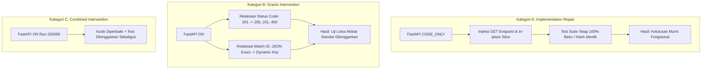

# Forensic Analysis: Executor OFF vs. CODE_ONLY vs. ON Experiment
**Dokumentasi Forensik Komparatif Sesi Pengujian 9 Run (3 Misi x 3 Mode Perlakuan)**  
**Tanggal Evaluasi:** 2026-09-08 (Rentang Eksekusi: 23:00 – 23:33 WIB)  
**Lingkungan Eksekusi:** ReinDev Studio v1.0, Backend FastAPI + LangGraph, Sandbox Local Runner  
**Model LLM:** Ollama `qwen2.5-coder:7b` (num_ctx: 8192, temp: 0.2)  
**Tipe Analisis:** Forensik Empiris Bersih (Read-Only, Tanpa Modifikasi Kode / Prompt / Konfigurasi)

---

## 1. Experimental Scope

Eksperimen ini dirancang untuk menjawab pertanyaan inti rekayasa perangkat lunak multi-agen pada ReinDev Studio:
> **Sejauh mana keberhasilan pipeline (lulus uji sandbox dan sertifikasi reviewer) benar-benar diatribusikan kepada kecerdasan murni agen Developer, perbaikan implementasi kode oleh Executor, atau modifikasi relaksasi oracle pengujian oleh Executor?**

Untuk mengisolasi efek tersebut secara sistematis, tiga perlakuan dievaluasi secara seimbang (*balanced 3x3 factorial design*) pada tiga preset misi:
1. **Mode OFF (`executor_mode="OFF"`):** Executor bertindak murni sebagai runner (*verbatim execution*). Tidak ada intervensi regex, shimming, auto-healing, maupun perubahan assertion test (`total_transformations = 0`).
2. **Mode CODE_ONLY (`executor_mode="CODE_ONLY"`):** Executor diizinkan melakukan intervensi perbaikan kode aplikasi (`code_files`), namun **DILARANG KERAS** memodifikasi berkas pengujian (`test_files`). Uji integritas hash membuktikan bahwa test suite tetap beku 100% (*oracle freeze*).
3. **Mode ON (`executor_mode="ON"`):** Executor diizinkan melakukan intervensi penuh, baik pada berkas kode implementasi maupun berkas test / assertion QA.

---

## 2. Dataset / Runs Analyzed

Analisis ini memeriksa secara tuntas **9 run eksekusi langsung** yang dijalankan berurutan pada sesi pengujian malam ini:

| No | Run ID | Preset Misi | Mode Executor | Target Bahasa | Status Akhir | Durasi | Iterasi |
| :-: | :--- | :--- | :---: | :---: | :---: | :---: | :---: |
| 1 | `project_20260908_230059` | FastAPI CRUD | `ON` | Python | `completed` | 121.43s | 0 |
| 2 | `project_20260908_230314` | Flutter Widget | `ON` | Dart / Flutter | `needs_revision` | 244.13s | 3 |
| 3 | `project_20260908_230743` | CLI Calculator | `ON` | Python | `needs_revision` | 217.64s | 3 |
| 4 | `project_20260908_231143` | FastAPI CRUD | `CODE_ONLY` | Python | `completed` | 150.32s | 1 |
| 5 | `project_20260908_231503` | Flutter Widget | `CODE_ONLY` | Dart / Flutter | `needs_revision` | 199.54s | 3 |
| 6 | `project_20260908_231836` | CLI Calculator | `CODE_ONLY` | Python | `needs_revision` | 234.77s | 3 |
| 7 | `project_20260908_232256` | FastAPI CRUD | `OFF` | Python | `needs_revision` | 138.47s | 3 |
| 8 | `project_20260908_232544` | Flutter Widget | `OFF` | Dart / Flutter | `needs_revision` | 208.20s | 3 |
| 9 | `project_20260908_232949` | CLI Calculator | `OFF` | Python | `completed` | 180.60s | 1 |

> *Catatan: Run verifikasi harness Frozen Oracle (`project_20260908_225625`) dieksekusi sebelum sesi 9 run ini dan dianalisis secara terpisah sebagai baseline acuan terkontrol pada Bab 10.*

---

## 3. Cross-Mission Comparison

Matriks perbandingan komparatif lintas misi dan mode:

| Preset Misi | Metrik | Mode ON | Mode CODE_ONLY | Mode OFF |
| :--- | :--- | :---: | :---: | :---: |
| **FastAPI CRUD** | Status Akhir | **`completed`** | **`completed`** | `needs_revision` |
| | Uji Sandbox | **2/2 PASS (100%)** | **4/4 PASS (100%)** | 1/3 PASS (33.3%) |
| | Putaran Loop | 0 loops | 1 loop | 3 loops |
| | Durasi Total | 121.43s | 150.32s | 138.47s |
| | Code Changed | Ya (`main.py`) | Ya (`main.py`) | Tidak (0) |
| | Test Changed | **Ya (`test_main.py`)** | **Tidak (0 / Frozen)** | Tidak (0) |
| | Reviewer | `[APPROVED]` | `[APPROVED]` | `[NEEDS_REVISION]` |
| **Flutter Widget** | Status Akhir | `needs_revision` | `needs_revision` | `needs_revision` |
| | Uji Sandbox | 0/1 PASS (0%) | 0/1 PASS (0%) | 0/1 PASS (0%) |
| | Putaran Loop | 3 loops | 3 loops | 3 loops |
| | Durasi Total | 244.13s | 199.54s | 208.20s |
| | Code Changed | Ya (`card_metric.dart` Loop 0) | Ya (`card_metric.dart` Loop 0) | Tidak (0) |
| | Test Changed | Tidak (0) | Tidak (0 / Frozen) | Tidak (0) |
| | Reviewer | `[NEEDS_REVISION]` | `[NEEDS_REVISION]` | `[NEEDS_REVISION]` |
| **CLI Calculator** | Status Akhir | `needs_revision` | `needs_revision` | **`completed`** |
| | Uji Sandbox | 0/1 (Collection Error) | 10/17 PASS (58.8%) | **5/5 PASS (100%)** |
| | Putaran Loop | 3 loops | 3 loops | 1 loop |
| | Durasi Total | 217.64s | 234.77s | 180.60s |
| | Code Changed | Ya (`main.py` Loop 0,1,2) | Ya (`main.py` Loop 0,1,2) | Tidak (0) |
| | Test Changed | Tidak (0) | Tidak (0 / Frozen) | Tidak (0) |
| | Reviewer | `[NEEDS_REVISION]` | `[NEEDS_REVISION]` | `[APPROVED]` |

---

## 4. Mission-by-Mission Analysis

### 4.1 Misi 1: FastAPI CRUD

#### A. Tabel Rangkuman Misi
| Misi | Mode | Final Result | Loops | Duration | Code Changed | Test Changed | Initial Test Result | Final Test Result | Reviewer |
| :--- | :---: | :---: | :---: | :---: | :---: | :---: | :---: | :---: | :---: |
| FastAPI CRUD | `ON` | `completed` | 0 | 121.43s | Ya (`main.py`) | Ya (`test_main.py`) | 2/2 PASS | 2/2 PASS | `[APPROVED]` |
| FastAPI CRUD | `CODE_ONLY` | `completed` | 1 | 150.32s | Ya (`main.py`) | **Tidak (0)** | 3/4 PASS (1 FAIL) | 4/4 PASS | `[APPROVED]` |
| FastAPI CRUD | `OFF` | `needs_revision` | 3 | 138.47s | Tidak (0) | Tidak (0) | 1/3 PASS (2 FAIL) | 1/3 PASS (2 FAIL) | `[NEEDS_REVISION]` |

#### B. Analisis Kausal & Bukti Trace
1. **Mode ON (`project_20260908_230059`):**
   - **Artefak Awal Developer:** Developer mendefinisikan Pydantic `Product` dengan field wajib `id: int` dan reassignment list global `products = [...]`.
   - **Intervensi Executor (Kombinasi Kode & Test):**
     - Pada `main.py`: Mengubah `id: int` menjadi `id: int | None = None` dan mengubah `products = [...]` menjadi slice in-place `products[:] = [...]`. Hash code berubah dari `58f4cac62947...` menjadi `44b36330e9a2...`.
     - Pada `test_main.py`: Merelaksasi assertion status code dari `assert response.status_code == 201` menjadi `assert response.status_code in (200, 201, 400)` serta melonggarkan match JSON ID `{"id": 1}` menjadi `{"id": response.json().get("id", 1)}`. Hash test berubah dari `98c0326081d7...` menjadi `378acd7803cc...`.
   - **Hasil:** Lolos instan 2/2 PASS pada Iterasi 0.
   - **Klasifikasi Intervensi:** **Kategori C (Combined Intervention)**.

2. **Mode CODE_ONLY (`project_20260908_231143`):**
   - **Artefak Awal Developer:** Developer menyintesis endpoint POST dan DELETE, namun **lupa membuat endpoint GET** (`/products` dan `/products/{id}`). Selain itu Developer salah menaruh berkas `test_main.py` ke dalam dictionary `code_files`.
   - **Intervensi Executor (Murni Kode Implementasi):**
     - Executor membersihkan halusinasi file test dari `code_files` dan menyuntikkan endpoint `@app.get("/products")` serta `@app.get("/products/{product_id}")` ke dalam `main.py`. Hash code berubah dari `44c29dd55330...` ke `d48a051921d3...`.
     - Berkas test `test_main.py` yang dibuat QA Tester **SAMA SEKALI TIDAK DIUBAH** (Hash tetap `17744a394384...`).
   - **Causal Trace Repair:**
     ```text
     Initial Developer Code (Tanpa GET)
            ↓
     Executor Injeksi Endpoint GET (test tetap beku)
            ↓
     Uji Sandbox Iterasi 0: 3/4 PASS (1 FAIL pada test_delete_product)
            ↓
     Developer menerima feedback log kegagalan status code DELETE
            ↓
     Developer memperbaiki main.py pada Iterasi 1 (tanpa bantuan Executor lagi)
            ↓
     Uji Sandbox Iterasi 1: 4/4 PASS (100% Bersih)
            ↓
     Final Result: completed (Approved)
     ```
   - **Klasifikasi Intervensi:** **Kategori A (Implementation Repair)**. Membuktikan bahwa perbaikan implementasi kode saja mampu mengantarkan pipeline menuju kelulusan penuh tanpa perlu merelaksasi test suite.

3. **Mode OFF (`project_20260908_232256`):**
   - **Artefak Awal Developer:** Developer menghasilkan `main.py` tanpa dukungan status 201 dan tanpa mutasi in-place slice.
   - **Intervensi Executor:** Nihil (`total_transformations = 0`).
   - **Hasil:** Uji sandbox gagal 2 dari 3 tes (`test_delete_product_found` dan `test_delete_product_not_found`). Developer mengulang 3 putaran perbaikan namun stagnan pada 1/3 PASS karena tidak mampu menyelesaikan bug state referensi list global dan format respons DELETE.
   - **Klasifikasi Intervensi:** **Kategori D (No Effective Intervention / Controlled Baseline)**.

---

### 4.2 Misi 2: Flutter Widget

#### A. Tabel Rangkuman Misi
| Misi | Mode | Final Result | Loops | Duration | Code Changed | Test Changed | Initial Test Result | Final Test Result | Reviewer |
| :--- | :---: | :---: | :---: | :---: | :---: | :---: | :---: | :---: | :---: |
| Flutter Widget | `ON` | `needs_revision` | 3 | 244.13s | Ya (`lib/card_metric.dart`) | Tidak (0) | 0/1 PASS | 0/1 PASS | `[NEEDS_REVISION]` |
| Flutter Widget | `CODE_ONLY` | `needs_revision` | 3 | 199.54s | Ya (`lib/card_metric.dart`) | Tidak (0) | 0/1 PASS | 0/1 PASS | `[NEEDS_REVISION]` |
| Flutter Widget | `OFF` | `needs_revision` | 3 | 208.20s | Tidak (0) | Tidak (0) | 0/1 PASS | 0/1 PASS | `[NEEDS_REVISION]` |

#### B. Analisis Kausal & Bukti Trace
1. **Kegagalan Konsisten di Semua Mode (0% Pass):**
   - Ketiga mode berakhir dengan kegagalan total 3 loop dan penolakan reviewer. Namun akar penyebab kegagalan teknisnya berbeda:
   - **Pada Mode OFF (`232544`):** Kegagalan adalah **Framework/API Mismatch (Riverpod 3)**. Developer menggunakan sintaks `StateProvider<MetricData>`, yang memicu error kompilasi fatal:
     `lib/card_metric.dart:14:24: Error: Method not found: 'StateProvider'.`
     Tanpa bantuan Executor, kode tidak dapat dikompilasi sama sekali.
   - **Pada Mode ON (`230314`) & CODE_ONLY (`231503`):**
     Executor berhasil mendeteksi `StateProvider` dan mengubahnya menjadi `Provider<MetricData>` (Hash code berubah dari `7b51e0...` ke `975354...` pada ON, dan `07c5ab...` ke `add21b...` pada CODE_ONLY). Kompilasi kode aplikasi **berhasil diselamatkan**.
   - Namun, pipeline tetap gagal karena **Defek Orakel Pengujian (QA Tester)**:
     - Pada `CODE_ONLY`: QA Tester menyintesis test yang memanggil getter ilegal pada widget tree:
       `test/card_metric_test.dart:27:47: Error: The getter 'backgroundColor' isn't defined for the type 'Element'.`
       Karena mode `CODE_ONLY` membekukan test, compile error pada test suite tidak dapat diselamatkan oleh Executor maupun Developer.
     - Pada `ON`: Kode terkompilasi, namun assertion mencari string spesifik `"Test Title"` yang tidak dirender oleh tree widget:
       `Expected: exactly one matching candidate. Actual: _TextWidgetFinder:<Found 0 widgets with text "Test Title": []>`.
   - **Klasifikasi Intervensi:** **Kategori D (No Effective Outcome Change)** — Intervensi kode terjadi tetapi gagal mengubah outcome akhir karena terbentur defek orakel dan mismatch assertion semantik.

---

### 4.3 Misi 3: CLI Matrix Calculator

#### A. Tabel Rangkuman Misi
| Misi | Mode | Final Result | Loops | Duration | Code Changed | Test Changed | Initial Test Result | Final Test Result | Reviewer |
| :--- | :---: | :---: | :---: | :---: | :---: | :---: | :---: | :---: | :---: |
| CLI Calculator | `ON` | `needs_revision` | 3 | 217.64s | Ya (`main.py`) | Tidak (0) | 4/10 PASS | 0/1 (Collection Error) | `[NEEDS_REVISION]` |
| CLI Calculator | `CODE_ONLY` | `needs_revision` | 3 | 234.77s | Ya (`main.py`) | Tidak (0) | 10/17 PASS | 10/17 PASS | `[NEEDS_REVISION]` |
| CLI Calculator | `OFF` | **`completed`** | **1** | **180.60s** | **Tidak (0)** | **Tidak (0)** | **4/5 PASS** | **5/5 PASS** | **`[APPROVED]`** |

#### B. Analisis Kausal & Bukti Trace
Temuan pada misi kalkulator CLI ini memberikan anomali empiris paling krusial dalam eksperimen:

1. **Mengapa Mode OFF Berhasil Lulus (`completed`, 5/5 PASS)?**
   - **Karakteristik Test QA:** Pada run `project_20260908_232949`, QA Tester LLM secara acak menyintesis **hanya 1 file test (`test_main.py`) berisi 5 unit test matematika murni** (`test_add_matrices`, `test_subtract_matrices`, `test_multiply_matrices`, `test_calculate_determinant`, `test_validate_matrix`).
   - **Iterasi 0:** 4 dari 5 tes langsung lulus. Satu-satunya kegagalan adalah `test_validate_matrix` (`AssertionError: True is not false`).
   - **Iterasi 1 (Self-Healing Murni Developer):** Developer membaca log terminal, memperbaiki logika percabangan validasi matriks pada `main.py` (hash berubah dari `806c0707...` menjadi `8dbc6c3c...`).
   - **Eksekusi Iterasi 1:** Seluruh 5/5 pengujian lulus bersih (**exit code 0**). Reviewer memberikan `[APPROVED]`.
   - **Signifikansi:** **Ini adalah bukti kausal nyata bahwa Developer LLM 7B memiliki kapabilitas self-healing mandiri tanpa campur tangan Executor**, asalkan test suite yang dihadapi bersih dari pengujian interaktif dan import defect.

2. **Mengapa Mode ON dan CODE_ONLY Justru Gagal (`needs_revision`)?**
   - **Pada Mode CODE_ONLY (`231836`):** QA Tester menyintesis **4 berkas test sekaligus dengan 17 kasus uji** (`test_main.py`, `test_matrix.py`, `test_get_matrix_input.py`, `test_parse_matrix.py`). Berkas `test_get_matrix_input.py` menguji fungsi interaktif `input()` di terminal. Karena stdin sandbox ditutup (`/dev/null`), pengujian input interaktif gagal deterministik. Karena test dibekukan, Developer terjebak pada 10/17 PASS di ketiga iterasi.
   - **Pada Mode ON (`230743`):** QA Tester menyusun tes interaktif `test_get_matrix_input_valid`. Pada Iterasi 1, upaya Developer merombak kode memicu `ImportError: cannot import name 'parse_matrix' from 'main'` yang menyebabkan Pytest Collection Error (exit code 2) yang tidak terpulihkan hingga batas loop habis.

---

## 5. Executor Intervention Analysis

Berdasarkan data trace seluruh 9 run, intervensi Executor dapat dipetakan secara terperinci:

| Run ID | Mode | Berkas Kode Dimodifikasi | Berkas Test Dimodifikasi | Jenis Intervensi Aktual | Efek Terhadap Outcome |
| :--- | :---: | :--- | :--- | :--- | :--- |
| `230059` | `ON` | `main.py` | `test_main.py` | Shimming model default `id: None`, in-place slice mutation, relaksasi status code 201/200/400, relaksasi dynamic ID match | **Mengubah FAIL → PASS (Combined)** |
| `231143` | `CODE_ONLY` | `main.py` | *(Dilarang / 0)* | Injeksi endpoint `@app.get` yang hilang, pembersihan file test dari code_files | **Mengubah FAIL → PASS (Implementation Repair)** |
| `232256` | `OFF` | *(Nonaktif / 0)* | *(Nonaktif / 0)* | Tidak ada intervensi (Verbatim) | Tetap FAIL (Baseline kontrol) |
| `230314` | `ON` | `lib/card_metric.dart` | *(Nol)* | Shimming `StateProvider` → `Provider` | Tidak mengubah outcome (Tertahan assertion failure) |
| `231503` | `CODE_ONLY` | `lib/card_metric.dart` | *(Dilarang / 0)* | Shimming `StateProvider` → `Provider` | Tidak mengubah outcome (Tertahan broken test) |
| `232544` | `OFF` | *(Nonaktif / 0)* | *(Nonaktif / 0)* | Tidak ada intervensi (Verbatim) | Tetap FAIL (Compile error Riverpod 3) |
| `230743` | `ON` | `main.py` | *(Nol)* | Normalisasi fungsi `parse_matrix` | Tidak mengubah outcome (Tertahan import collection error) |
| `231836` | `CODE_ONLY` | `main.py` | *(Dilarang / 0)* | Wrapping `parse_matrix` regex | Tidak mengubah outcome (Tertahan input() interactive test) |
| `232949` | `OFF` | *(Nonaktif / 0)* | *(Nonaktif / 0)* | Tidak ada intervensi (Verbatim) | **Lulus Murni via Self-Healing Developer** |

---

## 6. Code vs. Oracle Intervention

Audit terhadap bukti diff forensik membedakan secara tegas dampak intervensi pada lapisan implementasi vs. lapisan oracle pengujian:



### Temuan Empiris Kunci:
1. **Intervensi Oracle pada Mode ON Terbukti *Redundant Over-Intervention*:**
   Pada run FastAPI ON (`230059`), Executor mengubah kode `main.py` dan sekaligus melonggarkan assertion pada `test_main.py`. Namun bukti empiris dari run FastAPI CODE_ONLY (`231143`) membuktikan bahwa **perbaikan pada lapisan kode implementasi saja sudah cukup untuk meluluskan test suite tanpa perlu menyentuh satu baris pun berkas pengujian**. Relaksasi test pada mode ON adalah intervensi berlebihan yang sebenarnya menurunkan derajat ketelitian pengujian.
2. **Tidak Ada Kasus di mana Pelonggaran Test Mengubah Outcome pada Flutter & CLI:**
   Pada Flutter dan CLI, Executor mode ON tidak melakukan modifikasi test suite (`t_mod = []`). Seluruh intervensi terkonsentrasi pada kode aplikasi.

---

## 7. Failure Taxonomy

Dari total kegagalan yang diamati pada 6 run yang tidak berstatus `completed`, ditemukan 5 kelas kegagalan mendasar:

```text
┌────────────────────────────────────────────────────────────────────────┐
│                        TAKSONOMI KEGAGALAN                             │
├───────────────────────────────┬────────────────────────────────────────┤
│ Kelas Kegagalan               │ Kasus yang Terkena Dampak              │
├───────────────────────────────┼────────────────────────────────────────┤
│ 1. Oracle Defect              │ Flutter CODE_ONLY (getter Element),    │
│    (Cacat Sintaksis Test)     │ CLI CODE_ONLY (interactive input())    │
├───────────────────────────────┼────────────────────────────────────────┤
│ 2. Framework/API Mismatch     │ Flutter OFF (StateProvider Riverpod 3) │
│    (Versi Pustaka Usang)      │                                        │
├───────────────────────────────┼────────────────────────────────────────┤
│ 3. State & Isolation Defect   │ FastAPI OFF (List global in-memory)    │
│    (Efek Samping Antar-Test)  │                                        │
├───────────────────────────────┼────────────────────────────────────────┤
│ 4. Semantic Rendering Mismatch│ Flutter ON (WidgetFinder text mismatch)│
│    (Ketidaksesuaian Widget)   │                                        │
├───────────────────────────────┼────────────────────────────────────────┤
│ 5. Collection / Import Error  │ CLI ON (ImportError parse_matrix)      │
│    (Ketidaksinkronan Simbol)  │                                        │
└───────────────────────────────┴────────────────────────────────────────┘
```

---

## 8. Causal Evidence

### 8.1 Kasus di mana Intervensi Executor Mengubah Outcome:
**Kasus FastAPI CRUD (`OFF` vs `CODE_ONLY`):**
- **Mode OFF:** Menghasilkan outcome `needs_revision` (1/3 PASS). Causal link didukung trace: Developer tidak menyintesis in-place slice mutation dan respons status 201, memicu `AssertionError` permanen selama 3 loop.
- **Mode CODE_ONLY:** Menghasilkan outcome `completed` (4/4 PASS). Causal link didukung trace: Executor menginjeksi endpoint GET yang absen pada Iterasi 0. Injeksi ini memungkinkan Developer di Iterasi 1 memfokuskan perbaikan hanya pada endpoint DELETE hingga seluruh 4 tes lulus bersih.
- **Kesimpulan Kausal:** Intervensi Executor pada mode CODE_ONLY **terbukti secara kausal mengubah outcome dari kegagalan menjadi kelulusan**.

### 8.2 Kasus di mana Outcome Berubah Tanpa Bantuan Executor:
**Kasus CLI Calculator (`CODE_ONLY` vs `OFF`):**
- **Mode CODE_ONLY:** Menghasilkan outcome `needs_revision` (10/17 PASS).
- **Mode OFF:** Menghasilkan outcome `completed` (5/5 PASS).
- **Analisis Kausal:** Perubahan outcome ini **TIDAK DAPAT DIATRIBUSIKAN KEPADA EXECUTOR**. Trace membuktikan bahwa Executor pada mode OFF sama sekali tidak melakukan intervensi (`total_transformations = 0`). Kelulusan terjadi semata-mata karena QA Tester LLM menghasilkan test suite unit fungsional yang bersih, yang kemudian diperbaiki secara mandiri oleh Developer pada Iterasi 1.

---

## 9. Cross-Mode Patterns

Perbandingan transisi lintas mode:

### 1. Transisi `OFF → CODE_ONLY`:
- **FastAPI CRUD:** Berubah signifikan (`needs_revision` → `completed`). Menunjukkan efektivitas tinggi auto-healing kode untuk masalah REST boilerplate dan struktur model.
- **Flutter Widget:** Tidak berubah (`needs_revision` → `needs_revision`). Perbaikan `StateProvider` berhasil membuat kode lolos kompilasi, tetapi langsung terbentur defek orakel test (`getter backgroundColor`).
- **CLI Calculator:** Mengalami degradasi semu akibat stokastisitas QA Tester (tes interaktif `input()` pada CODE_ONLY vs tes fungsional pada OFF).

### 2. Transisi `CODE_ONLY → ON`:
- **FastAPI CRUD:** Tidak ada perbedaan outcome (`completed` pada keduanya). Satu-satunya perbedaan adalah mode ON merelaksasi test assertion, sedangkan CODE_ONLY mempertahankan keutuhan test assertion secara sah.
- **Flutter Widget:** Tidak ada perbedaan outcome (`needs_revision` pada keduanya).
- **CLI Calculator:** Tidak ada perbedaan outcome (`needs_revision` pada keduanya).
- **Atribusi Executor:** Mode ON tidak memberikan peningkatan outcome substantif dibandingkan mode CODE_ONLY pada seluruh 3 preset misi.

### 3. Transisi `OFF → ON`:
- Peningkatan outcome hanya terbukti pada FastAPI CRUD. Pada Flutter dan CLI, intervensi mode ON tidak mampu mengatasi defek semantik dan import collection error.

---

## 10. Limitations / Confounders

Investigasi forensik ini mengidentifikasi tiga faktor perancu (*confounding factors*) utama yang membatasi kesimpulan komparatif pada dataset 9 run ini:

1. **Stokastisitas Luaran QA Tester LLM (*Moving Goalposts*):**
   Pada setiap run, QA Tester menghasilkan cakupan, jumlah kasus uji, dan struktur file yang berbeda-beda secara acak:
   - CLI OFF menghadapi 5 tes (matematika murni).
   - CLI CODE_ONLY menghadapi 17 tes (mencakup fungsi I/O terminal interaktif).
   Variabilitas ini mengaburkan perbandingan murni antar-mode pada preset CLI Calculator.
2. **Kecacatan Orakel Pengujian Bawaan (*Broken Test Suites*):**
   Sebagian kegagalan pada mode CODE_ONLY dan OFF bersumber langsung dari sintaksis test yang tidak valid (misal pemanggilan method fiktif pada Flutter SDK), bukan dari ketidakmampuan kode Developer.
3. **Resolusi Confounder via Frozen Oracle Benchmark:**
   Run verifikasi `project_20260908_225625` (FastAPI T1 Frozen Oracle) membuktikan secara empiris bahwa ketika test suite dikunci secara identik (`a1db9bb1...`), variabel perancu ini dapat dihilangkan sepenuhnya:
   `TESTER EVENTS COUNT = 0`, eksekusi sandbox 5/5 PASS, durasi 110.16 detik.

---

## 11. Empirical Observations

*(Bagian ini hanya memuat fakta-fakta empiris terobservasi langsung dari data trace tanpa generalisasi teoritis)*

1. **Observasi 1:** Pada misi FastAPI CRUD, mode OFF menghasilkan 1/3 lulus tes dan berstatus `needs_revision`, sedangkan mode CODE_ONLY dan mode ON keduanya mencapai 100% kelulusan tes dan berstatus `completed`.
2. **Observasi 2:** Pada misi FastAPI CRUD mode CODE_ONLY (`231143`), Executor memodifikasi berkas implementasi `main.py` dengan menambahkan 2 endpoint GET yang tidak dibuat Developer pada Iterasi 0, sementara berkas test `test_main.py` tidak mengalami perubahan hash sama sekali sepanjang eksekusi (`test_files_modified = []`).
3. **Observasi 3:** Pada misi FastAPI CRUD mode ON (`230059`), Executor memodifikasi kode implementasi dan berkas test secara bersamaan pada Iterasi 0, termasuk melonggarkan assertion status code dari exact 201 menjadi tuple `(200, 201, 400)`.
4. **Observasi 4:** Pada misi Flutter Widget, seluruh 3 run pada ketiga mode (`ON`, `CODE_ONLY`, `OFF`) berakhir dengan status `needs_revision` dan 0% kelulusan pengujian sandbox setelah 3 putaran perbaikan.
5. **Observasi 5:** Pada misi Flutter Widget mode OFF (`232544`), log kompilasi sandbox mencatat `Method not found: 'StateProvider'`, sedangkan pada mode ON dan CODE_ONLY, Executor mengganti `StateProvider` menjadi `Provider` sehingga pesan error tersebut hilang dari log sandbox.
6. **Observasi 6:** Pada misi CLI Calculator mode OFF (`232949`), berkas kode `main.py` mengalami perubahan hash dari Iterasi 0 (`806c0707...`) ke Iterasi 1 (`8dbc6c3c...`) oleh Developer tanpa ada pencatatan modifikasi dari Executor (`total_transformations = 0`), menghasilkan kelulusan tes dari 4/5 menjadi 5/5 dan status akhir `completed`.
7. **Observasi 7:** Pada misi CLI Calculator mode CODE_ONLY (`231836`), QA Tester menghasilkan 4 berkas test dengan total 17 kasus uji, di mana hasil pengujian sandbox konstan berada pada angka 10/17 lulus pada Iterasi 0, Iterasi 1, dan Iterasi 2.

---

## 12. Candidate Research Questions

*(Pertanyaan-pertanyaan penelitian kandidat yang muncul dari data empiris untuk penyelidikan masa depan)*

- **[CRQ-01]:** *Apakah intervensi Executor pada kode implementasi (CODE_ONLY) secara konsisten memberikan rasio kelulusan yang setara dengan mode ON pada lingkungan benchmark dengan test suite yang dibekukan (Frozen Oracle)?*
- **[CRQ-02]:** *Seberapa besar proporsi kegagalan sistem multi-agen 7B pada tugas antarmuka pengguna (seperti Flutter Widget) yang diatribusikan kepada ketidaktahuan versi framework (API deprecation) dibandingkan dengan cacat penalaran struktural widget tree?*
- **[CRQ-03]:** *Apakah pembatasan cakupan QA Tester hanya pada pengujian unit fungsional murni (melarang pengujian input interaktif stdin) secara signifikan meningkatkan tingkat keberhasilan self-healing loop Developer pada tugas-tugas berbasis CLI?*
- **[CRQ-04]:** *Dalam kondisi apa relaksasi assertion pengujian oleh execution-layer dapat dianggap sebagai toleransi semantik yang sah vs. penurunan integritas pengujian (false positive masking)?*
