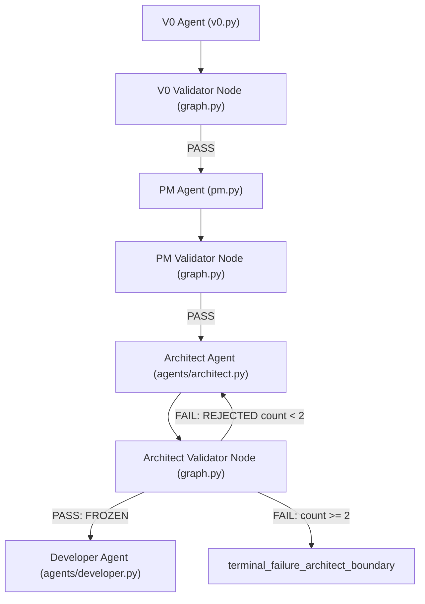

# PHASE 0 — FORENSIC ACTIVE-PATH AUDIT: SYSTEM ARCHITECT

**Date & Time:** 2026-09-18T21:34:00+07:00  
**Active Branch:** `experiment/treatment-1.8-agent-capability`  
**Base Commit:** `76c5f13 fix(pipeline): resolve contract gate to developer boundary integrity defects (Defects #1 and #2) & update governance`  
**Working Tree Status:** Pre-simplification clean test baseline (1,048 tests passing, 0 failing).  

---

## 1. ACTIVE ARCHITECT TOPOLOGY & CALL GRAPH

The active execution path in ReinDev Studio executes through LangGraph (`backend/graph.py`):

### Trace of Actual Runtime Flow:
1. **`V0` (`v0_agent`)**: Extracts requirements model (`v0_requirement_model`).
2. **`PM` (`pm_agent`)**: Produces specifications (`specifications`) and draft contract (`contract` with status `DRAFT`).
3. **`Architect` (`architect_agent`)**:
   - Takes: `task`, `target_language`, `v0_requirement_model`, `specifications`, `contract`, `frozen_oracle_path`, `test_files`.
   - On Turn 0: Assembles unified prompt directly from user task, V0 requirements, PM specs, and Acceptance Oracle obligations.
   - Invokes LLM: **Strictly 1 invocation**.
   - Extracts: Canonical `ArchitecturalBlueprint` JSON from raw output.
   - Synchronizes: AST facts from scaffold files with authoritative obligations.
   - Aligns: Contract into `aligned_contract`.
   - Serializes: Canonical blueprint to JSON (`architecture_plan`).
4. **`Contract Gate` (`architect_validator_node` in `graph.py` calling `seal_and_freeze_contract` in `contract.py`)**:
   - Validates obligation coverage, structural compatibility, scenario compatibility, and AST symbol resolvability.
   - If valid $\rightarrow$ Seals contract with SHA-256 (`contract_status = "FROZEN"`).
   - If invalid $\rightarrow$ Rejects contract (`contract_status = "REJECTED"`).
5. **`Developer` (`developer_agent`)**:
   - Receives frozen contract, authoritative target file, and canonical blueprint architecture plan.

---

## 2. FILES AND FUNCTIONS INVOLVED

| Subsystem | File Path | Primary Functions / Classes | Role in Active Path |
|---|---|---|---|
| **Workflow Graph** | `backend/graph.py` | `architect_validator_node`, `route_after_architect_validator` | Graph node execution and conditional routing |
| **Architect Agent** | `backend/agents/architect.py` | `architect_agent`, `_normalize_interface_contract_dict` | Context assembly, LLM invocation, blueprint extraction |
| **Acceptance Authority** | `backend/canonical_obligation.py` | `extract_canonical_oracle_obligations`, `format_authoritative_obligation_ledger`, `find_deterministic_callable_fact` | Extract authoritative public callables from test files |
| **Acceptance Scenarios** | `backend/canonical_scenario.py` | `extract_canonical_scenarios`, `format_scenarios_for_architect`, `extract_all_scaffold_facts` | AST fact extraction from scaffold code |
| **Blueprint Schema** | `backend/blueprint_schema.py` | `ArchitecturalBlueprint`, `parse_blueprint_json`, `serialize_blueprint_to_canonical_json`, `validate_canonical_architecture_plan_state` | Canonical Pydantic schema and JSON serialization |
| **Contract Authority** | `backend/contract.py` | `seal_and_freeze_contract`, `complete_aligned_contract`, `create_draft_contract` | Deterministic contract sealing and invariant enforcement |
| **Phase Validator** | `backend/phase_validators.py` | `validate_architect_phase` | Phase exit evaluation |
| **Context Hardening** | `backend/context_hardening.py` | `build_architect_decision_context`, `build_architect_repair_context` | Context assembly on repair turns |

---

## 3. AUDIT OF HISTORICAL STAGED COMPONENTS

| Staged Component | File Location | Status in Current Active Path | Notes |
|---|---|---|---|
| **Stage A (Obligation Mapping)** | `backend/architect_staged.py` | **DEACTIVATED** | Defined in `architect_staged.py`, not called in `architect_agent`. Vestigial dummy entry remains in `provenance["raw_stage_a_output"]`. |
| **Stage B1 (Element Realization)** | `backend/architect_staged.py` | **DEACTIVATED** | Defined in `architect_staged.py`, not called in `architect_agent`. |
| **Stage B2 (Interface Binding)** | `backend/architect_staged.py` | **DEACTIVATED** | Defined in `architect_staged.py`, not called in `architect_agent`. Vestigial dummy entry remains in `provenance["raw_stage_b_output"]`. |
| **Stage B3 / Assembly** | `backend/architect_staged.py` | **DEACTIVATED** | Defined in `architect_staged.py`, not called in `architect_agent`. |
| **Staged Repair Delivery** | `backend/b2_repair_delivery.py` | **DEACTIVATED** | Standalone module; not imported in active graph or architect agent. |
| **Staged Repair Lifecycle** | `backend/staged_repair.py` | **DEACTIVATED** | Standalone module; not imported in active graph or architect agent. |
| **Semantic Serializer Fallback** | `backend/semantic_serializer.py` | **VESTIGIAL FALLBACK** | Line 684 of `architect.py` checks for `STAGE B` or `semantic_decisions` as fallback parser. |

---

## 4. NUMBER OF ARCHITECT LLM INVOCATIONS

- **Turn 0 (Initial Generation):** Strictly **1 LLM call** (`llm.invoke(messages)` in `architect_agent`).
- **Turn 1 (Repair Attempt 1):** Strictly **1 LLM call** (if triggered by Contract Gate rejection).
- **Turn 2 (Repair Attempt 2):** Strictly **1 LLM call** (if triggered by Contract Gate rejection).
- **Maximum Lifetime Invocations:** $\le 3$ (1 initial + 2 repairs max).
- **Sequential Multi-stage Calls within a single turn:** **0** (no internal sub-stage loops).

---

## 5. INTERMEDIATE ARTIFACTS PRODUCED

1. `raw_output`: Raw LLM completion text containing `=== BLUEPRINT JSON === ... === END BLUEPRINT JSON ===`.
2. `extracted_bp`: Pydantic model instance of `ArchitecturalBlueprint`.
3. `scaffold_facts`: Extracted AST facts from `extracted_bp.files[*].code_scaffold`.
4. `aligned_contract`: Contract dictionary populated with `interface_contracts`, `data_models`, and `testable_assertions`.
5. `arch_plan`: Canonical JSON string representation of `extracted_bp` (stored in `state["architecture_plan"]`).
6. `frozen_contract`: Contract dictionary with SHA-256 seal and locked invariants (stored in `state["contract"]`).

---

## 6. CURRENT CANONICAL ARCHITECTURE STATE

State stored in `SquadState`:
- `state["architectural_blueprint"]`: Serialized dict of `ArchitecturalBlueprint`.
- `state["architecture_plan"]`: Canonical JSON string of `ArchitecturalBlueprint`.
- `state["contract"]`: Dict of `Contract` with `contract_status = "FROZEN"`.
- `state["contract_status"]`: `"FROZEN"` (or `"REJECTED"` / `"DELIVERY_FAILURE"`).
- `state["architect_telemetry"]`: Dict containing `llm_call_count`, `wall_time`, `input_chars`, `output_chars`, `scaffold_size_chars`.

---

## 7. REPAIR ROUTING

1. Contract Gate (`seal_and_freeze_contract`) evaluates the blueprint and aligned contract.
2. If validation errors occur:
   - `architect_validator_node` records errors in `contract_validation_errors`.
   - Increments `repair_attempt_counts["architect"]`.
   - Sets `contract_status = ContractStatus.REJECTED.value`.
   - Packages contextual evidence into `latest_evidence_package` and `contract_feedback`.
3. `route_after_architect_validator` checks repair budget:
   - If `count <= max_repairs` (default 2) $\rightarrow$ routes to `"architect"`.
   - If `count > max_repairs` $\rightarrow$ routes to `END` with status `"terminal_failure_architect_boundary"`.
4. On repair turn in `architect_agent`:
   - `is_repair_turn = True`.
   - Context assembled with previous blueprint, active failures, and repair targets.
   - LLM produces revised blueprint JSON.
   - Re-evaluated at Contract Gate.
