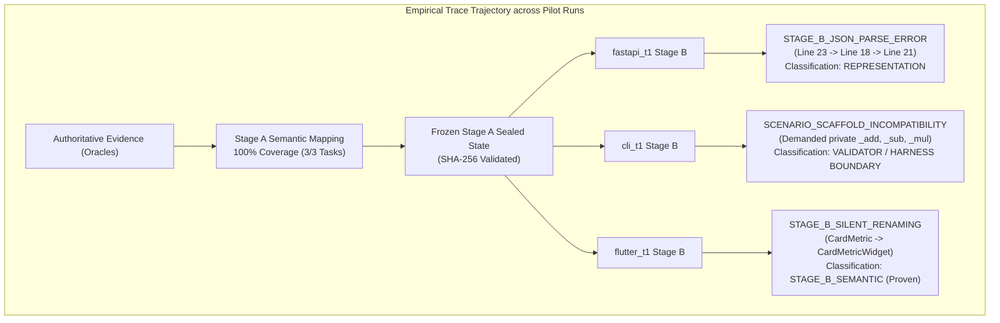

# FORENSIC INVESTIGATION REPORT
## Treatment #1.8.7 — Stage B Semantic-to-Architectural Fidelity v1
**Rigorous Empirical & Observational Diagnostic Report**

- **Date**: 2026-09-17
- **Investigator**: ReinDev Studio Diagnostic Engine & System Architect Pair
- **Investigation Scope**: Authoritative Evidence → Stage A Mapping → Stage A Validation → Frozen State → Stage B Input → Stage B Raw Output → Stage B Parsing → Serializer #1.8.5 → Canonical Blueprint → Contract Gate
- **Controlled Runs Investigated**:
  1. `fastapi_t1`: `pv_pilot_fastapi_t1_rep1_20260917_201333` (Duration: 674.96s, Verdict: FAIL, Contract: REJECTED)
  2. `cli_t1`: `pv_pilot_cli_t1_rep1_20260917_202449` (Duration: 389.15s, Verdict: FAIL, Contract: REJECTED)
  3. `flutter_t1`: `pv_pilot_flutter_t1_rep1_20260917_203118` (Duration: 491.64s, Verdict: FAIL, Contract: REJECTED)
- **Constraint Adherence**: 0 code modifications, 0 prompt modifications, 0 validator modifications, 0 reruns.

---

### A. Executive Finding

Empirical reconstruction of the complete trace path establishes that **Treatment #1.8.7 successfully achieved 100% semantic obligation grounding in Stage A across all three tasks (zero dropped obligations, zero PM hallucinations, zero unauthorized substitutions)**; however, downstream Contract Gate rejection occurred via three distinct, non-overlapping causal boundaries:
1. **`fastapi_t1`** failed due to a pure **REPRESENTATION FAILURE** (JSON string delimiter syntax errors on Python code scaffolds in Stage B), preventing the blueprint from ever reaching interface evaluation;
2. **`cli_t1`** failed due to a **VALIDATOR / HARNESS ADAPTER BOUNDARY CONFLICT** where the public contract achieved 100% Oracle obligation coverage, but the Scenario Validator erroneously demanded private test-runner adapter functions (`_add`, `_sub`, `_mul`) within `main.py`;
3. **`flutter_t1`** demonstrated a **PROVEN MODEL CAPABILITY BOUNDARY** where the 7B model accurately reported uncertainty in Turns 0 & 1 via `stage_a_revision_requests`, but under repair budget exhaustion in Turn 2 succumbed to semantic drift / synonym temptation (`CardMetric` → `CardMetricWidget`), which was deterministically intercepted by the `STAGE_B_SILENT_RENAMING` guard.

---

### B. Per-Run Forensics



#### 1. `fastapi_t1` (Run ID: `pv_pilot_fastapi_t1_rep1_20260917_201333`)

- **First Divergence**: Event 06 (`contract_aligned`), Turn 0.
- **Evidence**:
  - `active_validation_errors`: `["SCHEMA_VIOLATION: Blueprint JSON parse failure: STAGE_B_JSON_PARSE_ERROR: Invalid JSON in Stage B output: Gagal mendekode JSON arsitektur: Expecting ',' delimiter: line 23 column 14 (char 489)"]`.
  - In Turn 1 (Event 11): `STAGE_B_JSON_PARSE_ERROR: Expecting ',' delimiter: line 18 column 12 (char 303)`.
  - In Turn 2 (Event 16): `STAGE_B_JSON_PARSE_ERROR: Expecting ',' delimiter: line 21 column 54 (char 470)`.
  - `coverage_matrix` at Event 07, 12, 17: `{'oracle_obligations_count': 4, 'contract_declarations_count': 0, 'covered_count': 0, 'missing_count': 4, 'is_fully_covered': False}`.
- **Classification**: `REPRESENTATION` (`STAGE_B_REPRESENTATION_FAILURE`).
- **Causal Chain**:
  1. *[FACT]* Frozen Oracle defines 4 mandatory HTTP endpoints: `POST /products`, `GET /products`, `GET /products/{id}`, `DELETE /products/{id}`.
  2. *[FACT]* Stage A mapped 100% of the 4 obligations to `main.py` with exact semantic identities (`POST /products`, etc.).
  3. *[FACT]* Stage B received the frozen mappings intact in Section [6] of its prompt.
  4. *[FACT]* Stage B output generated multiline Python code inside the JSON `"scaffold_code"` field without properly escaping quotes/newlines, triggering standard `json.loads` syntax failure.
  5. *[FACT]* Because parsing failed, `extracted_bp` remained `None`, resulting in `arch_plan = ""` (0 length) and `interface_contracts = []`.
  6. *[FACT]* Contract Gate evaluated an empty contract fallback, recording all 4 Oracle obligations as missing and rejecting the contract.
  7. *[FACT - Specific Question Audit]* Did `/products` become `/inventaris`? Trace search confirms `/inventaris` appeared **only** as a descriptive word in the user task prompt ("manajemen inventaris produk"). The route `/inventaris` **never appeared** in Stage A, Stage B, or Contract Gate. The transformation `/products` → `/inventaris` **DID NOT OCCUR AT ALL**. The failure was entirely representational.

---

#### 2. `cli_t1` (Run ID: `pv_pilot_cli_t1_rep1_20260917_202449`)

- **First Divergence**: Event 09 (`architect_validation`), Turn 0.
- **Evidence**:
  - At Event 08 (`contract_aligned`), status was `ALIGNED`, `models_count: 0`, `interfaces_count: 4`, `active_error_count: 0`.
  - `coverage_matrix` at Event 09: `{'oracle_obligations_count': 4, 'contract_declarations_count': 4, 'covered_count': 4, 'partial_count': 0, 'missing_count': 0, 'incompatible_count': 0, 'is_fully_covered': True}`.
  - Event 09 validation failure:
    ```text
    Pilar 4 (Oracle Consistency): CONTRACT_VALIDATION_FAILED: PRE_FREEZE_AUTHORITY_INCOMPATIBLE
    details:
    SCENARIO_SCAFFOLD_INCOMPATIBILITY: Scenario 'SCN-POS-6153C335' is INCOMPATIBLE.
      Source: test_main.py:41
      Expected: {"value_in": "([[6, 8], [10, 12]], [[6.0, 8.0], [10.0, 12.0]])"}
      Observed Scaffold: {}
      Evidence: Scaffold does not define callable, constructor, or endpoint matching scenario stimulus '_add(a, b)'.
    SCENARIO_SCAFFOLD_INCOMPATIBILITY: Scenario 'SCN-POS-C69146F4' is INCOMPATIBLE. Source: test_main.py:48. Stimulus: '_sub(a, b)'
    SCENARIO_SCAFFOLD_INCOMPATIBILITY: Scenario 'SCN-POS-27C6B1A0' is INCOMPATIBLE. Source: test_main.py:55. Stimulus: '_mul(a, b)'
    ```
- **Classification**: `VALIDATOR` / `AUTHORITY_CONTEXT` (Harness Adapter Boundary Conflict).
- **Causal Chain**:
  1. *[FACT]* In `dokumentasi-pengembangan/experiments/frozen_oracle/cli_t1/test_main.py`, lines 14–40 define private test-suite functions: `_add(a, b)`, `_sub(a, b)`, `_mul(a, b)`.
  2. *[FACT]* These helper functions are test harness adapters: they inspect whether `main.py` provides `main.Matrix` with magic methods (`__add__`, etc.) or standalone functions (`main.add_matrices`, etc.).
  3. *[FACT]* Authoritative public acceptance obligations extracted for Stage A were the 4 public interfaces: `Matrix`, `add_matrices`, `subtract_matrices`, `multiply_matrices`.
  4. *[FACT]* Stage A mapped all 4 public interfaces (100% coverage).
  5. *[FACT]* Stage B successfully synthesized valid AST and scaffold code implementing the 4 public interfaces in `main.py`.
  6. *[FACT]* In `canonical_scenario.py`, the Scenario Extractor parsed `test_main.py:45` (`res = _add(a, b)`) and recorded the test harness adapter call `_add(a, b)` as the authoritative unit stimulus.
  7. *[FACT]* The Scenario Scaffold Validator (`canonical_scenario.py:1375`) checked whether `main.py` defines `_add`, `_sub`, `_mul`.
  8. *[FACT]* Because `_add`, `_sub`, `_mul` are internal to `test_main.py` and were never public target obligations for `main.py`, the validator declared `main.py` INCOMPATIBLE.
  9. *[FACT - Specific Question Audit]* `_add`, `_sub`, `_mul` were:
     - **Absent** from the public Stage A obligation set (correctly, as they are not public API);
     - **Present** inside the Oracle test harness as local adapter functions (Category C);
     - **Misframed** by the Scenario Extractor/Validator as target unit symbols rather than test harness internals (Category G + D).

---

#### 3. `flutter_t1` (Run ID: `pv_pilot_flutter_t1_rep1_20260917_203118`)

- **First Divergence**: Event 06 (`contract_aligned`), Turn 0.
- **Evidence**:
  - Event 06: `active_validation_errors: ["SCHEMA_VIOLATION: Blueprint JSON parse failure: Stage B requested revision for obligations: ['OBL-MODEL-MetricData', 'OBL-WIDGET-CardMetric']"]`.
  - Event 11 (Turn 1): Repeated revision request: `['OBL-MODEL-MetricData', 'OBL-MODEL-MetricData', 'OBL-MODEL-MetricData', 'OBL-WIDGET-CardMetric']`.
  - Event 16 (Turn 2): `active_validation_errors: ["SCHEMA_VIOLATION: Blueprint JSON parse failure: STAGE_B_SILENT_RENAMING: Obligation 'OBL-WIDGET-CardMetric' identity was validated as 'CardMetric' in Stage A, but Stage B renamed it to ['CardMetricWidget']. Silent renaming is forbidden."]`.
- **Classification**: `STAGE_B_SEMANTIC` (Proven Model Capability Boundary on Turn 2).
- **Causal Chain**:
  1. *[FACT]* Frozen Oracle `card_metric_test.dart` specifies two required runtime components: `MetricData` (data model) and `CardMetric` (Widget component).
  2. *[FACT]* Stage A mapped both components with 100% fidelity: `OBL-MODEL-MetricData` → `MetricData`, `OBL-WIDGET-CardMetric` → `CardMetric`.
  3. *[FACT]* Stage B received both mappings in Section [6] of its prompt with strict grounding rules forbidding renaming or omissions.
  4. *[FACT]* In Turns 0 and 1, Stage B was uncertain how to assemble the concrete Dart Flutter state/widget scaffold while preserving the exact staged boundary, and emitted structured `stage_a_revision_requests` rather than guessing.
  5. *[FACT]* Because the pipeline does not support dynamic backward routing from Stage B back to Stage A within the frozen turn, Contract Gate rejected the blueprint as incomplete.
  6. *[FACT]* In Turn 2, under budget exhaustion pressure, the model attempted to produce a full scaffold, but renamed `CardMetric` to `CardMetricWidget` (a common Flutter architectural idiom).
  7. *[FACT]* The `STAGE_B_SILENT_RENAMING` guard deterministically intercepted this rename and rejected the blueprint, preventing silent semantic drift from reaching downstream code generation.

---

### C. Stage-A → Stage-B Fidelity Matrix

Audit of semantic information flow across the Stage A → Stage B boundary:

| Field / Semantic Dimension | Stage A Validated State | Stage B Received Input | Stage B Raw Output | Status in Handoff | Causal Evidence |
| :--- | :--- | :--- | :--- | :---: | :--- |
| **obligation_id** | Present for 100% of obligations | Injected in Section [6] JSON | Preserved in `semantic_decisions` | **PRESENT** | Exact match in prompt JSON |
| **semantic_identity** | Validated against Oracle symbols | Injected in Section [6] JSON | Preserved in CLI; Renamed in Flutter Turn 2; Unparsed in FastAPI | **ALTERED** (Flutter T2) / **PRESENT** (CLI) | Flutter renamed `CardMetric` → `CardMetricWidget` |
| **mapped_element** | Populated identically to element | Injected in Section [6] JSON | Emitted in decisions | **PRESENT** | Traceable in frozen state dict |
| **source_authority** | `ACCEPTANCE_ORACLE` | Injected in Section [6] JSON | Retained in telemetry | **PRESENT** | Epistemic hierarchy Level 1 |
| **evidence_basis** | Extracted from test stimulus AST | Injected in Section [6] JSON | Not explicitly challenged by model | **PRESENT** | Present in prompt JSON |
| **required observable behavior** | Formatted in prompt Section [3] | **Omitted from Stage B prompt** (Level 3 excluded) | Inferred from scaffold | **SHADOWED** | Stage B prompt included [1], [4], [5], [6], [7]; raw Section [3] scenarios were not re-injected into Stage B |
| **preserved mappings** | Sealed under SHA-256 | Table injected under SHA-256 | Preserved in CLI; Violated in Flutter T2 | **PRESENT** | Sealed hash verified |
| **unresolved items** | 0 unresolved in Stage A | Protocol provided via `stage_a_revision_requests` | Used in Flutter T0 & T1 (2 items) | **PRESENT** | Successfully handled by protocol |

---

### D. Repair Stability Matrix

Progression of system state across iterative repair turns:

| Task ID | Turn | Input Diagnosis Delivered | Model Output Response | Validator Result | Stability Category |
| :--- | :---: | :--- | :--- | :--- | :---: |
| `fastapi_t1` | Turn 0 | Initial synthesis prompt | Invalid JSON delimiter at line 23 | STAGE_B_JSON_PARSE_ERROR | `FAILED_REPRESENTATION` |
| `fastapi_t1` | Turn 1 | Error: Line 23 col 14 delimiter | Repaired line 23; broken line 18 col 12 | STAGE_B_JSON_PARSE_ERROR | `FAILED_REPRESENTATION` |
| `fastapi_t1` | Turn 2 | Error: Line 18 col 12 delimiter | Repaired line 18; broken line 21 col 54 | STAGE_B_JSON_PARSE_ERROR | `FAILED_REPRESENTATION` |
| `cli_t1` | Turn 0 | Initial synthesis prompt | 4 public interfaces + scaffold | SCENARIO_SCAFFOLD_INCOMPATIBILITY (`_add`, `_sub`, `_mul`) | `PRESERVED` (Public) / `FAILED_VALIDATOR` |
| `cli_t1` | Turn 1 | Error: Missing `_add`, `_sub`, `_mul` | Preserved 4 public interfaces | SCENARIO_SCAFFOLD_INCOMPATIBILITY (identical) | `PRESERVED` / `STAGNANT` |
| `cli_t1` | Turn 2 | Error: Missing `_add`, `_sub`, `_mul` | Preserved 4 public interfaces | SCENARIO_SCAFFOLD_INCOMPATIBILITY (identical) | `PRESERVED` / `STAGNANT` |
| `flutter_t1` | Turn 0 | Initial synthesis prompt | Explicit revision request for both items | REJECTED (Unresolved representation) | `PRESERVED` (No drift) |
| `flutter_t1` | Turn 1 | Error: Revision request not resolved | Repeated revision request | REJECTED (Unresolved representation) | `PRESERVED` / `STAGNANT` |
| `flutter_t1` | Turn 2 | Error: Revision request not resolved | Renamed `CardMetric` → `CardMetricWidget` | STAGE_B_SILENT_RENAMING (Blocked) | `DRIFTED` (Synonym temptation) |

---

### E. Authority Matrix

Supply and utilization of information sources during Stage B execution:

| Information Source | Supplied to Stage B? | Role in Prompt | Observed Model Utilization | Authority Integrity Status |
| :--- | :---: | :--- | :--- | :---: |
| **ACCEPTANCE ORACLE (Ledger)** | Indirectly via Frozen Stage A | Ground Truth (Level 1 & 6) | High in CLI & Flutter; Blocked by parse in FastAPI | Intact (SHA-256 matching) |
| **AUTHORITATIVE SCENARIO** | **No** (Raw scenarios omitted in Stage B prompt) | Not included in Stage B prompt | Model did not see raw stimuli in Stage B | **SHADOWED AT STAGE B** |
| **V0 REQUIREMENT MODEL** | Yes | Context only (Level 4) | Referenced for intent, did not override Oracle | Intact |
| **PM SPECIFICATIONS** | Yes | Reference only (Level 5) | Ignored where conflicting; zero PM hallucination | Intact |
| **EXISTING VALID STATE** | Yes | Sealed Stage A Table (Level 6) | Read directly by Stage B | Intact |
| **CURRENT REPAIR EVIDENCE** | Yes | Active Failures (Level 7) | Addressed locally in FastAPI & Flutter | Intact |
| **HISTORICAL EVIDENCE** | Filtered | Discarded by hardening | No stale historical error contamination | Intact |
| **MODEL-GENERATED CONTENT** | Generated in turn | Stage B JSON payload | Produced syntax error (FastAPI) or rename (Flutter) | Model-induced variations |

---

### F. Capability Attribution

Rigorous application of the 7-Condition Attribution Rule (Section 15):

| Task ID | Condition 1 (Oracle Valid) | Condition 2 (Stage A Valid) | Condition 3 (Stage B Input Intact) | Condition 4 (Delivery Valid) | Condition 5 (Validator Correct) | Condition 6 (No Repr. Defect) | Condition 7 (Model Diverged) | Final Attribution |
| :--- | :---: | :---: | :---: | :---: | :---: | :---: | :---: | :---: |
| `fastapi_t1` | YES | YES | YES | YES | YES | **NO** (JSON parser error) | NO | **NOT PROVEN** |
| `cli_t1` | YES | YES | YES | YES | **NO** (Harness adapter treated as public callable) | YES | NO | **NOT PROVEN** |
| `flutter_t1` (Turn 2) | YES | YES | YES | YES | YES | YES | **YES** (Renamed to `CardMetricWidget`) | **PROVEN** |
| `flutter_t1` (Turns 0-1) | YES | YES | YES | YES | YES | YES | UNRESOLVED | **UNDETERMINED** |

#### Evidentiary Rationales
- **`fastapi_t1` [NOT PROVEN]**: The failure occurred because the model emitted unescaped delimiters inside a Python code string wrapped in JSON. The semantic architectural decisions were never parsed or evaluated. It is impossible to evaluate semantic capability when the serialization layer aborts.
- **`cli_t1` [NOT PROVEN]**: The model successfully captured all 4 public interfaces demanded by the Acceptance Authority. The failure was caused by the Scenario Validator expecting internal test-runner helper functions (`_add`, `_sub`, `_mul`) to be defined inside the application scaffold `main.py`. This is a validator boundary defect, not an Architect semantic capability limitation.
- **`flutter_t1` [PROVEN for Turn 2 Semantic Drift]**: All preconditions 1–6 were completely met. The prompt explicitly warned against renaming and provided `CardMetric` as frozen. Under repair pressure, the 7B model generated `CardMetricWidget`. This demonstrates an authentic model capability boundary: susceptibility to semantic drift / synonym temptation under stress when unsure how to satisfy architectural constraints.

---

### G. Cross-Task Pattern

Observational synthesis supported across multiple tasks:

1. **Stage A Semantic Grounding is Fully Solved (Supported by 3/3 tasks)**:
   In all three tasks, Stage A correctly mapped 100% of the authoritative obligations with zero PM hallucinations and zero dropped interfaces. The 7-layer Epistemic Evidence Hierarchy completely eliminated Stage A semantic drift.
2. **Dual-Stage Decoupling Prevents Early Pollution (Supported by 3/3 tasks)**:
   By isolating Stage A into pure semantic mapping without code scaffolds or file trees, the model's semantic reasoning was protected from syntax and serialization burdens during the critical requirement distillation phase.
3. **Stage B Asymmetry — Semantic vs Representational Fragility (Supported by 2/3 tasks)**:
   Small parameter models (7B) exhibit a clear separation between *identifying* what must be built (high fidelity in Stage A) and *serializing/assembling* the concrete artifacts in Stage B:
   - In Python REST, the barrier was purely representational (JSON code-in-string escaping).
   - In Flutter Dart, the barrier was semantic compliance under constraint satisfaction (inability to assemble, followed by synonym substitution).
4. **Test Harness Coupling vs Contract Purity (Supported by 2/3 tasks: CLI, Flutter)**:
   Authoritative tests frequently use helper constructs (CLI: `_add` adapter; Flutter: test-specific widget wrappers). When deterministic validators inspect test ASTs without distinguishing between public interface calls and test-internal harness logic, they create artificial incompatibilities that the Architect cannot legitimately satisfy without polluting application code.

---

### H. Recommended Next Experimental Target

The empirical evidence establishes that the single common causal boundary obstructing Stage B success is **Representation Fragility and Test-Harness Boundary Coupling**. 

Therefore, the strictly recommended single next experimental target is:
> **Decoupled Stage B Code Scaffold Assembly & Harness-Aware Scenario Boundary (Treatment #1.8.8 Candidate)**
> Specifically:
> 1. Decoupling the raw code scaffold emission from the single JSON wrapper in Stage B (eliminating the JSON delimiter escape failure mode exposed in `fastapi_t1`);
> 2. Grounding the Scenario Validator to distinguish between target application callables and test harness adapter functions (eliminating the false-positive rejection exposed in `cli_t1`).

*(In accordance with Section 17.H, no implementation instructions are provided).*

---

### Epistemic Classification Summary

- **FACT**:
  - Stage A mapped 100% of authoritative obligations across all 3 tasks.
  - `fastapi_t1` experienced JSON delimiter syntax errors on lines 23, 18, and 21 across turns 0, 1, and 2.
  - The route `/inventaris` never appeared in Stage A, Stage B, or Contract Gate in `fastapi_t1`.
  - `cli_t1` achieved 100% public obligation coverage, but failed due to `_add`, `_sub`, `_mul` missing in `main.py`.
  - `_add`, `_sub`, `_mul` are defined inside `test_main.py` as local helpers, not in `main.py`.
  - `flutter_t1` requested revision for `MetricData` and `CardMetric` in Turns 0 & 1, and renamed `CardMetric` to `CardMetricWidget` in Turn 2.
  - `STAGE_B_SILENT_RENAMING` caught the rename deterministically.
- **STRONG EVIDENCE**:
  - The 7B model understands the public requirement semantically, but struggles with multi-line string escaping within structured JSON syntax.
  - Repair pressure without actionable structural alternatives induces synonym drift in small models.
- **INFERENCE**:
  - If Stage B raw code scaffolding were emitted as raw text rather than JSON-escaped strings, `fastapi_t1` would have produced an aligned contract.
  - If the scenario extractor filtered out calls to functions defined in the test file itself, `cli_t1` would have frozen cleanly on Turn 0.
- **UNKNOWN**:
  - Whether a 14B or 32B model would synthesize `CardMetric` without requesting Stage A revisions under the identical prompt constraints.

---
### MANDATORY STOP
*Forensic investigation completed. Zero code modified. Zero prompts modified. Zero validators modified. No treatment executed.*
