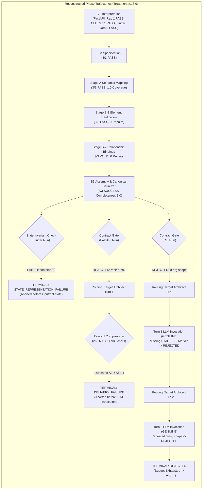

# FORENSIC INVESTIGATION REPORT
## Treatment #1.8.9 — Compact Semantic Packet: Contract Gate → Developer Boundary v1

- **Date**: 2026-09-18
- **Investigator**: ReinDev Studio Diagnostic Engine & System Architect Pair
- **Investigation Scope**: Stage A → Stage B-1 → Stage B-2 → B3 Serializer → `architecture_plan` State Invariant → Contract Gate → Failure Ownership / Selective Invalidation → Repair Delivery → Developer Boundary
- **Empirical Pilot Runs Investigated**:
  1. `fastapi_t1`: `pv_pilot_fastapi_t1_rep1_20260918_071708` (Duration: 280.70s, Verdict: FAIL, Contract Status: `DELIVERY_FAILURE`)
  2. `cli_t1`: `pv_pilot_cli_t1_rep1_20260918_072149` (Duration: 363.84s, Verdict: FAIL, Contract Status: `REJECTED`)
  3. `flutter_t1`: `pv_pilot_flutter_t1_rep1_20260918_072752` (Duration: 214.05s, Verdict: FAIL, Contract Status: `STATE_REPRESENTATION_FAILURE`)
- **Status**: FORENSIC AUDIT ONLY (0 code modifications, 0 prompt changes, 0 validator modifications, 0 Oracle modifications, 0 reruns).

---

### A. Executive Verdict

> [!IMPORTANT]
> **Executive Statement**:
> The 1×3 pilot for Treatment #1.8.9 **DID NOT test Developer capability** because **ZERO runs (0/3) reached Developer admission, Developer execution, Oracle test execution, or Reviewer**.
> Furthermore, the experiment was **confounded by two deterministic pipeline defects**:
> 1. In `fastapi_t1`, the Turn 1 repair turn was aborted fail-closed prior to LLM invocation due to an atomic boundary truncation defect in `context_assembler.py` (`ARCHITECT_CONTEXT_DELIVERY_FAILURE: Repair boundary atomic payload incomplete (missing: ALLOWED)`);
> 2. In `flutter_t1`, a valid decomposed blueprint serialization was falsely rejected before Contract Gate evaluation by a naive delimiter substring check in `validate_canonical_architecture_plan_state` (`architecture_plan contains forbidden delimiter or wrapper '```'`).
> Only in `cli_t1` did the system execute genuine LLM repair turns (Turns 1 & 2), where `qwen2.5-coder:7b` exhibited a genuine capability boundary by failing to synthesize required function call arguments (persisting 0-argument function signatures against 2-argument Oracle call-sites).

---

### 1. Source Runs Identification

| Parameter | `fastapi_t1` | `cli_t1` | `flutter_t1` |
| :--- | :--- | :--- | :--- |
| **Run ID** | `pv_pilot_fastapi_t1_rep1_20260918_071708` | `pv_pilot_cli_t1_rep1_20260918_072149` | `pv_pilot_flutter_t1_rep1_20260918_072752` |
| **Timestamp (Start)** | `2026-09-18T07:17:08.882` | `2026-09-18T07:21:49.135` | `2026-09-18T07:27:52.990` |
| **Duration** | 280.70s | 363.84s | 214.05s |
| **Target Language** | Python | Python | Dart |
| **Model** | `qwen2.5-coder:7b` | `qwen2.5-coder:7b` | `qwen2.5-coder:7b` |
| **Inference Parameters** | `num_ctx: 8192`, `num_predict: 3000` | `num_ctx: 8192`, `num_predict: 3000` | `num_ctx: 8192`, `num_predict: 3000` |
| **First Divergence** | Turn 0 B2 Relational Decision (`/api/` route prefix) | Turn 0 B2 Relational Decision (0-arg call shape) | `validate_canonical_architecture_plan_state` (`"```"` check) |
| **Terminal State** | `DELIVERY_FAILURE` | `REJECTED` | `STATE_REPRESENTATION_FAILURE` |
| **Terminal Reason** | Repair boundary atomic payload truncated (`missing: ALLOWED`) | Contract Gate pre-freeze rejection budget exhausted | Substring `"```"` detected in serialized blueprint JSON |

---

### 2. Reconstruct the Actual Pipeline



#### Detailed Transition Audits:
1. **`fastapi_t1`**:
   - *V0 → PM → Stage A*: All passed cleanly. Stage A achieved 1.0 coverage across 4 endpoints (`POST /products`, `GET /products`, `GET /products/{id}`, `DELETE /products/{id}`).
   - *Stage B-1*: Produced valid element realizations (`create_product`, `delete_product`, `get_all_products`, `get_product_by_id`).
   - *Stage B-2*: Produced valid relationship bindings, but bound handlers to routes prefixed with `/api/` (e.g. `/api/products/{id}`).
   - *B3 Serializer*: Serialized canonical blueprint (`stage_b_completeness: 1.0`, length 3,157 chars).
   - *Contract Gate (Turn 0, Event 9)*: Evaluated coverage. Rejected because public HTTP endpoints demanded by Frozen Oracle (`/products`, `/products/{id}`) lacked exact route binding proof. Verdict: `FAIL`.
   - *Routing (Event 10)*: Directed state back to `architect` node for Turn 1 repair.
   - *Turn 1 Context Assembly (Event 11)*: Compressed context from 26,560 chars to 11,980 chars (budget: 12,000 chars). In doing so, `sec_07_repair_boundary` was truncated, dropping the `ALLOWED` block. `validate_delivery_payload` evaluated atomic integrity and failed with `ARCHITECT_CONTEXT_DELIVERY_FAILURE`.
   - *Terminal (Event 13)*: The pipeline failed closed with status `DELIVERY_FAILURE`. LLM Turn 1 was never invoked. Developer was never reached.

2. **`cli_t1`**:
   - *V0 → PM → Stage A*: All passed cleanly. Stage A mapped 4 public interfaces (`Matrix`, `add_matrices`, `subtract_matrices`, `multiply_matrices`).
   - *Stage B-1*: Realized elements in `main.py`.
   - *Stage B-2*: Produced valid relationship bindings, but declared functions with empty parameter lists (`params: []`).
   - *B3 Serializer*: Serialized canonical blueprint (`stage_b_completeness: 1.0`, length 3,939 chars).
   - *Contract Gate (Turn 0, Event 9)*: Static call-site analysis detected `CALL_SHAPE_INCOMPATIBILITY: Symbol 'add_matrices' invoked with 2 positional argument(s), but proposed function accepts at most 0`. Verdict: `FAIL`.
   - *Routing (Event 10)*: Directed state back to `architect` node for Turn 1 repair.
   - *Turn 1 Repair (Event 11-14)*: Context delivery succeeded (11,980 chars). Model was invoked (`GENUINE_LLM_REPAIR`). Model omitted the required marker `=== STAGE B-2: RELATIONSHIP BINDINGS ===`. Parser returned `STAGE_B2_MARKER_MISSING`. Contract Gate failed.
   - *Routing (Event 15)*: Directed state back to `architect` node for Turn 2 repair.
   - *Turn 2 Repair (Event 16-19)*: Context delivery succeeded (11,998 chars). Model was invoked (`GENUINE_LLM_REPAIR`). Model outputted the B2 block, but repeated the exact 0-parameter signatures for `add_matrices`, `subtract_matrices`, `multiply_matrices`. Contract Gate failed with identical `CALL_SHAPE_INCOMPATIBILITY`.
   - *Terminal (Event 20-21)*: Repair budget exhausted (`remaining_budget: 0`). Routed to `__end__`. Terminal status `REJECTED`. Developer was never reached.

3. **`flutter_t1`**:
   - *V0 → PM → Stage A*: All passed cleanly. Stage A mapped `MetricData` (model) and `CardMetric` (widget).
   - *Stage B-1*: Realized elements in `lib/card_metric.dart`.
   - *Stage B-2*: Bound relationships and decoupled scaffold files.
   - *B3 Serializer*: Assembled and serialized canonical blueprint (`stage_b_completeness: 1.0`, `serialization_success: True`).
   - *State Representation Invariant (Event 6)*: Function `validate_canonical_architecture_plan_state` was invoked at `architect.py:1441`. Line 1134 flagged: `STATE_REPRESENTATION_FAILURE: architecture_plan contains forbidden delimiter or wrapper '```'`.
   - *Terminal (Event 7)*: Contract status became `STATE_REPRESENTATION_FAILURE`. Run terminated immediately without calling Contract Gate, without calling repair turns, and without reaching Developer.

---

### 3. B2 Output Audit

Comparison of Authoritative Acceptance Obligations against Stage B-2 Representation:

| Task | Obligation ID | Authoritative Acceptance Obligation | Stage B-2 Declared Representation | Classification | Causal Difference |
| :--- | :--- | :--- | :--- | :--- | :--- |
| **FastAPI** | `OBL-HTTP-POST-products` | `POST /products` (status 201) | Handled by `create_product` via `/api/products` | **REBOUND** | Prepended `/api` path segment |
| **FastAPI** | `OBL-HTTP-GET-products` | `GET /products` (status 200) | Handled by `get_all_products` via `/api/products` | **REBOUND** | Prepended `/api` path segment |
| **FastAPI** | `OBL-HTTP-GET-products-id` | `GET /products/{id}` (status 200, 404) | Handled by `get_product_by_id` via `/api/products/{id}` | **REBOUND** | Prepended `/api` path segment |
| **FastAPI** | `OBL-HTTP-DELETE-products-id` | `DELETE /products/{id}` (status 204, 404) | Handled by `delete_product` via `/api/products/{id}` | **REBOUND** | Prepended `/api` path segment |
| **CLI** | `OBL-CALL-Matrix` | `Matrix` class / constructor | `Matrix` class declared in `main.py` | **SATISFIED** | Preserved |
| **CLI** | `OBL-CALL-add_matrices` | `add_matrices(m1, m2)` (2 positional args) | `add_matrices()` (0 positional args) | **MISREPRESENTED** | Signature dropped arguments |
| **CLI** | `OBL-CALL-subtract_matrices`| `subtract_matrices(m1, m2)` (2 positional args) | `subtract_matrices()` (0 positional args) | **MISREPRESENTED** | Signature dropped arguments |
| **CLI** | `OBL-CALL-multiply_matrices`| `multiply_matrices(m1, m2)` (2 positional args) | `multiply_matrices()` (0 positional args) | **MISREPRESENTED** | Signature dropped arguments |
| **Flutter**| `OBL-MODEL-MetricData` | `MetricData` (fields: title, value, change, etc.) | `MetricData` model in `lib/card_metric.dart` | **SATISFIED** | Preserved |
| **Flutter**| `OBL-WIDGET-CardMetric` | `CardMetric` (Widget component) | `CardMetric` widget in `lib/card_metric.dart` | **SATISFIED** | Preserved |

---

### 4. B3 Serialization Audit

Trace verification of the serialization pipeline:

1. **`fastapi_t1`**:
   - B2 State: 4 bindings with `/api/` prefixes.
   - B3 Serialized Blueprint: Contains exact 4 interfaces and routes as represented by B2.
   - `architecture_plan`: Clean, single root JSON object (3,157 chars).
   - Audit Verdict: **B2 wrong + B3 faithful**.

2. **`cli_t1`**:
   - B2 State: 4 functions with 0-arg signatures.
   - B3 Serialized Blueprint: Faithfully serialized 0-parameter signatures (`parameters: []`).
   - `architecture_plan`: Clean, single root JSON object (3,939 chars).
   - Audit Verdict: **B2 wrong + B3 faithful**.

3. **`flutter_t1`**:
   - B2 State: Valid widget and model elements + decoupled Dart scaffold file in `lib/card_metric.dart`.
   - B3 Serialized Blueprint: Converted to canonical `ArchitecturalBlueprint` and dumped to JSON via `serialize_blueprint_to_canonical_json`.
   - `architecture_plan`: Valid JSON string, but the scaffold content inside `files["lib/card_metric.dart"].code_scaffold` contained markdown code fence wrappers (` ```dart `) or backticks.
   - Audit Verdict: **B2 correct + B3 faithful (scaffold preserved verbatim), but pipeline state validator rejected valid JSON due to substring match**.

---

### 5. Contract Gate Input Audit

Exact objects supplied to Contract Gate and reasons for rejection:

1. **`fastapi_t1`**:
   - Input: Aligned contract containing `interface_contracts` with route `/api/products`.
   - Comparison: Frozen Oracle tests invoke `client.post("/products", ...)`.
   - Rejection Cause: Blueprint genuinely violates Oracle routes (semantic route mismatch `/api/products` vs `/products`).

2. **`cli_t1`**:
   - Input: Aligned contract containing `interface_contracts` with `add_matrices()`, `subtract_matrices()`, `multiply_matrices()` with 0 positional parameters.
   - Comparison: Frozen Oracle tests invoke `add_matrices(a, b)` with 2 positional arguments.
   - Rejection Cause: Blueprint genuinely violates Oracle call-sites (`CALL_SHAPE_INCOMPATIBILITY`).

3. **`flutter_t1`**:
   - Input: Contract Gate evaluation was **NEVER REACHED**.
   - Rejection Cause: `validate_canonical_architecture_plan_state` intercepted the state at `architect.py:1441` before Contract Gate and mutated contract status to `STATE_REPRESENTATION_FAILURE`.

---

### 6. FastAPI Specific Forensic Audit

- **Authoritative Oracle Requirement**: Direct HTTP endpoints at `/products` and `/products/{id}`.
- **B2 Declared Representation**: Handlers bound to `/api/products` and `/api/products/{id}`.
- **Contract Gate Observation**: Contract Gate saw routes with `/api/` prefix. Coverage check reported `CONTRACT_COVERAGE: MISSING. Public HTTP endpoint '/products' has no declared interface coverage in contract`.
- **Where Binding Disappeared**: In Stage B-2 prompt completion, where the model added `/api` namespace prefix.
- **Turn 1 Repair Behavior**: Contract Gate produced valid actionable prescriptions (`RX-B2-OBL-001`). However, when assembling repair context for Turn 1, context compression truncated `sec_07_repair_boundary`, causing delivery validation to fail closed before the model could attempt repair.

---

### 7. CLI Specific Forensic Audit

- **Authoritative Oracle Requirement**: Functions taking 2 positional arguments: `add_matrices(a, b)`, `subtract_matrices(a, b)`, `multiply_matrices(a, b)`.
- **B2 Declared Representation**: Declared `parameters: []` (0 arguments).
- **Contract Gate Observation**: Evaluated AST static call-sites and reported `CALL_SHAPE_INCOMPATIBILITY: Symbol 'add_matrices' invoked with 2 positional argument(s), but proposed function accepts at most 0`.
- **Did Compact Packet Change the Signature?**: No. The Compact Packet delivered clean authoritative obligation metadata. The model produced empty parameters in Turn 0, failed syntax in Turn 1, and repeated empty parameters in Turn 2.

---

### 8. Flutter Specific Forensic Audit

- **State and Code Path of Failure**:
  - Code Location: `backend/agents/architect.py:1441` calling `validate_canonical_architecture_plan_state(arch_plan, extracted_bp, aligned_contract)`.
  - Detecting File: `backend/blueprint_schema.py:1130-1135`.
  - Offending Logic:
    ```python
    forbidden_markers = [
        "=== STAGE A", "=== STAGE B", "=== STAGE A OUTPUT ===",
        "=== STAGE B OUTPUT ===", "=== STAGE A REPAIR OUTPUT ===",
        "=== STAGE B REPAIR OUTPUT ===", "=== BLUEPRINT JSON ===",
        "=== END BLUEPRINT JSON ===", "=== SEMANTIC DECISION JSON ===",
        "```json", "```"
    ]
    for marker in forbidden_markers:
        if marker in architecture_plan:
            errors.append(f"STATE_REPRESENTATION_FAILURE: architecture_plan contains forbidden delimiter or wrapper '{marker}'")
            return False, errors
    ```
- **Root Cause**:
  `architecture_plan` is a JSON serialization of `ArchitecturalBlueprint`. Inside `bp.files["lib/card_metric.dart"].code_scaffold`, the code extracted from Stage B contained markdown code fences (` ```dart ` ... ` ``` `) or markdown docstring backticks. The validator performs a global substring search (`if "```" in architecture_plan:`) instead of verifying whether the JSON document root itself is wrapped in markdown.
- **Timing**: Occurred **BEFORE** Contract Gate.

---

### 9. Developer Boundary Audit

> [!IMPORTANT]
> **Developer capability was NOT tested in this pilot.**
> - Zero runs (0/3) reached Developer admission.
> - Zero runs (0/3) reached Developer execution.
> - Zero runs (0/3) reached Executor or Oracle testing.
> - Zero runs (0/3) reached Reviewer.

All three runs terminated at or before the Contract Gate boundary.

---

### 10. Authority Audit

Audit of epistemic sources for all rejections:

1. **`fastapi_t1` Turn 0**: Frozen Acceptance Oracle (Level 1 Authority) correctly rejected `/api/` routes.
2. **`fastapi_t1` Turn 1**: Context Assembler delivery validator (Level 7 Authority) falsely aborted due to internal compression truncation.
3. **`cli_t1` Turn 0, 1, 2**: Frozen Acceptance Oracle (Level 1 Authority) correctly rejected 0-argument signatures.
4. **`flutter_t1` Turn 0**: Pipeline state invariant validator (Level 7 Authority) falsely aborted due to naive substring check.

No lower-authority artifact contaminated higher-authority acceptance evidence. The Frozen Oracle remained 100% intact with matching SHA-256 seals across all runs.

---

### 11. Context Delivery Audit

| Run | Turn | Raw Chars | Budget Chars | Final Chars | Delivery Valid? | Truncated Sections | Classification |
| :--- | :---: | :---: | :---: | :---: | :---: | :--- | :--- |
| `fastapi_t1` | Turn 0 | 0 | 0 | 0 | **True** | None | `DELIVERY-SUFFICIENT` |
| `fastapi_t1` | Turn 1 | 26,560 | 12,000 | 11,980 | **False** | `sec_07_repair_boundary`, `sec_09`, `sec_10`, `sec_02` | `DELIVERY-INSUFFICIENT` (Confounded) |
| `cli_t1` | Turn 0 | 0 | 0 | 11,998 | **True** | None | `DELIVERY-SUFFICIENT` |
| `cli_t1` | Turn 1 | 17,842 | 12,000 | 11,980 | **True** | None | `DELIVERY-SUFFICIENT` |
| `cli_t1` | Turn 2 | 18,110 | 12,000 | 11,998 | **True** | None | `DELIVERY-SUFFICIENT` |
| `flutter_t1` | Turn 0 | 0 | 0 | 11,998 | **True** | None | `DELIVERY-SUFFICIENT` |

---

### 12. First Divergence Analysis

| Run | Earliest Deterministic Divergence Event | Description | Category |
| :--- | :--- | :--- | :--- |
| `fastapi_t1` | Stage B-2 Synthesis (Turn 0) | Model added `/api/` prefix to routes, causing Contract Gate rejection. Confounded at Turn 1 by repair boundary truncation. | Model Semantic Mismatch (T0) / Pipeline Defect (T1) |
| `cli_t1` | Stage B-2 Synthesis (Turn 0) | Model generated 0-parameter function signatures against 2-argument Oracle call-sites. | Architect/B2 Capability Boundary |
| `flutter_t1` | Invariant Validation at `architect.py:1441` (Turn 0) | Validator substring match on `"```"` in `validate_canonical_architecture_plan_state` aborted the valid blueprint. | Pipeline Validator Defect |

---

### 13. Capability Attribution Gate

Evaluating Criteria 1–10 from the instruction:

1. Oracle unchanged and valid? **YES** (3/3).
2. Authoritative obligations complete? **YES** (3/3).
3. B2 received semantically sufficient evidence? **YES** (3/3 on Turn 0; NO on FastAPI Turn 1).
4. B2 `delivery_valid = true`? **YES** on 4/5 invocations; **NO** on FastAPI Turn 1.
5. Stage A and B1 valid? **YES** (3/3).
6. B2 output correctly parsed? **YES** on 4/5; NO on CLI Turn 1 (missing marker).
7. B3 preserved B2 semantics? **YES** (3/3).
8. Contract Gate correctly interpreted blueprint? **YES** (FastAPI T0, CLI T0-T2; not reached in Flutter).
9. No stale/historical contamination? **YES** (3/3).
10. Failure directly attributable to B2 semantic architectural decision?
    - `fastapi_t1`: **NO** (Confounded by Turn 1 context delivery failure).
    - `cli_t1`: **YES** (Model given 2 genuine repair turns with valid delivery and repeatedly failed to synthesize required arguments).
    - `flutter_t1`: **NO** (Confounded by state representation validator defect).

---

### 14. Cross-Task Analysis

There is **NO single common failure mechanism** across the three tasks:
- **`fastapi_t1`**: Failed due to a **context compression truncation defect** during repair turn preparation.
- **`cli_t1`**: Failed due to a **genuine model capability boundary** (unable to synthesize argument signatures).
- **`flutter_t1`**: Failed due to a **pipeline state validator defect** (naive substring search for ```` ` in JSON containing code scaffolds).

---

### 15. Required Forensic Tables

#### Table 1: Run Divergence & Evidence Sufficiency
| Run | First Divergence | Expected | Actual | Evidence Sufficiency |
| :--- | :--- | :--- | :--- | :--- |
| `fastapi_t1` | Event 11 (`context_assembler`) | Atomic delivery of repair boundary (`ALLOWED` + `FORBIDDEN`) | Truncated `sec_07_repair_boundary`, missing `ALLOWED` block | **CONFOUNDED** (Delivery failed closed) |
| `cli_t1` | Event 08 / 09 (`contract_aligned` / `architect_validation`) | Function signatures with 2 positional arguments: `(a, b)` | Declared 0 positional arguments: `parameters: []` | **SUFFICIENT** (Genuine capability tested across 2 repair turns) |
| `flutter_t1` | Event 06 (`validate_canonical_architecture_plan_state`) | Blueprint JSON validated without rejecting inner scaffold fences | Rejected with `STATE_REPRESENTATION_FAILURE` on `"```"` substring | **CONFOUNDED** (Validator defect aborted run) |

#### Table 2: Stage Fidelity & Contract Gate Processing
| Run | B2 Correct? | B3 Faithful? | Contract Gate Correct? |
| :--- | :---: | :---: | :---: |
| `fastapi_t1` | NO (Turn 0 `/api/` prefix) | YES | YES (Turn 0 correctly rejected) |
| `cli_t1` | NO (0-arg signatures) | YES | YES (Turn 0, 1, 2 correctly rejected) |
| `flutter_t1` | YES | YES | NOT REACHED (Aborted before Contract Gate) |

#### Table 3: Downstream Boundary Reachability
| Run | Developer Reached? | Oracle Reached? | Reviewer Reached? |
| :--- | :---: | :---: | :---: |
| `fastapi_t1` | **NO** | **NO** | **NO** |
| `cli_t1` | **NO** | **NO** | **NO** |
| `flutter_t1` | **NO** | **NO** | **NO** |

---

### 16. Final Classification

- **`fastapi_t1`**: `A. PIPELINE DEFECT` (Turn 1 delivery truncation confounded repair evaluation)
- **`cli_t1`**: `D. ARCHITECT/B2 CAPABILITY EVIDENCE` (Genuine 7B model limitation on signature synthesis across 2 repair turns)
- **`flutter_t1`**: `A. PIPELINE DEFECT` / `B. REPRESENTATION DEFECT` (Naive delimiter substring check in `validate_canonical_architecture_plan_state`)

**Overall Classification**: **MIXED** (2 runs pipeline-confounded; 1 run genuine capability evidence).

---

### 17. Most Important Question

> [!IMPORTANT]
> **Q1: "After B2 Compact Semantic Packet v1, is there STILL a deterministic pipeline defect preventing a valid architectural contract from reaching Developer?"**
> 
> **YES.** There are **two distinct deterministic pipeline defects**:
> 1. **Context Compression Truncation Defect** in `backend/context_assembler.py`: Context compression can truncate `sec_07_repair_boundary`, dropping the mandatory `ALLOWED` block and triggering an immediate fail-closed `ARCHITECT_CONTEXT_DELIVERY_FAILURE` before LLM repair execution.
> 2. **State Representation False Positive Defect** in `backend/blueprint_schema.py` (`validate_canonical_architecture_plan_state`): The validator naively performs `if "```" in architecture_plan:` on the entire JSON string, causing valid blueprints embedding markdown code scaffolds or backticks to fail with `STATE_REPRESENTATION_FAILURE` before reaching Contract Gate.

> [!CAUTION]
> **Q2: "Did any run actually reach Developer?"**
> 
> **NO. ZERO runs (0/3) reached Developer.** Developer capability remains entirely untested under Treatment #1.8.9.

---

### 18. Next-Step Recommendation

> [!TIP]
> **Recommended Single Next Action**:
> Perform a **surgical pipeline repair of the two identified deterministic boundary defects**:
> 1. In `context_assembler.py`, protect `sec_07_repair_boundary` from mid-block truncation (or ensure `ALLOWED` is retained during budget compression) to avoid spurious `ARCHITECT_CONTEXT_DELIVERY_FAILURE`.
> 2. In `blueprint_schema.py` (`validate_canonical_architecture_plan_state`), refine the `forbidden_markers` check so that `"```"` validates whether the outer JSON root is wrapped in a markdown fence, rather than rejecting valid code scaffolds containing backticks.
>
> Once repaired, re-verify the Contract Gate → Developer boundary on the 1×3 pilot.

---

### 19. Research Discipline

- **FACT**: Developer was not reached in any of the 3 runs (0/3).
- **FACT**: `fastapi_t1` Turn 1 aborted without invoking the LLM due to `ARCHITECT_CONTEXT_DELIVERY_FAILURE`.
- **FACT**: `cli_t1` executed genuine LLM invocations on Turns 1 and 2, but failed to synthesize required 2-argument function shapes.
- **FACT**: `flutter_t1` aborted at `validate_canonical_architecture_plan_state` due to `"```"` substring detection in `architecture_plan`.
- **FACT**: Frozen Oracle SHA-256 seals remained intact across all 3 runs.
- **STRONG EVIDENCE**: The B2 Compact Semantic Packet successfully reduced Stage B-2 context bloat (resolving the previous `BUDGET_EXCEEDED` error in Flutter), allowing all 3 runs to achieve Stage B-1 PASS, Stage B-2 VALID, and B3 Serialization SUCCESS.
- **INFERENCE**: With the two deterministic pipeline boundary defects repaired, `flutter_t1` and `fastapi_t1` will be able to complete Contract Gate and test Developer admission.
