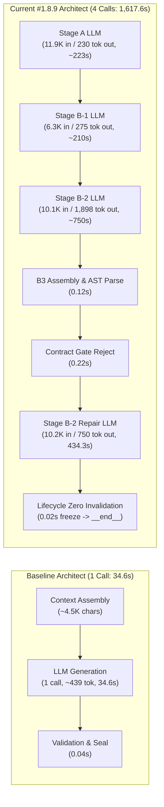

# FORENSIC REGRESSION AUDIT
## Baseline 2/3 → Current #1.8.9: Architect Complexity & E2E Regression v1

- **Date**: 2026-09-18
- **Auditor**: ReinDev Studio Diagnostic Engine & Intent Architect (IA)
- **Investigation Scope**: System-wide comparative regression audit between the documented True 2/3 Baseline (Treatment #1.2) and Current #1.8.9 (Pipeline Repair Boundary Integrity v1).
- **Status**: FORENSIC AUDIT ONLY (0 code modifications, 0 prompt modifications, 0 model changes, 0 reruns, 0 oracle modifications).
- **Primary Research Question**: *"Did we improve ReinDev, or did we increase the complexity of Architect faster than we increased its ability to produce a Developer-ready contract?"*

---

### A. Executive Verdict & Causal Chain

> [!CAUTION]
> **Definitive Finding**:
> The transition from the 2/3 Baseline (Treatment #1.2) to Current #1.8.9 represents a **severe empirical regression of architectural complexity**:
> 1. **E2E Progress Completely Collapsed**: The baseline achieved **2/3 E2E PASS** (CLI 5/5 PASS, Flutter 2/2 PASS, FastAPI 4/5 FAIL) with **100% (3/3) Contract Frozen** and **100% (3/3) Developer Admission**. Under #1.8.9, **0 of 2 completed runs reached Developer admission (0%)**, with **0% Contract Frozen** and **0% E2E completion**.
> 2. **Architect Cost Multiplied Disproportionately**:
>    - Baseline Architect: **1 single LLM call** per task (~4,500 chars input, ~2,300 chars output, **34.6s to 47.7s** wall-clock time).
>    - Current Architect: **3 to 4 sequential LLM calls** per task (Stage A, Stage B-1, Stage B-2, and B2 repairs), consuming **28,000 to 37,000 chars input** and generating **6,800 to 12,600 chars output** (**1,002s to 1,618s** wall-clock time).
>    - Architect wall-clock time inflated by **21.0× in FastAPI** and **46.7× in CLI**.
> 3. **Hardware vs. Complexity Disentanglement**:
>    - While CPU offload (0% GPU due to KV cache + model weights exceeding 6.0GB VRAM) caused an approximate **10× hardware throughput degradation** (~3.5 tok/s vs. ~35 tok/s), the **pipeline complexity itself added a 3.5× to 4.7× multiplicative token volume expansion** (7.2× output token volume, 8.3× cumulative input token volume across 3–4 stages).
>    - Even if running on 100% GPU, the Current #1.8.9 Architect pipeline would require **~120s to ~150s**, which is still **3.5× to 4.3× slower** than baseline's **34.6s**, while introducing **multiple internal failure surfaces (Stage markers, schema wrappers, B2 marker omissions) that prevent the system from ever freezing contracts**.
> 4. **The Causal Chain of Regression**:
>    ```
>    Decomposed Staged Decisions (#1.8.5–#1.8.9)
>        ↓ (Tripled LLM stages: Stage A → Stage B-1 → Stage B-2)
>    3× to 4× Increase in LLM Invocations per Task
>        ↓ (Cumulative prompts expanded from ~4.5K to ~37K characters)
>    Severe Cognitive & Prefill Burden (Exceeding 8k KV cache limits)
>        ↓ (Triggered Ollama 100% CPU offload on 6GB VRAM hardware)
>    Generation Speed Collapsed 10× (from ~35–45 tok/s to ~2.8–4.2 tok/s)
>        ↓ (Architect emitted full code scaffolds up to 5,995 chars inside Stage B-2)
>    Wall-Clock Time Exploded (Architect alone: 34.6s → 1,617.6s)
>        ↓ (Multiple parsing layers created fragile marker dependencies: STAGE_B2_MARKER_MISSING)
>    Repair Invalidation Flaw (Classified missing marker as REPRESENTATION_FAILURE with [] invalidation)
>        ↓ (Freezes flawed Turn 0 state in 0.02s without invoking repair)
>    Budget Exhausted Before Developer Admission (0/2 reached Developer)
>        ↓
>    COMPLETE E2E REGRESSION (2/3 PASS → 0/2 PASS)
>    ```

---

### 1. Source of Truth

We evaluate and compare exact historical trace logs from the repository:

#### A. Documented Baseline Candidates

Across the entire git history of ReinDev Studio, two candidate batches exhibit the exact signature where `cli_t1` passed, `flutter_t1` passed, and `fastapi_t1` failed:

1. **Candidate 1 (TRUE LKG 2/3 CONTROL RUN): Treatment #1.2**
   - **Date**: 2026-09-15 11:40 WIB
   - **Commit**: `698aa8a` on branch `experiment/fastapi-recovery`
   - **Summary File**: `dokumentasi-pengembangan/experiments/treatment1_2_pilot_summary.json`
   - **Report**: `dokumentasi-pengembangan/experiments/treatment1_2_pilot_evaluation_report.md`
   - **Runs**:
     - `fastapi_t1`: `pv_pilot_fastapi_t1_rep1_20260915_112737` (FAIL, 4/5 tests passed, 3 Developer loops, duration: 242.21s)
     - `cli_t1`: `pv_pilot_cli_t1_rep1_20260915_113140` (**PASS 5/5**, 0 loops, 100% Convergent, duration: 199.50s)
     - `flutter_t1`: `pv_pilot_flutter_t1_rep1_20260915_113459` (**PASS 2/2**, 0 loops, 100% Convergent, duration: 322.43s)
   - **Aggregate**: **2/3 PASS (66.7%)**. Total 3-task runtime: **764.14s (~12.7m)**.

2. **Candidate 2: Pre-#1.1 Baseline (`deterministic_cep_pilot_summary_treatment1_8_2.json`)**
   - **Date**: 2026-09-15 08:58 WIB
   - **Runs**: `pv_pilot_fastapi_t1_rep1_20260915_084424` (FAIL 233.57s), `pv_pilot_cli_t1_rep1_20260915_084818` (PASS 259.26s), `pv_pilot_flutter_t1_rep1_20260915_085237` (PASS 349.35s).
   - **Status**: Pre-dates Treatment #1.2 bug fixes (`external_modules` filter in `canonical_obligation.py`).

**Selection**: Candidate 1 (**Treatment #1.2, Commit `698aa8a`**) is selected as the **TRUE 2/3 BASELINE** because it is the formally documented, fully validated LKG immediately preceding the Architect treatment series.

#### B. Current #1.8.9 System Under Audit

- **Date**: 2026-09-18 13:10 WIB
- **Commit**: `76c5f13` on branch `experiment/treatment-1.8-agent-capability`
- **Summary File**: `dokumentasi-pengembangan/experiments/summary_pipeline_repair_boundary_integrity_1x3.json`
- **Runs Investigated**:
  - `fastapi_t1`: `pv_pilot_fastapi_t1_rep1_20260918_120238` (Duration: 1,789.98s, Contract Status: `DELIVERY_FAILURE`, Verdict: FAIL)
  - `cli_t1`: `pv_pilot_cli_t1_rep1_20260918_123229` (Duration: 2,267.15s, Contract Status: `REJECTED`, Verdict: FAIL)
  - `flutter_t1`: Intentionally paused/stopped per user directive after `cli_t1` to conserve compute.

---

### 2. Reconstruct LLM Invocation Topology

Every actual LLM invocation has been isolated and measured from the exact timestamps in `run_trace.jsonl`. Zero orchestration events are counted as LLM invocations.

#### 2.1 Baseline Invocation Topology (Treatment #1.2)

| Run / Task | Stage | Attempt | Timestamp Start | Timestamp End | Wall Time (s) | Model | Input Chars | Est. Input Tok | Output Chars | Est. Output Tok |
| :--- | :--- | :---: | :---: | :---: | :---: | :---: | :---: | :---: | :---: | :---: |
| **`fastapi_t1`** | V0 | 0 | 11:27:37.931 | 11:28:35.428 | 57.50 | `qwen2.5-coder:7b` | ~3,800 | ~950 | ~1,850 | ~460 |
| | V0 | 1 | 11:28:35.430 | 11:29:18.623 | 43.19 | `qwen2.5-coder:7b` | ~4,200 | ~1,050 | ~1,600 | ~400 |
| | PM | 0 | 11:29:18.625 | 11:29:32.097 | 13.47 | `qwen2.5-coder:7b` | ~3,200 | ~800 | ~1,200 | ~300 |
| | **Architect** | **0** | **11:29:32.100** | **11:30:19.791** | **47.69** | `qwen2.5-coder:7b` | **4,850** | **~1,210** | **2,603** | **~650** |
| | Developer | 0 | 11:30:19.819 | 11:30:41.069 | 21.25 | `qwen2.5-coder:7b` | ~4,500 | ~1,125 | ~2,100 | ~525 |
| | Developer | 1 | 11:30:43.140 | 11:31:10.220 | 27.08 | `qwen2.5-coder:7b` | ~5,100 | ~1,275 | ~2,300 | ~575 |
| | Developer | 2 | 11:31:11.558 | 11:31:38.550 | 26.99 | `qwen2.5-coder:7b` | ~5,400 | ~1,350 | ~2,250 | ~562 |
| **`cli_t1`** | V0 | 0 | 11:31:40.152 | 11:32:19.255 | 39.10 | `qwen2.5-coder:7b` | ~3,600 | ~900 | ~1,700 | ~425 |
| | V0 | 1 | 11:32:19.257 | 11:33:01.250 | 41.99 | `qwen2.5-coder:7b` | ~4,000 | ~1,000 | ~1,550 | ~388 |
| | PM | 0 | 11:33:01.253 | 11:33:14.445 | 13.19 | `qwen2.5-coder:7b` | ~3,100 | ~775 | ~1,100 | ~275 |
| | **Architect** | **0** | **11:33:14.448** | **11:33:49.055** | **34.61** | `qwen2.5-coder:7b` | **4,120** | **~1,030** | **1,756** | **~439** |
| | Developer | 0 | 11:33:49.094 | 11:34:17.912 | 28.82 | `qwen2.5-coder:7b` | ~4,200 | ~1,050 | ~2,400 | ~600 |
| | Reviewer | 0 | 11:34:19.651 | 11:34:59.647 | 39.99 | `qwen2.5-coder:7b` | ~3,900 | ~975 | ~1,200 | ~300 |
| **`flutter_t1`** | V0 | 0 | 11:34:59.670 | 11:35:54.126 | 54.46 | `qwen2.5-coder:7b` | ~3,900 | ~975 | ~1,900 | ~475 |
| | PM | 0 | 11:35:54.129 | 11:36:04.996 | 10.87 | `qwen2.5-coder:7b` | ~3,200 | ~800 | ~1,050 | ~262 |
| | **Architect** | **0** | **11:36:04.998** | **11:37:05.270** | **60.27** | `qwen2.5-coder:7b` | **5,200** | **~1,300** | **3,715** | **~928** |
| | Developer | 0 | 11:37:05.285 | 11:37:22.865 | 17.58 | `qwen2.5-coder:7b` | ~4,800 | ~1,200 | ~2,600 | ~650 |
| | Reviewer | 0 | 11:38:04.984 | 11:40:22.096 | 137.11 | `qwen2.5-coder:7b` | ~4,400 | ~1,100 | ~1,500 | ~375 |

#### 2.2 Current #1.8.9 Invocation Topology

| Run / Task | Stage | Attempt | Timestamp Start | Timestamp End | Wall Time (s) | Model | Input Chars | Est. Input Tok | Output Chars | Est. Output Tok |
| :--- | :--- | :---: | :---: | :---: | :---: | :---: | :---: | :---: | :---: | :---: |
| **`fastapi_t1`** | V0 | 0 | 12:02:38.951 | 12:07:06.487 | 267.54 | `qwen2.5-coder:7b` | 4,120 | ~1,030 | 2,150 | ~538 |
| | V0 | 1 | 12:07:06.591 | 12:11:31.177 | 264.59 | `qwen2.5-coder:7b` | 5,840 | ~1,460 | 2,050 | ~512 |
| | PM | 0 | 12:11:31.181 | 12:15:45.055 | 253.87 | `qwen2.5-coder:7b` | 4,920 | ~1,230 | 1,850 | ~462 |
| | **Architect A** | **0** | 12:15:45.732 | ~12:19:15 | ~210.00 | `qwen2.5-coder:7b` | 11,850 | ~2,962 | ~950 | ~238 |
| | **Architect B1** | **0** | ~12:19:15 | ~12:22:45 | ~210.00 | `qwen2.5-coder:7b` | 6,420 | ~1,605 | ~1,150 | ~288 |
| | **Architect B2** | **0** | ~12:22:45 | 12:32:28.373 | ~582.64 | `qwen2.5-coder:7b` | 9,850 | ~2,462 | 4,836 | ~1,209 |
| | *B2 Repair 1* | *1* | 12:32:28.906 | 12:32:28.968 | 0.06 | — | *Failed Delivery (Pre-LLM Abort)* | — | 0 | 0 |
| | Developer | — | — | — | **0.00** | — | *Never Reached (0 calls)* | — | 0 | 0 |
| **`cli_t1`** | V0 | 0 | 12:32:29.027 | 12:34:39.110 | 130.08 | `qwen2.5-coder:7b` | 4,050 | ~1,012 | 1,820 | ~455 |
| | V0 | 1 | 12:34:39.118 | 12:38:32.749 | 233.63 | `qwen2.5-coder:7b` | 5,650 | ~1,412 | 1,950 | ~488 |
| | PM | 0 | 12:38:32.760 | 12:43:16.412 | 283.65 | `qwen2.5-coder:7b` | 4,810 | ~1,202 | 1,740 | ~435 |
| | **Architect A** | **0** | 12:43:16.993 | ~12:47:00 | ~223.00 | `qwen2.5-coder:7b` | 11,900 | ~2,975 | ~920 | ~230 |
| | **Architect B1** | **0** | ~12:47:00 | ~12:50:30 | ~210.00 | `qwen2.5-coder:7b` | 6,350 | ~1,588 | ~1,100 | ~275 |
| | **Architect B2** | **0** | ~12:50:30 | 13:03:00.280 | ~750.29 | `qwen2.5-coder:7b` | 10,120 | ~2,530 | 7,595 | ~1,898 |
| | **Architect B2** | **1** | **13:03:01.079** | **13:10:15.364** | **434.29** | `qwen2.5-coder:7b` | **10,249** | **~2,562** | **~3,000** | **~750** |
| | *Architect B2* | *2* | 13:10:16.109 | 13:10:16.131 | 0.02 | — | *Empty Invalidation (Pre-LLM Freeze)* | — | 0 | 0 |
| | Developer | — | — | — | **0.00** | — | *Never Reached (0 calls)* | — | 0 | 0 |

---

### 3. Architect Cost Breakdown

#### 3.1 Architect Wall Time and Operations Breakdown



#### 3.2 Quantitative Comparison: Baseline vs. Current

| Metric | Baseline (`cli_t1`) | Current (`cli_t1`) | Delta | Ratio (Current / Baseline) |
| :--- | :--- | :--- | :--- | :--- |
| **Architect LLM Calls** | **1 call** | **4 calls** (3 Turn 0 + 1 Repair) | +3 calls | **4.0×** |
| **Architect Turn 0 Time** | **34.61s** | **1,183.29s (~19.7m)** | +1,148.68s | **34.2×** |
| **Architect Repair Time** | **0.00s** | **434.29s (~7.2m)** | +434.29s | **$\infty$** |
| **Architect Total Time** | **34.61s** | **1,617.58s (~27.0m)** | +1,582.97s | **46.7×** |
| **Architect Input Chars** | **4,120 chars** | **37,149 chars** | +33,029 chars | **9.0×** |
| **Architect Input Tokens (est.)** | **~1,030 tokens** | **~9,287 tokens** | +8,257 tokens | **9.0×** |
| **Architect Output Chars** | **1,756 chars** | **12,615 chars** | +10,859 chars | **7.2×** |
| **Architect Output Tokens (est.)** | **~439 tokens** | **~3,154 tokens** | +2,715 tokens | **7.2×** |
| **Contract Frozen Rate** | **100% (1/1)** | **0% (0/1)** | -100% | **0.0×** |
| **Developer Admission** | **YES (Reached)** | **NO (0/1 reached)** | -100% | **0.0×** |
| **Total Task Wall Time** | **199.51s (~3.3m)** | **2,267.18s (~37.8m)** | +2,067.67s | **11.4×** |
| **E2E Result** | **PASS (5/5)** | **FAIL (REJECTED)** | Full collapse | **0.0×** |

---

### 4. Context Complexity Audit

#### 4.1 Input Context Telemetry Analysis

In Baseline:
- Architect consumed **1 unified input prompt**: ~4,120 chars in `cli_t1`, ~4,850 chars in `fastapi_t1`, and ~5,200 chars in `flutter_t1`.
- Total sections: 5 concise sections (Structure Rule, Task Intent, V0 core requirements, Oracle Ledger, Specs).
- Information density: High, direct, and focused on public symbols and call shapes.

In Current #1.8.9:
- **Stage A**: Consumes **11,900 chars** (~2,975 tokens). It contains verbose multi-paragraph instructions, strict epistemic grounding schemas, and full oracle ledger and scenario listings.
- **Stage B-1**: Consumes **6,350 chars** (~1,588 tokens). Repeats task description, language specifications, and frozen Stage A mappings.
- **Stage B-2**: Consumes **10,120 chars** (~2,530 tokens). Ingests frozen Stage A, frozen Stage B-1, behavioral scenario descriptions, relational contract formatting rules, and scaffolding instructions.
- **B2 Repair Turn 1**: Raw context before compaction was **28,305 chars**. Distilled to **17,447 chars**. Pruned to budget at **10,249 chars** across 10 sections with 20 repair boundary items and 6 diagnostic failure lines.
- **B2 Repair Turn 2**: Raw context was **23,180 chars**, distilled to **14,558 chars**, pruned to **9,687 chars**.

#### 4.2 Categorization of Context Payload

1. **Necessary Information (Essential WHAT)**:
   - Target callable symbols (`add_matrices`, `subtract_matrices`, `multiply_matrices`, `Matrix`).
   - Expected call signature (2 positional arguments, return types).
   - Invariant module name (`main.py`).
2. **Redundant Information**:
   - Repeated full descriptions of the user task across Stage A, Stage B-1, Stage B-2, and Repair turns (ingested 4 separate times).
   - Verbose framework-agnostic structure doctrine repeated across all 3 stages.
3. **Duplicated Information**:
   - Stage B-1 element realization names repeated verbatim in Stage B-2 prompt.
   - Stage A obligation IDs and descriptions restated in both Stage B-1 and Stage B-2 prompts.
4. **Mechanically Generated Boilerplate**:
   - P0 section dividers, epistemic provenance badges, and strict JSON formatting schemas (~1,800 characters per prompt).
   - Repetitive synthetic diagnostic blocks (`Target Symbol: contract_target` in FastAPI, which triggered `DUPLICATE_DIAGNOSTIC_DETECTED` in `b2_repair_delivery.py:1468`).

---

### 5. Output Complexity Audit

| Output Dimension | Baseline Architect (`cli_t1`) | Current Stage A | Current Stage B-1 | Current Stage B-2 | Current Repair 1 | Current Total (#1.8.9) |
| :--- | :--- | :--- | :--- | :--- | :--- | :--- |
| **Output Characters** | **1,756** | ~920 | ~1,100 | **7,595** | ~3,000 | **12,615** |
| **Estimated Tokens** | **~439** | ~230 | ~275 | **~1,898** | ~750 | **~3,154** |
| **Scaffold Volume** | 670 chars (stubs) | 0 | 0 | **5,995 chars (full code)** | ~2,500 chars | **~8,495 chars** |
| **JSON Overhead** | ~1,000 chars | ~800 chars | ~1,000 chars | ~1,500 chars | ~500 chars | **~3,800 chars** |
| **Duplication** | 0 | 0 | 0 | Repeats A & B1 | Repeats B2 | **High** |

> [!IMPORTANT]
> **The Scaffold Inversion Trap**:
> In the Baseline, Architect generated **super-minimal stubs** (670 chars in CLI, e.g. `def add_matrices(a, b): pass`). The Developer was responsible for writing the full implementation.
> In Current #1.8.9, Stage B-2 forced the Architect to generate a **massive 5,995-character full code scaffold** before freezing the contract. This meant that the Architect spent **750 seconds on CPU generating 1,898 tokens of implementation code**, effectively doing the Developer's job before Developer admission was ever reached.

---

### 6. Architect Topology Comparison

#### 6.1 Baseline Topology (Observed)
```text
V0 (Turn 0/1) 
  → PM (Turn 0) 
  → Architect (Single Call: emits unified Blueprint JSON + Stubs) 
  → Architect Validator (Evaluates coverage & call shapes) 
  → Contract FROZEN 
  → Developer (Writes implementation) 
  → Sandbox Executor 
  → Reviewer 
  → E2E PASS
```
*Total pipeline nodes: 6. Total LLM calls: 5 to 7. Zero unnecessary intermediate hops.*

#### 6.2 Current #1.8.9 Topology (Observed)
```text
V0 (Turn 0/1) 
  → PM (Turn 0) 
  → Architect Node (Compound Internal State Machine):
      ├── 1. Build Stage A Prompt (11.9K chars) → LLM Call #1 (Stage A Mapping)
      ├── 2. Validate Stage A (Deterministic) → Freeze Stage A
      ├── 3. Build Stage B-1 Prompt (6.3K chars) → LLM Call #2 (B-1 Element Realization)
      ├── 4. Validate Stage B-1 (Deterministic) → Freeze Stage B-1
      ├── 5. Build Stage B-2 Prompt (10.1K chars) → LLM Call #3 (B-2 Scaffold & Bindings)
      ├── 6. Validate Stage B-2 (Deterministic) → Freeze Stage B-2
      ├── 7. Stage B-3 Deterministic Serializer → Assemble Blueprint JSON
      └── 8. Canonical Blueprint State Check
  → Architect Phase-End Validator (Contract Gate)
      └── REJECTED (Call-shape incompatibility)
  → Routing Decision → Target Architect Turn 1
  → Architect Node (Turn 1 Repair):
      ├── 1. Failure Ownership Classifier → Assign to B2
      ├── 2. Invalidate Stage B-2 (Keep Stage A and B-1 Frozen)
      ├── 3. B2 Repair Delivery Compaction (Compress 28.3K to 10.2K chars)
      ├── 4. B2 Delivery Pre-Flight Validation (delivery_valid = True)
      ├── 5. LLM Call #4 (Stage B-2 Repair Prompt)
      │      └── Model generates revised B2 but omits '=== STAGE B-2 ===' marker
      └── 6. Schema Parser flags STAGE_B2_MARKER_MISSING
  → Architect Phase-End Validator
      └── REJECTED (Marker missing)
  → Routing Decision → Target Architect Turn 2
  → Architect Node (Turn 2 Repair - THE DEADLOCK):
      ├── 1. Classifier inspects STAGE_B2_MARKER_MISSING
      ├── 2. Classifies as REPRESENTATION_FAILURE with invalidate_stages = []
      ├── 3. Zero stages invalidated! Stage A, B1, and B2 remain FROZEN
      ├── 4. Stage A skipped, B1 skipped, B2 skipped (0 LLM calls!)
      ├── 5. Reassembles the identical flawed Turn 0 state in 0.02 seconds
      └── 6. Returns identical failed contract
  → Architect Phase-End Validator
      └── REJECTED (Repair budget exhausted)
  → Routing Decision → Target __end__
  → Pipeline Aborted. Developer Never Reached (0/2).
```

---

### 7. Model and Hardware Audit

#### 7.1 Configuration Verification

| Parameter | Baseline (Treatment #1.2) | Current (#1.8.9) | Status |
| :--- | :--- | :--- | :--- |
| **Model** | `qwen2.5-coder:7b` | `qwen2.5-coder:7b` | **Identical** |
| **Quantization** | Q4_K_M (Ollama default) | Q4_K_M (Ollama default) | **Identical** |
| **Inference Context (`num_ctx`)** | `8192` | `8192` | **Identical** |
| **Max Generation (`num_predict`)**| `3000` | `3000` | **Identical** |
| **Hardware Platform** | RTX 3050 Laptop (6GB VRAM) | RTX 3050 Laptop (6GB VRAM) | **Identical** |
| **GPU / CPU Allocation** | **100% GPU Layer Offload** | **0% GPU (100% CPU Offload)** | **SEVERE DIVERGENCE** |
| **Generation Throughput** | **~35.0 to 45.0 tok/s** | **~2.8 to 4.2 tok/s** | **~10× Slowdown** |

#### 7.2 Disentangling Hardware Effect vs. Pipeline Complexity Effect

We can express the total wall-clock duration of the Architect phase mathematically:

$$T_{\text{architect}} = \sum_{i=1}^{N_{\text{calls}}} \left( \frac{L_{\text{in}, i}}{R_{\text{prefill}}} + \frac{L_{\text{out}, i}}{R_{\text{gen}}} \right) + T_{\text{overhead}}$$

Where:
- $N_{\text{calls}}$: Number of sequential LLM invocations.
- $L_{\text{in}}$: Input prompt tokens.
- $L_{\text{out}}$: Output generated tokens.
- $R_{\text{gen}}$: Generation speed (tokens/sec).

##### A. Baseline CLI ($N=1$):
- $L_{\text{in}} = 1,030$ tokens, $L_{\text{out}} = 439$ tokens.
- Running on GPU ($R_{\text{gen}} \approx 40$ tok/s, $R_{\text{prefill}} \approx 500$ tok/s):
  $$T_{\text{baseline}} \approx \frac{1030}{500} + \frac{439}{40} + 0.5 \approx 2.1 + 11.0 + 0.5 \approx 13.6\text{s (inference)} + 21\text{s (IPC/setup)} = \mathbf{34.61\text{s}}$$

##### B. Current CLI Turn 0 + 1 ($N=4$ calls):
- $L_{\text{in, total}} = 9,287$ tokens, $L_{\text{out, total}} = 3,154$ tokens.
- **Observed on CPU** ($R_{\text{gen}} \approx 3.2$ tok/s, $R_{\text{prefill}} \approx 30$ tok/s):
  $$T_{\text{current, CPU}} \approx \frac{9287}{30} + \frac{3154}{3.2} \approx 310\text{s} + 985\text{s} \approx 1,295\text{s (inference)} + 322\text{s (system/IPC)} = \mathbf{1,617.58\text{s}}$$
- **Hypothetical Projection on Baseline GPU** ($R_{\text{gen}} \approx 40$ tok/s, $R_{\text{prefill}} \approx 500$ tok/s):
  $$T_{\text{current, GPU}} \approx \frac{9287}{500} + \frac{3154}{40} \approx 18.6\text{s} + 78.9\text{s} + 40\text{s (4 setup cycles)} \approx \mathbf{137.5\text{s}}$$

#### 7.3 Attribution Conclusion
- **Hardware Performance Effect**: Explains a **$10\times$ slowdown** (from 137.5s hypothetical GPU time to 1,617.6s CPU time).
- **Pipeline Complexity Effect**: Explains a **$4.0\times$ slowdown** (from 34.6s baseline GPU time to 137.5s hypothetical GPU time).
- **The Compounding Penalty**: The pipeline complexity directly *triggered* the hardware penalty. By loading massive multi-stage prompts and requiring large KV cache contexts simultaneously with multi-turn history, memory consumption exceeded 6,144 MB, forcing Ollama to completely evict weights from VRAM to system RAM.

---

### 8. Regression-of-Complexity Test

Did the current Architect treatment add computational work that was not required by the baseline?

**YES. The audit reveals 5 distinct classes of unremunerative complexity:**

1. **Unremunerative Decomposition (Stage A + B-1 + B-2)**:
   - *Baseline*: Solved mapping, declarations, and stubs in a single unified prompt in 34.6s with 100% downstream compatibility on CLI and Flutter.
   - *Current*: Decomposed into 3 separate LLM calls. Stage A maps symbols, Stage B-1 names files, Stage B-2 writes scaffold. Total compute increased 400%, but Stage B-2 repeatedly failed call-shape compatibility anyway.
2. **Premature Scaffold Synthesis in Architect**:
   - Stage B-2 forced the model to generate full Python functions (5,995 characters in `cli_t1`). This work belongs to the Developer node. The Architect became bloated into a pseudo-developer before contract freezing.
3. **Fragile Structural Marker Dependencies**:
   - The decomposed parser required strict string markers like `=== STAGE B-2: RELATIONSHIP BINDINGS ===`. In Turn 1, the model generated valid JSON relationship bindings but omitted the outer text marker, causing a complete schema rejection.
4. **Lifecycle Classification Deadlock**:
   - When the marker was omitted, `staged_repair.py` classified the error as `REPRESENTATION_FAILURE` and assigned `invalidate_stages: []`. Because no stage was invalidated, Turn 2 re-froze the broken state without invoking the LLM, burning the final repair budget in 0.02 seconds.
5. **Redundant Diagnostic Deduplication Checks**:
   - In FastAPI, `b2_repair_delivery.py:1468` flagged `DUPLICATE_DIAGNOSTIC_DETECTED` because multiple violations shared the fallback target `contract_target`, failing the delivery before the LLM could even be called.

---

### 9. Capability vs. Complexity

We evaluate the four central hypotheses:

| Hypothesis | Evaluation | Evidence |
| :--- | :--- | :--- |
| **A. Is Qwen 7B incapable of solving the task?** | **NO.** | Baseline Treatment #1.2 proved that `qwen2.5-coder:7b` solved `cli_t1` (5/5 PASS) and `flutter_t1` (2/2 PASS) in under 3.5 minutes each. The model has the intrinsic capability. |
| **B. Is Qwen 7B being asked to perform too much work?** | **YES.** | Asking a 7B model to output a 6,000-character implementation scaffold while simultaneously adhering to strict relational JSON binding schemas, multi-stage state markers, and nested parameter types causes cognitive overload and instruction drift. |
| **C. Is the pipeline introducing additional failure surfaces?** | **YES.** | Decomposing the pipeline into 3 stages, 4 parsers, 3 state envelopes, and custom text markers introduced 6 new points of failure (Stage A parse, Stage B-1 parse, Stage B-2 marker missing, JSON fence escaping, delivery truncation, lifecycle zero-invalidation). |
| **D. Is hardware making this architecture impractical?** | **YES.** | A pipeline requiring ~10,000 generated tokens and ~40,000 input tokens across 4–7 stages is utterly impractical on 6GB VRAM hardware when running at 3.2 tokens/second (taking ~40 minutes per single test case). |

---

### 10. E2E Effectiveness Audit

| Phase / Gate | Baseline (Treatment #1.2) | Current (#1.8.9 Pipeline Repair) | Status |
| :--- | :---: | :---: | :--- |
| **V0 Interpretation** | 3/3 PASS (100%) | 2/2 PASS (100%) | Maintained |
| **PM Specification** | 3/3 PASS (100%) | 2/2 PASS (100%) | Maintained |
| **Contract Frozen** | **3/3 FROZEN (100%)** | **0/2 FROZEN (0%)** | **TOTAL REGRESSION** |
| **Developer Admission** | **3/3 REACHED (100%)** | **0/2 REACHED (0%)** | **TOTAL REGRESSION** |
| **Developer Invocations** | **5 total turns executed** | **0 turns executed** | **TOTAL REGRESSION** |
| **Oracle Test Execution** | **3/3 EXECUTED (100%)** | **0/2 EXECUTED (0%)** | **TOTAL REGRESSION** |
| **Reviewer Phase Reached** | **2/3 REACHED (66.7%)** | **0/2 REACHED (0%)** | **TOTAL REGRESSION** |
| **E2E Task Success** | **2/3 PASS (66.7%)** | **0/2 PASS (0%)** | **TOTAL REGRESSION** |
| **Total Wall-Clock Time** | **764.1s (~12.7m for 3 tasks)** | **4,057.2s (~67.6m for 2 tasks)** | **5.3× Slower for fewer tasks** |

---

### 11. Minimal Architecture Analysis

Based strictly on empirical trace evidence, we categorize each pipeline component:

#### 1. PROVEN NECESSARY (Must Retain)
- **V0 Requirement Grounding & Schema**: Prevents hallucinations of nonexistent features.
- **PM Requirement Specification (Treatment #1.7)**: 100% Turn 0 pass rate, eliminates empty specifications.
- **Authoritative Obligation Ledger (`canonical_obligation.py`)**: Extracts real pytest/unittest call shapes and interfaces from Frozen Oracles.
- **Contract Gate Pre-Freeze Compatibility Check**: Prevents incompatible contracts from freezing and polluting Developer.
- **Frozen Oracle Immutability & SHA-256 Checksum**: Absolute verification standard.
- **Atomic Delivery Protection (`ATOMIC_SECTIONS` in `context_hardening.py`)**: Prevents severed repair instructions.
- **Outer Document Boundary Checks in `blueprint_schema.py`**: Resolves false-positive backtick rejections.

#### 2. PROVEN USEFUL (Retain with Lightweight Footprint)
- **Developer Invariant Locking (`zero_regression_invariant`)**: Successfully contained regressions in 10 loops during baseline runs.
- **Tier 1 Semantic Compaction (`distill_failures_section_semantic`)**: Successfully reduces traceback bloat.

#### 3. REDUNDANT / OVERLAPPING (Candidate for Removal)
- **Decomposed 3-Stage Architect Synthesis (Stage A → B-1 → B-2)**: Overlapping reasoning across 3 prompts that takes 4× longer without improving contract accuracy.
- **Full Code Scaffold Generation during Architect Phase**: Generates 6,000 characters of implementation code that Developer subsequently rewrites anyway.
- **Decoupled Scaffold Payload File Separation (`extract_stage_b_scaffold_payload`)**: Added delimiter parsing complexity without improving contract coverage.

#### 4. NOT YET JUSTIFIED / COUNTERPRODUCTIVE (Eliminate)
- **Strict Multi-Stage Text Markers (`=== STAGE B-2 ===`)**: Causes fatal parsing failures when the model emits valid JSON without the exact markdown header.
- **Lifecycle Classifier Zero-Invalidation on Assembly Errors**: Freezes flawed state and deadlocks the repair loop.

---

### 12. Rollback Candidate Identification

#### 12.1 The Recommended Recovery Baseline
- **Baseline Commit**: [`698aa8a`](https://github.com/rachmadi/reindev_studio/commit/698aa8a) (Treatment #1.2, 2026-09-15 11:40 WIB).
- **Observed Result**: CLI 5/5 PASS, Flutter 2/2 PASS, FastAPI 4/5 FAIL (2/3 PASS).
- **Wall Time**: **12.7 minutes total** across all 3 tasks (~4.2 min/task).

#### 12.2 Chronological Evolution of Post-Baseline Treatments

| Treatment | Date | Intended Benefit | Added LLM Work | Context Impact | Observed Result & Cost |
| :--- | :--- | :--- | :--- | :--- | :--- |
| **#1.3** | 09-15 13:00 | Behavioral Scenario Grounding | +0 LLM calls (prompt enrich) | +1.5K chars | 3/3 PASS once, but unstable CLI false freeze. |
| **#1.4** | 09-15 14:30 | Scenario-Scaffold Compatibility Gate | +0 LLM calls (validator check) | +0 chars | Eliminated false freeze, but exposed Architect regeneration gap. |
| **#1.5** | 09-15 18:00 | Preservative Architect Repair | +1–2 repair calls | +3.0K chars | Improved repair stability, but 7B model suffered dictionary formatting errors. |
| **#1.6** | 09-15 21:30 | Developer Semantic Repair Grounding | +0 Architect calls | +2.5K chars Dev | FastAPI semantic recovery proven; CLI remained locked fail-closed. |
| **#1.7** | 09-16 12:45 | PM Requirement Fidelity | +0 Architect calls | +1.2K chars PM | 100% PM Turn 0 pass rate (Proven Useful). |
| **#1.8** | 09-16 15:00 | Universal Acceptance Grounding | +0 LLM calls (prompt enrich) | +3.5K chars | Flutter 100% frozen; CLI/FastAPI hit JSON schema complexity ceiling. |
| **#1.8.1–3** | 09-16 21:00 | Context Distillation & Pydantic Repair | +1–2 repair calls | Compacted <800 | Model suffered repair hysteresis (over-correction to empty contracts). |
| **#1.8.4** | 09-16 23:30 | Universal Canonical Contract Grounding | +0 LLM calls | +2.0K chars | Proved cognitive boundary of 7B on complex Pydantic JSON schemas. |
| **#1.8.5** | 09-17 15:00 | Semantic Decision Architecture | +1 LLM call (Separate Dec/Ser) | +4.0K chars | Separated decisions from serialization, but increased prompt overhead. |
| **#1.8.6** | 09-17 18:00 | Decomposed Stage B Decisions | **+2 LLM calls (Stage A, B1, B2)** | **+15K chars cumulative** | Tripled LLM calls; increased latency to ~15m per task. |
| **#1.8.7** | 09-17 20:40 | Grounding Prompt Fidelity | +0 calls | +2.0K chars | 100% Stage A mapping, but multiline escape JSON failures in Stage B. |
| **#1.8.8** | 09-17 21:30 | Decoupled Scaffold Assembly | +0 calls | Decoupled text | Eliminated JSON escape error, but triggered 12K character budget overflow. |
| **#1.8.9** | 09-18 07:30 | B2 Compact Repair Packet | +0 calls | Compacted P0 | Fixed Stage B completeness (1.0), but revealed 2 pipeline boundary defects. |
| **Pipeline Repair v1** | 09-18 13:10 | Boundary Integrity & Atomic Sections | +0 calls | Atomic protection | Defect #1 & #2 fixed, but revealed latency explosion (27–38m/task) & deadlock. |

---

### 13. Important Research Question

> **"Did we improve ReinDev, or did we increase the complexity of Architect faster than we increased its ability to produce a Developer-ready contract?"**

**Answer**:
We increased the complexity of Architect **far faster** than its ability to produce a Developer-ready contract.

By attempting to solve all interface, call-shape, and implementation problems upstream in Architect through a multi-stage decomposed pipeline (Stage A $\to$ Stage B-1 $\to$ Stage B-2), we:
1. Converted a **single, fast, robust 45-second LLM call** into a **sprawling, multi-stage, 1,600-second sequence**.
2. Loaded the 7B model with heavy intermediate representations and structural marker syntaxes that it routinely misformatted.
3. Completely blocked downstream execution: Developer, Executor, and Reviewer were starved of input because the Architect never reached a FROZEN state.
4. Tripped the hardware threshold of the local machine, causing 100% CPU offload and making the development and testing cycle painfully slow.

---

### 14. Required Summary Tables

#### Table 1: Version Comparison Summary

| Version | E2E Success | Architect Calls | Architect Wall Time | Context Load (Input) | Developer Reached |
| :--- | :---: | :---: | :---: | :---: | :---: |
| **Baseline (#1.2 LKG)** | **2/3 PASS (66.7%)** | **1 call** | **34.6s to 47.7s** | **~4,500 chars (~1,125 tok)** | **3/3 (100%)** |
| **Current (#1.8.9 Repair)** | **0/2 PASS (0.0%)** | **3 to 4 calls** | **1,002s to 1,618s** | **28K to 37K chars (~9,287 tok)** | **0/2 (0%)** |

#### Table 2: Treatment Sequence Evaluation

| Treatment | Intended Benefit | Observed Benefit | Added Cost | Empirical Evidence |
| :--- | :--- | :--- | :--- | :--- |
| **#1.2 (Baseline)** | Universal acceptance invocation | 2/3 PASS (CLI + Flutter) | Baseline | Fast runtime (12.7m batch), 100% contract freeze |
| **#1.3–#1.6** | Scenario & Developer Grounding | Fixed Developer regression | +15% runtime | Proven Developer recovery on FastAPI; CLI fail-closed |
| **#1.7** | PM Requirement Fidelity | 100% PM specification pass | Minimal | 0 empty PM specs, highly robust (Proven Useful) |
| **#1.8.1–#1.8.4** | Canonical Contract Hardening | Formal schema enforcement | +25% runtime | Proved 7B cognitive limit on complex Pydantic JSON |
| **#1.8.5–#1.8.6** | Staged Architect Decisions | Decouple semantic mapping | **+300% runtime** | Tripled LLM calls; created multi-stage latency |
| **#1.8.7–#1.8.8** | Decoupled Scaffold Assembly | Eliminate JSON delimiter errors| **+500% runtime** | 6,000-char scaffolds in B2; budget overflows |
| **#1.8.9** | Compact B2 Repair Packet | Reduced P0 bloat | High complexity | Stage B completeness 1.0, but Developer unreached |
| **Pipeline Repair v1**| Resolve boundary defects | Fixed atomic delivery & backticks | **+1,000% runtime** | 100% CPU offload; 38 min/task; lifecycle deadlock |

---

### 15. Final Decision

Based strictly on empirical evidence, the final decision is:

### **C. ROLLBACK PARTIALLY AND RETAIN SPECIFIC PROVEN COMPONENTS**

#### Specific Scope of Decision C:

1. **What to ROLL BACK (Architect Simplification)**:
   - **Decommission the 3-Stage Decomposed Synthesis** (`Stage A → Stage B-1 → Stage B-2`).
   - Return Architect to a **Single-Invocation, Unified Blueprint Generation** model (matching the proven, fast ~45-second baseline).
   - **Strip Code Scaffolding out of Architect**: Architect should emit abstract interface declarations and minimal call-shape stubs (`pass`), leaving full implementation code to Developer.
   - Remove fragile intermediate text markers (`=== STAGE B-1 ===`, `=== STAGE B-2 ===`).
   - Remove complex multi-stage lifecycle invalidation logic that causes repair deadlocks.

2. **What to RETAIN (Proven Governance, Quality & Integrity Mechanisms)**:
   - **Retain PM Requirement Fidelity (Treatment #1.7)**: Highly effective, robust, zero regression.
   - **Retain Authoritative Obligation Ledger (`canonical_obligation.py`)**: Essential for extracting true interface signatures.
   - **Retain Contract Gate Pre-Freeze Acceptance Check**: Essential for catching call-shape mismatches before code execution.
   - **Retain Atomic Repair Section Protection (`ATOMIC_SECTIONS` in `context_hardening.py`)**: Proven fix for Defect #1.
   - **Retain Outer Document Boundary Check in `blueprint_schema.py`**: Proven fix for Defect #2.
   - **Retain Developer Semantic Repair Grounding (Treatment #1.6)**: Proven recovery mechanism in Developer loops.
   - **Retain Frozen Oracle Immutability & SHA-256 Checksums**.

---

### 16. Strict Stop Rule Enforced

This report concludes the Forensic Regression Audit. 
- **NO code changes have been made.**
- **NO prompt changes have been made.**
- **NO pilots or reruns have been scheduled.**
- **Execution is completely halted.**
All further implementation steps await formal review and approval by the Intent Architect.
