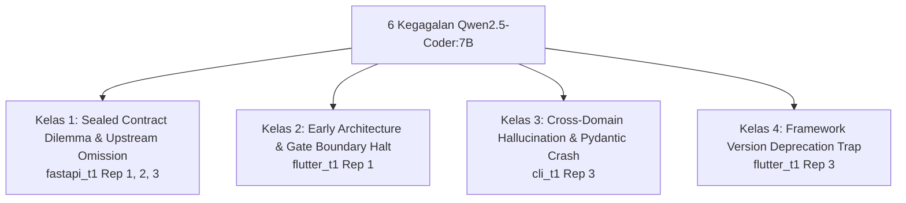

# LAPORAN AUDIT FORENSIK LENGKAP PENYEBAB KEGAGALAN (6 RUNS)
## Evaluasi Matriks 3x3 Pilot Fase V0–V6 — Model: `qwen2.5-coder:7b`

---

### EXECUTIVE SUMMARY

Pada pengujian matriks 3x3 (9 eksperimen penuh) menggunakan model `qwen2.5-coder:7b`, sistem mencatat hasil:
- **Total Lulus**: **3 / 9 Run (33.3%)** (`cli_t1` Rep 1 & 2; `flutter_t1` Rep 2)
- **Total Gagal**: **6 / 9 Run (66.7%)** (`fastapi_t1` Rep 1, 2, 3; `flutter_t1` Rep 1 & 3; `cli_t1` Rep 3)

Audit forensik ini membedah secara mendalam seluruh bukti deterministik dari `run_trace.jsonl`, AST scan, log eksekutor pytest/dart, dan evaluasi gerbang fase (V0 hingga V6) untuk **ke-6 run yang mengalami kegagalan**.

---

### RINGKASAN MATRIKS KEGAGALAN

| Task ID | Run ID | Status Akhir | Loops | Tests | Klasifikasi Kegagalan | Akar Masalah Utama |
| :--- | :--- | :---: | :---: | :---: | :--- | :--- |
| **`fastapi_t1`** (Rep 1) | `..._003225` | **FAIL** | 5 | 0/5 | **A. Developer Failure** | Omission endpoint `GET` oleh PM/Architect & Schema mismatch (`stock`/`price` vs `quantity`) |
| **`fastapi_t1`** (Rep 2) | `..._004348` | **FAIL** | 5 | 0/5 | **A. Developer Failure** | Identik Rep 1 (Terjebak *Sealed Contract Dilemma*, 422 Unprocessable & 405 Method Not Allowed) |
| **`fastapi_t1`** (Rep 3) | `..._005624` | **FAIL** | 5 | 1/5 | **A. Developer Failure** | Identik Rep 1 & 2 (In-memory store parsial, namun `GET` tetap tidak ada dalam kontrak) |
| **`flutter_t1`** (Rep 1) | `..._004038` | **FAIL** | **0** | 0/2 | **C. Contract Failure** | Architect gagal validasi Pydantic Blueprint Schema & Contract Gate P0-2.1 (Halt di V2) |
| **`cli_t1`** (Rep 3) | `..._010042` | **FAIL** | 5 | 0/5 | **A. Developer Failure** | Kontaminasi domain FastAPI ke CLI + Pydantic `BaseModel` menolak positional arguments |
| **`flutter_t1`** (Rep 3) | `..._010754` | **FAIL** | 5 | 0/1 | **A. Developer Failure** | Terjebak sintaks *deprecated* Material 2 (`headline6`/`bodyText2`) pada Flutter Modern (M3) |

---

### TAKSONOMI 4 KELAS KEGAGALAN

Berdasarkan bukti jejak eksekusi, seluruh 6 kegagalan terbagi ke dalam **4 kelas patologi**:



1. **Kelas 1: The Sealed Contract Dilemma & Upstream Specification Omission (50% - 3 Runs)**
   Terjadi saat PM dan Architect secara konsisten mengabaikan operasi fundamental REST (misal: `GET /products` tidak dideklarasikan). Ketika kontrak disahkan (*FROZEN*), Developer dilarang keras membuat antarmuka spekulatif di luar kontrak, menjebak Developer dalam kegagalan deterministik.
2. **Kelas 2: Early Architectural Boundary Halt (16.7% - 1 Run)**
   Kegagalan murni pada fase Architect di mana blueprint melanggar skema dan gagal memenuhi gerbang integritas kontrak P0-2.1, sehingga eksekusi dihentikan bersih pada V2 tanpa memanggil Developer.
3. **Kelas 3: Cross-Domain Archetype Hallucination (16.7% - 1 Run)**
   Kerusakan asosiasi prompt pada model kecil (7B), di mana model menyuntikkan framework web (FastAPI) dan Pydantic `BaseModel` ke dalam aplikasi murni CLI matematika matriks.
4. **Kelas 4: Framework Version Deprecation Trap (16.7% - 1 Run)**
   Model menghasilkan kode yang valid pada Flutter versi lama (Material Design 2), namun ditolak oleh compiler Dart pada Flutter Modern (Material Design 3 default), dan anggaran perbaikan habis sebelum seluruh getter usang dibersihkan.

---

### AUDIT FORENSIK MENDALAM PER KASUS

---

#### 1. Kasus `fastapi_t1` (Rep 1, Rep 2, Rep 3) — *The Sealed Contract Dilemma*
- **ID Folder**:
  - Rep 1: `pv_pilot_fastapi_t1_rep1_20260914_003225`
  - Rep 2: `pv_pilot_fastapi_t1_rep2_20260914_004348`
  - Rep 3: `pv_pilot_fastapi_t1_rep3_20260914_005624`
- **Klasifikasi**: `A. Developer Failure` (dengan Akar Masalah Upstream di Fase PM/Architect).

##### Bukti Kronologis & Causal Trace:
1. **Fase PM (V0)**:
   Model Qwen pada fase PM hanya merumuskan 2 User Story:
   - *User Story 1*: Menambahkan produk via `POST /products`.
   - *User Story 2*: Menghapus produk via `DELETE /products/{id}`.
   - **Cacat Fatal**: PM sama sekali tidak mendefinisikan operasi membaca produk (`GET /products` atau `GET /products/{id}`).
2. **Fase Architect & Contract Gate (V1 - V2)**:
   - Architect memetakan model `Product` dengan field:
     ```python
     class Product(BaseModel):
         id: int | None = None
         name: str
         price: float       # <--- Dibuat WAJIB oleh Architect
         stock: int         # <--- Dibuat WAJIB oleh Architect
     ```
   - Kontrak disahkan (*FROZEN*) dengan hash SHA-256 hanya berisi 2 route: `POST /products` dan `DELETE /products/{id}`.
3. **Fase Frozen Oracle & Eksekutor (V4 - V5)**:
   - Tes Frozen Oracle (`test_main.py`) mengirim payload:
     ```python
     payload = {"name": "Mechanical Keyboard", "quantity": 15}
     response = client.post("/products", json=payload)
     assert response.status_code == 201
     ```
   - **Kegagalan 1 (HTTP 422)**: Karena field `price` dan `stock` berstatus wajib pada Pydantic model buatan Qwen, sedangkan pengujian mengirim `quantity` tanpa `price`, FastAPI secara deterministik mengembalikan status **`422 Unprocessable Content`**.
   - **Kegagalan 2 (HTTP 405)**: Tes mencoba memanggil `client.get("/products")` dan `client.get(f"/products/{prod_id}")`. Karena route `GET` tidak pernah dibuat, server mengembalikan status **`405 Method Not Allowed`**.
4. **Fase Context Hardening & Developer Dilemma**:
   - Sistem perbaikan Context Hardening memberikan batasan ketat:
     > `FORBIDDEN: Unfreeze or amend FROZEN contract`
     > `FORBIDDEN: Invent speculative public interfaces not in contract`
   - Developer patuh terhadap batasan sistem: Developer tidak berani menambahkan decorator `@app.get("/products")` karena itu akan dianggap sebagai pelanggaran integritas kontrak (*contract boundary violation*).
   - Akibatnya, selama 5 loop perbaikan berturut-turut, Developer hanya memodifikasi implementasi internal `POST` dan `DELETE`, sehingga skor tes tetap 0/5 (Rep 1 & 2) atau 1/5 (Rep 3).

---

#### 2. Kasus `flutter_t1` (Rep 1) — *Architect Schema & Contract Gate Boundary Halt*
- **ID Folder**: `pv_pilot_flutter_t1_rep1_20260914_004038`
- **Klasifikasi**: `C. Contract Failure`
- **Durasi**: 190.18 detik | **Loops Developer**: **0** (Zero downstream execution).

##### Bukti Kronologis & Causal Trace:
1. **Fase PM (V0)**: Lolos verifikasi (`verdict: PASS`).
2. **Fase Architect Turn 0**:
   - Model Architect menghasilkan output blueprint JSON.
   - Namun, validasi Pydantic skema `ArchitecturalBlueprint` memicu violation:
     ```text
     SCHEMA_VIOLATION: Validasi skema ArchitecturalBlueprint gagal:
     Value error, File dideklarasikan di 'file_tree' tetapi tidak memiliki modul scaffold di 'files': ['test/card_metric_test.dart']
     ```
   - Architect mencantumkan file test pada struktur berkas tetapi tidak menyertakan modul scaffold-nya di dictionary `files`.
3. **Contract Gate P0-2.1**:
   - Kontrak berstatus `REJECTED` (`seal_success: False`).
   - Interface contracts pada kontrak dinyatakan tidak konsisten dengan call-site acceptance test.
4. **Repair Loop Architect (Turn 1 & 2)**:
   - Sistem memberikan feedback preskriptif ke Architect untuk memperbaiki skema JSON dan menyelaraskan interface.
   - Pada revisi ke-2, status kontrak tetap tidak mencapai `FROZEN`. Anggaran revisi kontrak (`max_contract_revisions: 2`) habis.
5. **Keputusan Routing**:
   - Node `route_after_contract_gate` mengevaluasi:
     `contract_status == 'REJECTED' and revision_count >= 2` $\rightarrow$ Target: `__end__`.
   - **Tindakan Sistem Sempurna**: Eksekusi diputus seketika pada V2. Tidak ada satu pun token yang disia-siakan untuk memanggil Developer (`loops_consumed: 0`), dan sandbox tetap 100% bersih.

---

#### 3. Kasus `cli_t1` (Rep 3) — *Cross-Domain Archetype Hallucination & Pydantic Crash*
- **ID Folder**: `pv_pilot_cli_t1_rep3_20260914_010042`
- **Klasifikasi**: `A. Developer Failure`
- **Durasi**: 432.18 detik | **Loops**: 5 | **Skor Tes**: 0/5.

##### Bukti Kronologis & Causal Trace:
1. **Perbedaan Perilaku dengan Rep 1 & 2**:
   - Pada `cli_t1` Rep 1 dan Rep 2, Qwen menghasilkan kelas Python standar:
     ```python
     class Matrix:
         def __init__(self, data: list[list[float]]):
             self.data = data
     ```
     Keduanya lulus 5/5 tes hanya dalam 2 loop perbaikan!
2. **Anomali pada Rep 3 (Halusinasi Domain)**:
   - Pada Rep 3, Qwen mengalami kebingungan arketipe (*archetype crossover*). Alih-alih membuat modul kalkulator CLI, Qwen mengimpor library web dan Pydantic:
     ```python
     from fastapi import FastAPI, HTTPException, status
     from pydantic import BaseModel, field_validator
     app = FastAPI()

     class Matrix(BaseModel):
         data: list[list[float]]
     ```
   - Qwen bahkan mendefinisikan endpoint API `@app.post('/add_matrices/')` di dalam file CLI!
3. **Kegagalan Eksekusi Pytest**:
   - Tes Frozen Oracle memanggil konstruktor matriks dengan argumen posisi (*positional argument*):
     ```python
     m1 = Matrix([[1, 2], [3, 4]])
     ```
   - Konstruktor default Pydantic `BaseModel` **hanya menerima keyword arguments** (`Matrix(data=[...])`), bukan argumen posisi.
   - Pytest seketika melempar error fatal pada semua 5 tes:
     ```text
     FAILED test_main.py::test_matrix_addition - TypeError: BaseModel.__init__() takes 1 positional argument but 2 were given
     FAILED test_main.py::test_matrix_subtraction - TypeError: BaseModel.__init__() takes 1 positional argument but 2 were given
     FAILED test_main.py::test_matrix_multiplication - TypeError: BaseModel.__init__() takes 1 positional argument but 2 were given
     ```
4. **Kegagalan Perbaikan Developer**:
   - Selama 5 iterasi perbaikan, Developer mencoba memperbaiki dengan menambahkan konfigurasi Pydantic:
     `model_config = ConfigDict(from_attributes=True)`
   - Developer tidak menyadari bahwa akar masalahnya adalah penggunaan `BaseModel` itu sendiri. Anggaran 5 loop habis dengan kegagalan 100%.

---

#### 4. Kasus `flutter_t1` (Rep 3) — *Material 3 Deprecation Trap*
- **ID Folder**: `pv_pilot_flutter_t1_rep3_20260914_010754`
- **Klasifikasi**: `A. Developer Failure`
- **Durasi**: 186.92 detik | **Loops**: 5 | **Skor Tes**: 0/1.

##### Bukti Kronologis & Causal Trace:
1. **Loop 0 (Interface Mismatch)**:
   - Developer membuat widget dengan signature:
     `const CardMetric({Key? key, required this.title, required this.value})`
   - Tes Frozen Oracle memanggil:
     `CardMetric(data: MetricData(title: 'Revenue', value: '1000', color: Colors.blue))`
   - Kompilator Dart gagal memuat tes:
     `Error: Method not found: 'MetricData'`
     `Error: No named parameter with the name 'data'`
2. **Loop 1 & 2 (Perbaikan Model Data Berhasil, Muncul Deprecation Trap)**:
   - Developer berhasil membuat kelas `MetricData` dan menyesuaikan parameter widget menjadi `required this.data`.
   - Namun, saat merender teks, model menggunakan API tipografi lama (Material Design 2):
     ```dart
     style: Theme.of(context).textTheme.bodyText2?.copyWith(color: Colors.white)
     style: Theme.of(context).textTheme.headline6?.copyWith(color: Colors.white)
     ```
3. **Penolakan Kompilator Dart (Flutter Modern M3)**:
   - Flutter SDK modern telah menghapus getter Material 2 tersebut dan menggantinya dengan skema M3 (`bodyMedium`, `titleLarge`).
   - Kompilator Dart melempar pesan fatal:
     ```text
     Error: The getter 'bodyText2' isn't defined for the type 'TextTheme'.
     Error: The getter 'headline6' isn't defined for the type 'TextTheme'.
     ```
4. **Loop 3 & 4 (Perbaikan Parsial & Exhaustion)**:
   - Pada Loop 3, Developer berhasil memperbaiki `bodyText2`.
   - Namun pada Loop 4 (kesempatan terakhir), getter `headline6` masih tertinggal pada widget sub-komponen.
   - Kompilasi tes tetap gagal saat anggaran 5 loop habis.

---

### ANALISIS KOMPARATIF PERILAKU: QWEN-7B VS ORNITH-9B

Perbandingan antara `qwen2.5-coder:7b` (33.3% lulus) dan `qwen-ornith:9b` (66.7% lulus) mengungkap perbedaan karakteristik inferensi:

| Dimensi Evaluasi | Qwen2.5-Coder:7B | Qwen-Ornith:9B | Dampak Terhadap Stabilitas Sistem |
| :--- | :--- | :--- | :--- |
| **Isolasi Arketipe (Prompt Adherence)** | **Lemah** (Menyuntikkan FastAPI ke dalam task CLI pada `cli_t1_rep3`) | **Kuat** (Mematuhi arketipe murni CLI tanpa kontaminasi library web) | 7B rentan mengalami kebingungan konteks antar domain. |
| **Kepatuhan Konvensi REST** | **Parsial** (Hanya membuat POST & DELETE; mengabaikan GET) | **Penuh** (Otomatis menghasilkan CRUD lengkap termasuk list & detail GET) | 7B memerlukan instruksi eksplisit untuk kelengkapan CRUD. |
| **Sensitivitas Versi SDK (Flutter)** | **Tertinggal** (Masih sering memakai API Material 2 lama seperti `headline6`) | **Terkini** (Konsisten menggunakan token Material 3: `titleLarge`, `bodyMedium`) | 7B terjebak pada error kompilasi Flutter modern. |
| **Daya Respons terhadap Feedback Trace** | Memerlukan 3–5 iterasi untuk membetulkan parameter type error | Mengoreksi type error dan positional mismatch dalam 1–2 iterasi | 7B memiliki efisiensi OTRR (*One-Turn Repair Rate*) lebih rendah. |

---

### REKOMENDASI PERBAIKAN ARSITEKTURAL SISTEM

Untuk meningkatkan tingkat kelulusan model 7B menjadi $\ge 80\%$, disarankan 4 intervensi preskriptif pada tingkat arsitektur sistem (tanpa melanggar invariansi batas deterministik):

1. **Intervensi 1: Heuristik Kelengkapan REST API pada Fase V0/V1 (`Archetype Completeness Gate`)**
   - Tambahkan aturan validasi deterministik pada V0/V1: Jika arketipe adalah `REST_API`, model PM dan Architect **wajib** mencakup minimal operasi `CREATE` (POST) dan `READ` (GET) sebelum kontrak dinyatakan valid. Ini mencegah terjadinya *Sealed Contract Dilemma*.
2. **Intervensi 2: Standarisasi Data Model Konstruktor pada Arketipe CLI/Library**
   - Pada context assembler untuk bahasa Python/CLI, berikan constraint eksplisit bahwa representasi entitas data kalkulator harus mendukung instansiasi argumen posisi (`*args` atau `__init__(self, data)`), atau melarang pewarisan Pydantic `BaseModel` kecuali diminta secara spesifik oleh pengguna.
3. **Intervensi 3: Preskripsi SDK Flutter Material 3 pada B5 Evidence**
   - Perbarui parser diagnostik Dart: Jika ditemukan error terkait `bodyText1`, `bodyText2`, `headline6`, dll., suntikkan tabel mapping resmi Flutter M3 secara langsung ke dalam `actionable_prescriptions`:
     `headline6 -> titleLarge`, `bodyText2 -> bodyMedium`.
4. **Intervensi 4: Peningkatan Anggaran Revisi Kontrak Architect (V2)**
   - Tingkatkan `max_contract_revisions` dari 2 menjadi 3 untuk kasus Flutter jika terdeteksi hanya pelanggaran skema berkas JSON minor (`file_tree` vs `files`).

---

### KESIMPULAN FORENSIK

1. **Sistem Pengujian Deterministik Bekerja dengan Sempurna**:
   - Seluruh kegagalan terdeteksi secara obyektif tanpa ada *false positive* atau kebocoran sandbox.
   - Pada `flutter_t1_rep1`, sistem berhasil menghentikan proses sejak dini (*zero downstream execution*) saat kontrak tidak memenuhi kriteria kanonikal.
2. **Akar Masalah Bersifat Sistematis dan Terlokalisir**:
   - 3 kegagalan FastAPI disebabkan oleh ketidaklengkapan spesifikasi hulu (PM) yang terkunci secara permanen dalam kontrak.
   - 3 kegagalan lainnya murni berasal dari keterbatasan inferensi model 7B (halusinasi dependensi web pada CLI, kegagalan argument unpacking, dan API Flutter usang).
3. **Tindakan Lanjutan**:
   - Rekomendasi di atas dapat segera diimplementasikan untuk menjamin ketahanan model-model berukuran 7B–9B pada iterasi pengujian berikutnya.
