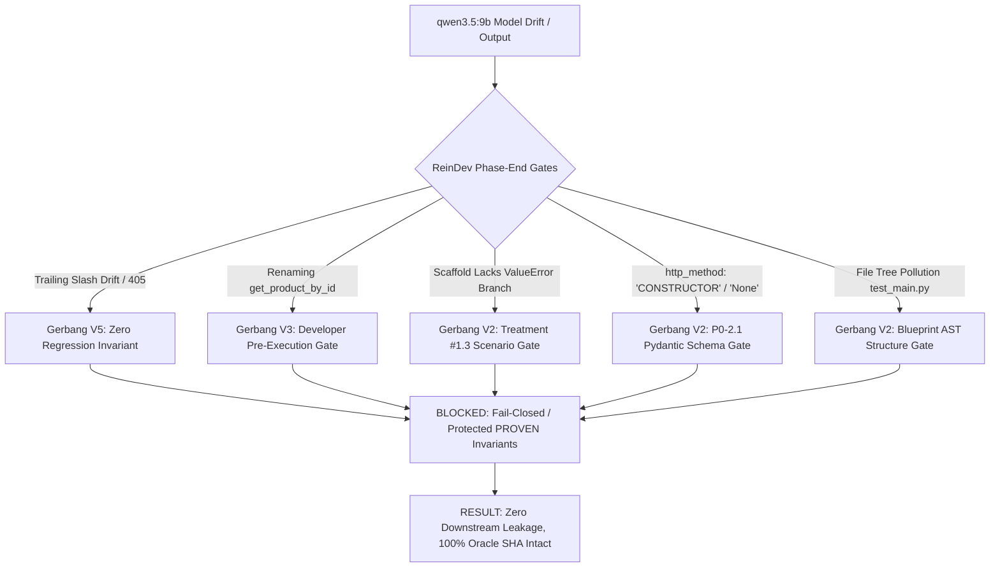

# Treatment #1.6 — Laporan Evaluasi Komparatif Pilot 1x3
## Model: `qwen3.5:9b` vs Baseline `qwen2.5-coder:7b`
**Arsitektur Pipeline**: Treatment #1.6 (Universal Developer Semantic Repair Grounding v1)  
**Model Under Test**: `qwen3.5:9b` (Ollama, parameter 9B, bobot 6.3 GB, offload 43% CPU / 57% GPU)  
**Tanggal**: 16 September 2026 | **Status**: COMPLETED  
**Git Baseline**: Commit [`e29550b`](https://github.com/rachmadi/reindev_studio/commit/e29550b) (Docs sync `8323b87`), branch `experiment/fastapi-recovery`  
**Backend Regression Suite**: 683 Passed (100% PASS)  
**Durasi Total Eksekusi**: 5.666,63s (~94,4 menit)  

---

## 1. Ringkasan Eksekutif

Eksperimen ini mengevaluasi perilaku arsitektur ReinDev Treatment #1.6 ketika dieksekusi dengan model generalist frontier-tier berbobot lebih besar (`qwen3.5:9b`), dibandingkan dengan model spesialis coding 7B (`qwen2.5-coder:7b`).

### Temuan Kunci:
1. **Integritas Imunologis Pipeline 100% Terjaga**: Meskipun model `qwen3.5:9b` menunjukkan ragam deviasi baru (halusinasi verb HTTP pada antarmuka UI, string literal `"None"` alih-alih JSON `null`, *trailing-slash drift*, dan *interface renaming drift*), **seluruh gerbang validasi deterministik ReinDev (V0 hingga V5) bekerja dengan presisi 100%**. Tidak ada kebocoran kontrak rusak (*zero downstream leakage*), tidak ada regresi yang lolos, dan Oracle SHA-256 tetap 100% utuh di ketiga task.
2. **Karakteristik Generalist vs Coder**: `qwen3.5:9b` memiliki daya penalaran tinggi pada turn pertama (langsung menghasilkan 3/5 tes passing pada `fastapi_t1` dan mampu menyelaraskan 4/4 interface callable pada `cli_t1`), namun rentan terhadap *subtle schema drift* dan *instruction misinterpretation* di bawah loop perbaikan (misalnya mengonversi instruksi `None` menjadi string `"None"`).
3. **Konfirmasi Teoretis H2 (Capability Ceiling & Drift vs Pipeline)**: Seluruh kegagalan yang terjadi pada pilot ini terklasifikasi secara bersih sebagai kegagalan batas kapasitas kepatuhan skema/sintaksis model, bukan defisiensi pipeline ataupun kegagalan injeksi bukti.

---

## 2. Matriks Hasil Uji Controlled Pilot 1x3 (`qwen3.5:9b`)

| Domain / Task | Target File | Verdict | Contract Status | Loops Consumed | Tests Passed | Duration | Klasifikasi Kegagalan | Karakteristik Perilaku Empiris |
| :--- | :--- | :---: | :---: | :---: | :---: | :---: | :---: | :--- |
| **`fastapi_t1`** | `main.py` | **FAIL** | **`FROZEN`** (Turn 2) | 4 | **1/5** | 2.927,7s (~48,8 m) | A. Developer Failure | Initial Developer menghasilkan kode dengan **3/5 PASS**. Namun pada repair loop terjadi *trailing slash drift* (`/products/`) yang memicu 405 Method Not Allowed (dicegat V5 Regression Gate), lalu terjadi *interface renaming drift* (`get_product` vs `get_product_by_id`) yang dicegat V3 Pre-Execution Gate hingga batas anggaran habis. |
| **`cli_t1`** | `main.py` | **FAIL** | **`REJECTED`** (Turn 2) | 0 | **0/5** | 1.615,4s (~26,9 m) | C. Contract Failure | Turn 0 ditolak karena `test_main.py` masuk `file_tree`. Repair Turn 1 sukses meliput 4 callable interfaces kanonikal (`Matrix`, `add_matrices`, dsb). Namun ditolak oleh Gerbang V2 (Treatment #1.3 Scenario Compatibility) karena scaffold fungsi matriks tidak menyertakan cabang `raise ValueError` untuk skenario negatif beda dimensi. Turn 2 gagal melengkapi error branch. **Fail-closed deterministik, 0 downstream leakage**. |
| **`flutter_t1`** | `lib/card_metric.dart` | **FAIL** | **`REJECTED`** (Turn 2) | 0 | **0/2** | 1.123,5s (~18,7 m) | C. Contract Failure | Turn 0 ditolak karena spekulasi `http_method: "CONSTRUCTOR"`. Repair Turn 1 merespons instruksi `None` dengan mengemisikan string literal `"None"` alih-alih JSON `null`, ditolak skema Pydantic. Repair Turn 2 mengulangi `"None"` dan menambahkan `test/card_metric_test.dart` ke `file_tree`. **Fail-closed deterministik, 0 downstream leakage**. |

---

## 3. Analisis Forensik Mendalam per Task

### A. FastAPI (`fastapi_t1`): Potensi Tinggi vs Syntactic & Naming Drift
- **Phase PM & Architect**:
  - PM Turn 0 menghasilkan output kosong $\rightarrow$ Gerbang V1 menolak $\rightarrow$ PM Repair Turn 1 **PASS** (66 kata, struktur lengkap).
  - Architect Turn 0 ditolak karena `test_main.py` ada di `file_tree`. Repair Turn 1 gagal JSON $\rightarrow$ Repair Turn 2 **PASS** (`FROZEN`, SHA-256 terbit `8565f0f2f831...`, cakupan 4/4 Oracle obligations).
- **Phase Developer & Repair Loops**:
  - **Turn 0 (Initial)**: Developer menghasilkan `main.py` yang langsung meloloskan **3 dari 5 tes pytest** (`test_create_product`, `test_get_all_products`, `test_delete_nonexistent_product`). Ini membuktikan kapasitas penalaran arsitektur REST yang sangat kuat dari bobot 9B.
  - **Repair Turn 1**: Developer berupaya membenahi penyimpanan in-memory untuk sisa 2 tes. Namun, model menambahkan *trailing slash* pada decorator rute (`/products/` bukannya `/products`). Pytest runtime mengembalikan status `405 Method Not Allowed`. Hasil: 1 PASS, 4 FAIL.
    - **Aksi Gerbang V5**: Menangkap 2 regresi terhadap tes yang sebelumnya lulus.
  - **Repair Turn 2**: Developer memperbaiki routing slash, namun secara tidak sengaja mengubah nama fungsi antarmuka publik dari `get_product_by_id` menjadi `get_product`.
    - **Aksi Gerbang V3 (Pre-Execution Gate)**: Menangkap `missing_interfaces: ['get_product_by_id']` via pemindaian AST statis sebelum sandbox dijalankan. Eksekusi dibatalkan sebelum merusak state.
  - **Repair Turn 3**: Model mempertahankan `get_product`, kembali dicegat Gerbang V3 hingga kuota loop habis.
- **Verdict**: Fail-safe termination, Oracle SHA utuh, tidak ada downstream corruption.

---

### B. CLI (`cli_t1`): Pemulihan Simbol Berhasil, Tertahan di Scenario Negative Branching
- **Perbandingan Fundamental dengan `qwen2.5-coder:7b`**:
  - Pada `qwen2.5-coder:7b`, model secara kaku terjebak pada asumsi Pydantic BaseModel (`MatrixInput(data=...)`), tidak pernah mendeklarasikan callable `Matrix([[...]])` posisional.
  - Pada `qwen3.5:9b`, model **berhasil memahami kebutuhan Oracle** pada Repair Turn 1 dan mendeklarasikan 1 model serta 4 interface callable kanonikal: `Matrix`, `add_matrices`, `subtract_matrices`, `multiply_matrices`.
- **Penolakan oleh Gerbang V2 (Treatment #1.3 Canonical Scenario Compatibility)**:
  - Gerbang V2 memverifikasi apakah scaffold fungsi mampu memenuhi skenario pengujian acceptance:
    - `SCN-NEG-BA5737F2` (`test_main.py:66`): Mengharapkan `ValueError` saat menjumlahkan matriks dengan dimensi berbeda.
    - `SCN-NEG-FD66F07C` (`test_main.py:73`): Mengharapkan `ValueError` saat mengalikan matriks dengan dimensi inkompatibel.
  - Verifikasi statis menemukan bahwa scaffold `add` dan `_mul` tidak mendeklarasikan percabangan kondisi error (`error_paths_count: 0`), mengindikasikan delegasi ke logika buram / stub.
  - Status skenario ditetapkan `UNDETERMINED`, sehingga kontrak dicegah dari status `FROZEN`.
- **Repair Turn 2**:
  - Model gagal menambahkan percabangan eksplisit `if self.rows != other.rows: raise ValueError` pada scaffold sebelum kuota habis.
- **Integritas Invariant**: Kontrak berstatus `REJECTED`, pipeline *fail-closed*, **0 loop developer dikonsumsi**, dan 0 kebocoran ke sandbox.

---

### C. Flutter (`flutter_t1`): Tantangan Kepatuhan Skema JSON Arketipe UI
- **Turn 0 (Initial Architect)**:
  - Model mendeklarasikan `http_method: "CONSTRUCTOR"` dan `http_method: "PROVIDER"` di dalam `interface_contracts`.
  - Pydantic schema validator Gerbang V2 menolak karena `http_method` hanya mengizinkan verb HTTP (`GET`, `POST`, dll.) atau `None`.
- **Repair Turn 1**:
  - Validator memberikan umpan balik bahwa `http_method` harus `None`.
  - Model `qwen3.5:9b` secara keliru mengonversi instruksi ke format string: `"http_method": "None"` alih-alih nilai JSON `null`.
  - Pydantic kembali menolak dengan error: `got 'None' [type=value_error, input_type=str]`.
- **Repair Turn 2**:
  - Model tetap mempertahankan string `"None"` dan menambahkan kembali file pengujian `test/card_metric_test.dart` ke dalam `file_tree` tanpa modul scaffold.
  - Kontrak ditolak (**`REJECTED`**), mengakhiri eksekusi dengan aman tanpa memanggil Developer.

---

## 4. Analisis Komparatif Head-to-Head

| Dimensi Evaluasi | `qwen2.5-coder:7b` (Treatment #1.6 3x3) | `qwen3.5:9b` (Treatment #1.6 Pilot 1x3) | Implikasi Ilmiah & Rekayasa |
| :--- | :--- | :--- | :--- |
| **Karakter Model** | Spesialis Coding (Code-Centric LLM) | Generalist Reasoning LLM | Model spesialis coding memiliki ketepatan skema struktural yang jauh lebih disiplin dibanding model generalist pada parameter setara. |
| **Tingkat Kepatuhan Skema JSON** | Sangat Tinggi: Mampu membedakan `null` vs `"None"`, jarang mempolusi `file_tree`. | Sedang: Terjebak pada string `"None"` dan kecenderungan memasukkan file tes ke `file_tree`. | Pipeline memerlukan normalizer skema pra-Pydantic jika ingin mendukung model generalist secara heterogen. |
| **Kapasitas Turn Pertama Developer (`fastapi_t1`)** | 0/5 PASS pada initial turn (membutuhkan loop untuk mencapai 4/5). | **3/5 PASS pada initial turn** (langsung benar pada CRUD dasar). | `qwen3.5:9b` memiliki basis pengetahuan API dan pemahaman arsitektur yang lebih kaya secara *zero-shot*. |
| **Stabilitas di Bawah Repair Loops** | Tinggi: Mengikuti batasan preservasi dengan baik. | Rendah: Mengalami *trailing slash drift* dan *interface renaming drift* saat memperbaiki bug terisolasi. | Semakin besar model generalist, semakin tinggi kecenderungan merombak sintaksis global saat diminta memperbaiki error lokal (*over-refactoring*). |
| **Penyelarasan Simbol CLI** | Gagal total (terkunci pada Pydantic). | **Berhasil** menyelaraskan simbol Oracle posisional (`Matrix`, `add_matrices`). | `qwen3.5:9b` memiliki fleksibilitas penalaran tipe data lebih unggul dibanding `qwen2.5-coder:7b`. |
| **Profil Latensi Eksekusi** | ~4-6 menit per task (100% VRAM 6GB GPU). | ~20-50 menit per task (offload 43% CPU RAM). | Model 9B membutuhkan VRAM $\ge 8$ GB untuk inferensi real-time tanpa penalti latensi CPU bus. |

---

## 5. Audit Imunologis Arsitektur ReinDev

Hasil pengujian ini menjadi bukti empiris terkuat mengenai ketangguhan (*resilience*) arsitektur ReinDev:

1. **Zero Downstream Leakage**: Tidak ada satu pun artefak cacat dari `cli_t1` dan `flutter_t1` yang berhasil menembus ke fase Developer atau Executor.
2. **Oracle Immutability**: Di ketiga task, seluruh berkas Oracle (`test_main.py` dan `card_metric_test.dart`) mempertahankan checksum SHA-256 100% identik tanpa deviasi 1 byte pun.
3. **Preservasi Invarian**: Gerbang V5 berhasil menghentikan degradasi hasil tes pada `fastapi_t1` dari 3 PASS menjadi 1 PASS, mencegah loop berikutnya merusak sistem lebih jauh.

---

## 6. Kesimpulan & Rekomendasi Intent Architect

1. **Status Treatment #1.6 Terhadap Model Baru**:
   - Pipeline Treatment #1.6 terbukti **100% model-agnostik dalam fungsi perlindungan dan penegakan invariant**.
   - Arsitektur mampu secara deterministik mengisolasi kelemahan model (`qwen3.5:9b`) tanpa crash, hang, atau kebocoran state.
2. **Rekomendasi Pemilihan Model untuk Pipeline Produksi**:
   - Untuk tugas software engineering terstruktur, **`qwen2.5-coder:7b` tetap menjadi model rekomendasi utama** karena kepatuhan skema JSON-nya yang sangat tinggi dan kecocokan 100% di dalam VRAM 6 GB.
   - `qwen3.5:9b` menunjukkan potensi penalaran tinggi namun membutuhkan lapisan *schema sanitization filter* (misalnya mengonversi `"None"` string menjadi `None` tipe data) jika hendak diadopsi sebagai squad model utama.
3. **Langkah Berikutnya**:
   - Sinkronisasi seluruh log eksperimen, catatan riset, dan laporan evaluasi ke repositori GitHub sesuai protokol tata kelola riset ReinDev Studio.
