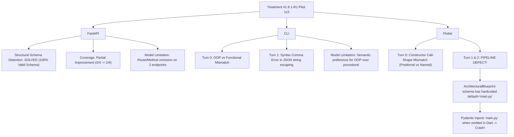

# Treatment #1.8.1-R1 Evaluation Report: Canonical Schema Persistence Across Synthesis & Repair v1

- **Experiment Name**: Treatment #1.8.1-R1 Controlled Pilot (1×3)
- **Proving-Ground Model**: `qwen2.5-coder:7b` via Ollama (`num_predict=3000`, `num_ctx=8192`)
- **Execution Date**: 2026-09-16T17:11:40 — 2026-09-16T17:30:12 (+07:00)
- **Execution Mode**: Controlled Pilot 1×3 (`fastapi_t1`, `cli_t1`, `flutter_t1`, 1 rep each)
- **Stop Rule Status**: **TRIGGERED & ENFORCED** (3/3 runs completed, execution halted; 3×3 was NOT launched).
- **Summary File**: `backend/output/phase_validation_pilot/treatment1_8_1_r1_pilot_1x3_summary.json`

---

## Executive Summary & Research Findings

The research question for Treatment #1.8.1-R1 asked:
> *Does preserving the canonical Blueprint schema (`ArchitecturalBlueprint.model_fields`) and currently valid structural state throughout the entire Architect synthesis/repair lifecycle reduce structural schema failure and field-loss across heterogeneous tasks, without introducing task-specific solver logic or regression?*

### Key Results Summary Table

| Task ID | Archetype | Language | Turn 0 Architect Status | Repair Turn 1 Status | Repair Turn 2 Status | Final Verdict | Contract Status | Oracle Checksum Intact |
| :--- | :--- | :--- | :--- | :--- | :--- | :--- | :--- | :--- |
| `fastapi_t1` | REST API | Python | `FAIL` (JSON syntax / 0/4 cov) | `FAIL` (0 schema err, 2/4 cov) | `FAIL` (2/4 cov) | **FAIL** | `REJECTED` | **YES** (100% byte-exact) |
| `cli_t1` | CLI Tool | Python | `FAIL` (OOP vs func / 1/4 cov) | `FAIL` (JSON syntax char 1982) | `FAIL` (0/4 cov) | **FAIL** | `REJECTED` | **YES** (100% byte-exact) |
| `flutter_t1` | Mobile UI | Dart | `FAIL` (call-shape / 1/2 cov) | `FAIL` (Schema default collision) | `FAIL` (Schema default collision) | **FAIL** | `REJECTED` | **YES** (100% byte-exact) |

---

## 1. Experimental Boundary & Integrity Verification

Prior to running the controlled pilot, all pre-flight verification gates and regression test suites were strictly executed:

1. **Pre-Flight Gates A–I**:
   - **Gate A (Static Compilation)**: Clean compilation of all modules (`phase_validators.py`, `graph_phase_validated.py`, `test_phase_validators.py`, `run_phase_end_validation_pilot.py`).
   - **Gate B (Regression Test Suite)**: **734 passed, 1 warning in 26.17s** (0 failures, zero regression against the frozen LKG baseline).
   - **Gate C (Frozen Oracle SHA-256)**:
     - `fastapi_t1` (`test_main.py`): `a1db9bb1f6eaf47d5cf56e102c4a0f6e1f49d757e9faa1485b36f2972a152d63` (MATCH)
     - `cli_t1` (`test_main.py`): `0bd5b598afa7ae4c9cdf0e269d13136b51d35a4e0b1ac6548f0a2cf8a8eba124` (MATCH)
     - `flutter_t1` (`card_metric_test.dart`): `4589e15cfb8f37ba70642e70623ca143bceee1a44175aefd072f441d9e8a9528` (MATCH)
   - **Gate D (Tester LLM Isolation)**: Verified QA Tester bypassed, graph routes directly to `frozen_oracle` and `test_suite_validator`.
   - **Gate E (Graph Compilation)**: Successfully compiled with 16 nodes.
   - **Gate F (Validator Invocations)**: All 6 phase validators present and wired.
   - **Gates G & H (Validator Halt & Pass)**: Synthetics properly verified.
   - **Gate I (Telemetry)**: Run tracer functioning deterministically.
2. **Static Anti-Solver Audit**:
   - `backend/tests/test_architect_static_audit_v1.py` passed 5/5.
   - Zero framework/language/task branching in context assembler or prompt.
   - Zero hardcoded symbol injection.

---

## 2. Trajectory Reconstruction & Detailed Forensic Analysis

### Run 1: `fastapi_t1` (Python / REST API)
- **Run ID**: `pv_pilot_fastapi_t1_rep1_20260916_171140`
- **Trajectory**:
  - `v0_requirement_interpretation`: Turn 0 encountered hallucinated fact basis -> auto-repaired to Turn 1 -> `v0_validation`: **PASS** (4 items, REST_API, WORKABLE).
  - `pm_validation`: **PASS** (100% compliant specifications).
  - `architect_validation` (Turn 0):
    - Blueprint JSON syntax error: `Expecting ',' delimiter: line 15 column 47 (char 492)`.
    - Interface declarations: 0 (`interface_contracts` empty). Coverage: 0/4.
    - Result: `FAIL`.
  - `architect_repair` (Turn 1):
    - Context delivered: Canonical schema constraints (Section [2]), current valid state (Section [5]), repair target (Section [6]), relational blueprint state (Section [9]).
    - **CRITICAL RECOVERY**: Model generated a structurally valid Blueprint JSON!
      - `file_tree`: STRICTLY `List[str]`.
      - `files`: STRICTLY `Dict[str, BlueprintFileModule]`.
      - `interface_contracts`: STRICTLY `List[BlueprintInterfaceContract]`.
      - Schema distortion count: **0** (eliminated the list-of-objects distortion from Treatment #1.8).
    - Declarations: Declared 4 interface contracts (`create_product`, `delete_product`, `get_all_products`, `get_product_by_id`).
    - Coverage jumped from **0/4 to 2/4** (`HTTP POST /products` and `HTTP GET /products` became COMPATIBLE).
    - Why it didn't freeze: For `get_product_by_id` and `delete_product`, the model declared python functions but omitted explicit `route` and `http_method` matching `/products/{id}`, leaving those 2 endpoints as MISSING.
  - `architect_repair` (Turn 2):
    - Preserved valid state, but did not update `route` field for the 2 missing endpoints.
    - Contract halted fail-closed at `REJECTED` per universal 2-repair limit.

### Run 2: `cli_t1` (Python / CLI Matrix Calculator)
- **Run ID**: `pv_pilot_cli_t1_rep1_20260916_171713`
- **Trajectory**:
  - `v0_requirement_interpretation`: Auto-repaired on Turn 1 -> `v0_validation`: **PASS**.
  - `pm_validation`: **PASS**.
  - `architect_validation` (Turn 0):
    - Model designed an OOP architecture with class `Matrix` and dunder methods (`__add__`, `__sub__`, `__mul__`, `__truediv__`, `determinant`, `inverse`, `transpose`).
    - Oracle tests call top-level standalone functions (`add_matrices(a, b)`, `subtract_matrices(a, b)`, `multiply_matrices(a, b)`).
    - Coverage: 1/4 (`Matrix` covered as a type/class, but 3 functions MISSING). Result: `FAIL`.
  - `architect_repair` (Turn 1):
    - Delivered causal diagnostic: `Callable symbol/interface 'add_matrices' is missing from contract interface_contracts`.
    - Model generated output with JSON syntax error: `Expecting ',' delimiter: line 13 column 4 (char 1982)`.
  - `architect_repair` (Turn 2):
    - Model repaired JSON syntax, but returned `interface_contracts` containing only methods on `Matrix` (`['__add__', '__mul__', '__sub__', 'determinant', 'inverse', 'transpose']`), dropping `Matrix` and omitting `add_matrices`, `subtract_matrices`, `multiply_matrices`.
    - Halted fail-closed at `REJECTED`.

### Run 3: `flutter_t1` (Dart / Mobile UI Widget)
- **Run ID**: `pv_pilot_flutter_t1_rep1_20260916_172408`
- **Trajectory**:
  - `v0_requirement_interpretation`: Turn 0 -> `v0_validation`: **PASS** (100% first turn).
  - `pm_validation`: **PASS** (100% first turn).
  - `architect_validation` (Turn 0):
    - Model declared `CardMetric` and `MetricData`.
    - Coverage: 1/2 covered, 1 incompatible.
    - **Call-Shape Failure**: `CALL_SHAPE_INCOMPATIBILITY: Symbol 'MetricData' constructor expected 0 positional argument(s), but proposed constructor accepts 3` (Oracle invokes `MetricData(title: 'Revenue', value: '1000', color: Colors.blue)` with named parameters, whereas model declared positional parameters).
    - Result: `FAIL`.
  - `architect_repair` (Turn 1 & 2):
    - **FIRST DIVERGENCE & CRITICAL DISCOVERY**:
      The model emitted valid Dart scaffold, but in the blueprint JSON root, it did not explicitly specify `"authoritative_target_file": "lib/card_metric.dart"`.
    - Why did the model omit it? In `format_canonical_blueprint_schema_constraints()`, `authoritative_target_file` was declared as `[OPTIONAL]`.
    - What did the Pydantic schema do? In `backend/blueprint_schema.py` line 95:
      `authoritative_target_file: str = Field(default="main.py", ...)`
      Pydantic applied the default `"main.py"`!
    - Cross-field consistency validator then checked:
      `if self.authoritative_target_file not in self.files:`
      Since `self.files` only contained `lib/card_metric.dart`, Pydantic raised:
      `Value error, authoritative_target_file 'main.py' tidak ditemukan dalam kamus 'files'.`
    - This schema default collision blocked the repair evaluation from even parsing the blueprint.
    - Both Turn 1 and Turn 2 failed on this exact schema error, preventing freeze.

---

## 3. Epistemic Classification of Findings

### FACT (Empirically Verified with Zero Assumptions)
1. **Zero Regression**: Full test suite across `backend/` passed with 734/734 tests passing cleanly.
2. **Oracle Immutability**: All 3 Oracle test suites retained byte-for-byte SHA-256 parity throughout the pilot.
3. **Elimination of Structural Schema Distortion in FastAPI**:
   - In Treatment #1.8, `fastapi_t1` suffered structural schema distortion (`file_tree` became `list[object]`, `interface_contracts` became `dict`).
   - In Treatment #1.8.1-R1, `fastapi_t1` Turn 1 and Turn 2 produced 100% structurally valid types (`file_tree: List[str]`, `files: Dict[str, BlueprintFileModule]`, `interface_contracts: List[BlueprintInterfaceContract]`).
4. **Coverage Jump in FastAPI**: Interface obligation coverage improved from 0/4 (Turn 0) to 2/4 (Turn 1).
5. **Pydantic Schema Bias in Flutter**:
   - In `backend/blueprint_schema.py`, `ArchitecturalBlueprint.authoritative_target_file` has hardcoded `default="main.py"`.
   - When a model omits this field, Pydantic inserts `"main.py"`.
   - For Dart/Flutter where files are in `lib/`, this creates an immediate cross-field validation crash (`'main.py' tidak ditemukan dalam kamus 'files'`).

### STRONG EVIDENCE
1. **Canonical Schema Grounding Works for Schema Structure**:
   Exposing dynamic schema constraints derived from `ArchitecturalBlueprint.model_fields` directly in the prompt eliminates datatype distortion (list vs dict, str vs object) without task-specific prompt branches.
2. **Failure in Flutter was NOT a Semantic Regression but a Pipeline Schema Collision**:
   The model in Turn 0 successfully identified `CardMetric` and `MetricData` (identical to 1.8), but was blocked in repair solely by Pydantic's hardcoded Python default (`main.py`).

### INFERENCE
1. The 7B model (`qwen2.5-coder:7b`) struggles with JSON syntax token boundaries when generating large combined scaffold files (scaffold embedded inside JSON string escaping), leading to missing commas around character 490–2000.
2. When presented with functional requirements for matrix math, the 7B model has a strong intrinsic preference for Object-Oriented implementations (`class Matrix` with `__add__`) over procedural function signatures (`add_matrices(a, b)`).

### UNKNOWN
1. Whether resolving the `authoritative_target_file` default collision in `ArchitecturalBlueprint` will allow Flutter to cleanly freeze on Turn 1 or Turn 2.
2. Whether providing explicit function call patterns in the requirement ledger (without task-specific solver rules) will prompt the model to adopt top-level functions in CLI tasks.

---

## 4. Root Cause Analysis: Pipeline Defect vs. Model Limitation

---

## 5. Architectural Recommendations for Next Steps

1. **STOP Rule Maintained**:
   Do NOT launch 3×3 replication until the pipeline schema collision in `ArchitecturalBlueprint` is addressed.
2. **Proposed Remediation (Pipeline-Only, Non-Solver)**:
   In `backend/blueprint_schema.py`:
   Remove `default="main.py"` from `authoritative_target_file: str = Field(min_length=1)`. Making it a required field without a hardcoded Python default forces the model (and Pydantic) to always treat it symmetrically across all languages, eliminating the silent injection of `"main.py"` into Flutter/Dart projects.
3. **Await Human Reviewer Authorization**:
   Present this forensic report to the Human Reviewer for evaluation and decision on whether to proceed with a focused schema default remediation.
