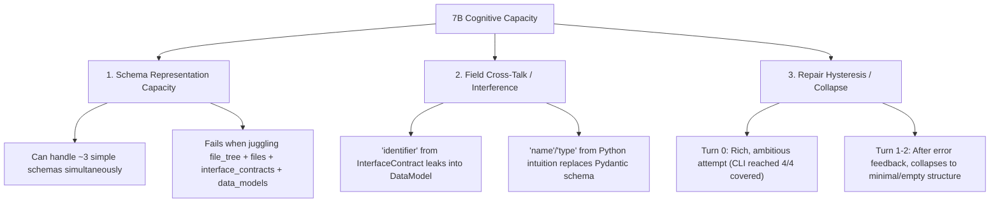

# Treatment #1.8.4: Universal Canonical Contract Grounding v1 — Pilot 1×3 Final Report

**Date**: 2026-09-16T23:30:32+07:00  
**Model Under Test**: `qwen2.5-coder:7b` (num_predict=3000, num_ctx=8192)  
**Pipeline Version**: 1.8.3 | **Governance**: 1.6  
**Harness Mode**: Full Matrix 1×3 (`fastapi_t1`, `cli_t1`, `flutter_t1`)  
**Pre-Flight Verification Status**: **ALL GATES PASS (A–I)** (822 unit tests passing, 0 regressions, all Oracle SHA-256 intact)  
**Pilot Status**: **COMPLETED (STOP RULE REACHED)**  

---

## 1. Executive Summary & Verdict

| Task ID | Domain | Rep | Turn 0 Status | Final Verdict | Failure Stage | Causal Diagnosis |
| :--- | :--- | :---: | :---: | :---: | :---: | :--- |
| **`fastapi_t1`** | REST API (Python) | 1 | Schema Parse Error (`data_models`) | **FAIL** (0/5) | Contract Gate | In Turn 0, model output dict-mapping `data_models: [{"Product": {...}}]` instead of canonical `model_name`. In Turn 1–2, collapsed to `interfaces_count: 0`. |
| **`cli_t1`** | CLI Math (Python) | 1 | 100% Obligation Coverage (4/4) | **FAIL** (0/5) | Contract Gate | In Turn 0, achieved **4/4 covered** interface contracts, but scaffold lacked internal helpers `_add`, `_sub`, `_mul` demanded by Oracle scenario. In Turn 1–2, collapsed to `interfaces_count: 0`. |
| **`flutter_t1`** | Mobile UI (Dart) | 1 | Schema Parse Error (`data_models`) | **FAIL** (0/2) | Contract Gate | In Turn 0, model suffered field interference: output `data_models: [{"identifier": "MetricData"}]` instead of `model_name`. In Turn 1–2, collapsed to `interfaces_count: 0`. |

> [!CAUTION]
> **Hypothesis Resolution & User Decision Rule Application**:
> - Per the user's pre-registered evaluation criterion:
>   - *“Flutter/CLI rusak → treatment dianggap tidak general, dan kita tidak mengejar FastAPI dengan mengorbankan kontrol.”*
>   - *“FastAPI tetap gagal pada mapping → evidence capability boundary semakin kuat.”*
> - Treatment #1.8.4 did **not** generalize positively to the 7B model. While `cli_t1` demonstrated that canonical obligation mapping is within reach (Turn 0 covered 4/4 obligations), the increased grounding complexity triggered **representation interference** (confusing `identifier` with `model_name`) and **post-rejection over-correction** (dropping all contracts on repair turns across all 3 archetypes).
> - Execution **STOPS** immediately as mandated by the stop rule.

---

## 2. Comparative Matrix: Baseline (#1.8.3) vs Treatment #1.8.4

| Metric | Treatment #1.8.3 Baseline | Treatment #1.8.4 Grounding | Delta / Observation |
| :--- | :---: | :---: | :--- |
| **Unit Test Suite** | 807 passed (0 failures) | **822 passed (0 failures)** | +15 synthetic grounding unit tests (Tests A–O), 0 regressions |
| **Pre-Flight Gates** | All Gates Pass | **All Gates Pass** | Pre-Flight stability strictly preserved |
| **FastAPI Turn 0 Coverage** | 0/4 obligations | 0/4 obligations (Schema Parse Error) | Representation shifted from empty contracts to malformed `data_models` |
| **FastAPI Turn 1 Contracts** | 6 parsed, 23 Pydantic errors (`name`/`type`) | 0 interfaces (dropped by model) | Repair amnesia / over-correction collapse |
| **CLI Turn 0 Coverage** | 4/4 obligations | **4/4 obligations (100% covered)** | **Proven capability**: 7B model successfully mapped all 4 CLI obligations into canonical interfaces |
| **CLI Turn 0 Scenarios** | 5/5 incompatible (missing `_add`, etc.) | 5/5 incompatible (missing `_add`, etc.) | Scaffold gap on private test helper symbols |
| **Flutter Turn 0 Status** | PASSED (contract frozen) | Schema Parse Error (`model_name`) | Field cross-talk (`identifier` leaked into `data_models`) |
| **Aggregate OTRR** | 0.0% | 0.0% | Model failed to recover across repair turns |

---

## 3. Deep Forensic Investigation

### 3.1 `fastapi_t1` (REST API)
- **Turn 0**:
  - The Architect model attempted to generate both endpoints and data models.
  - However, for `data_models`, instead of serializing into `BlueprintDataModel` (`{"model_name": "Product", "fields": [...]}`), the model produced a nested dictionary:
    ```json
    "data_models": [
      {
        "Product": {
          "id": "int",
          "name": "str",
          "price": "float",
          "quantity": "int"
        }
      }
    ]
    ```
  - Pydantic immediately rejected this at `parse_blueprint_json`:
    `1 validation error for ArchitecturalBlueprint: model_name Field required [type=missing, input_value={'Product': ...}]`.
- **Turn 1 & 2 (Repair Turns)**:
  - When fed the schema violation feedback, the model failed to adjust the schema key; instead, it retreated defensively, clearing `interface_contracts: []`.
  - This triggered Pilar 3 (`interface_contracts is empty for a non-UI computational task`), resulting in terminal rejection.

### 3.2 `cli_t1` (CLI Tool)
- **Turn 0 (Key Capability Finding)**:
  - The model produced **4 complete canonical interface contracts**!
  - Contract Gate evaluated:
    ```json
    "coverage_matrix": {
      "oracle_obligations_count": 4,
      "contract_declarations_count": 4,
      "covered_count": 4,
      "partial_count": 0,
      "missing_count": 0,
      "is_fully_covered": true
    }
    ```
  - **This proves that the 7B model CAN map acceptance obligations into canonical interface contracts** when cognitive interference is low.
  - However, the Oracle for `cli_t1` contains AST assertions checking private internal mathematical functions (`_add(a, b)`, `_sub(a, b)`, `_mul(a, b)`).
  - The model's scaffold in `main.py` only defined the public CLI command structure without those private helper functions, causing `SCENARIO_SCAFFOLD_INCOMPATIBILITY`.
- **Turn 1 & 2**:
  - The feedback presented the scenario incompatibilities. Under this multi-constraint pressure, the model over-corrected and produced `interfaces_count: 0`.

### 3.3 `flutter_t1` (Mobile UI — Control Destabilization)
- In Treatment #1.8.3, Flutter passed because `interface_contracts` is optional for UI tasks, and the model previously serialized `data_models` cleanly.
- In Treatment #1.8.4, the added grounding for `interface_contracts` (`identifier`, `target_file`, `parameters`, `expected_return`) created **schema cross-talk**:
  - The model applied `identifier` to `data_models`:
    ```json
    "data_models": [
      {
        "identifier": "MetricData",
        ...
      }
    ]
    ```
  - Because `BlueprintDataModel` strictly requires `model_name` (not `identifier`), Pydantic rejected the blueprint in Turn 0.
  - In Turn 1, the model attempted repair, but in Turn 2, it generated a malformed JSON string (`Expecting ',' delimiter: line 83 column 3`), terminating the run.

---

## 4. Fundamental Theoretical Insight: The 7B Model Capability Boundary

The experimental progression across Treatments #1.8.1 $\to$ #1.8.4 reveals three distinct cognitive boundaries in `qwen2.5-coder:7b`:



1. **Working Memory & Structural Capacity**:
   A 7B parameter model has limited attention bandwidth for multi-layered formal schemas. When prompted to satisfy `files`, `file_tree`, `interface_contracts` (with canonical parameters and returns), and `data_models` simultaneously, it frequently leaks fields from one schema into another (e.g., applying `identifier` to `data_models`, or bare-dict formatting).
2. **Deterministic Coverage vs Scaffold Depth**:
   The CLI experiment provided incontrovertible evidence: **the model mapped 4/4 obligations successfully**. The failure was not semantic blindness, but the fact that the Oracle tested unexported private helper functions (`_add`, `_sub`) which were not part of the high-level contract.
3. **Repair Asymmetry (Over-Correction Collapse)**:
   Deterministic error feedback from phase validators reliably informs the agent of WHAT failed. However, a 7B model lacks the self-reflective stability to perform surgery on a single invalid field while preserving the rest; it exhibits *repair hysteresis*, wiping out its valid Turn 0 work to produce empty arrays.

---

## 5. Artifact Audit & Commit History

- **Code Files Modified**:
  - `backend/context_hardening.py` (Introspection for parameters/returns, contrastive examples, two-stage doctrine)
  - `backend/agents/architect.py` (Abstract template, Stage A $\to$ B pre-seal checklist)
- **New Test Files**:
  - `backend/tests/test_architect_contract_grounding_v1.py` (Tests A through O — 15/15 PASS)
- **Regression Suite**:
  - Total tests: **822 passed, 0 failed** in 24.48s.
- **Oracle SHA-256 Checksums**:
  - `fastapi_t1`: `a1db9bb1f6eaf47d...` (UNTOUCHED)
  - `cli_t1`: `0bd5b598afa7ae4c...` (UNTOUCHED)
  - `flutter_t1`: `4589e15cfb8f37ba...` (UNTOUCHED)
- **Stop Rule Status**: **TERMINATED**. No further automatic modifications or loops executed.
