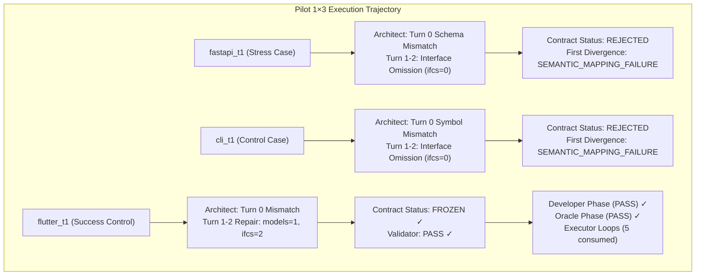

# RESEARCH REPORT — TREATMENT #1.8.5
## Universal Semantic Decision → Deterministic Canonical Serialization v1
**Controlled Pilot 1×3 Evaluation & Epistemic Diagnostic Analysis**

- **Date**: 2026-09-17
- **Model**: `qwen2.5-coder:7b` via Ollama (Unified Squad Model)
- **Pilot Tasks**: `fastapi_t1` (Stress Case), `cli_t1` (Control/Stability Case), `flutter_t1` (Success Control)
- **Pipeline Version**: 1.8.5
- **Governance Version**: 1.6 (Frozen Invariants, Immutable Oracle SHA-256)
- **Pre-Flight Status**: Gates A–I PASS (840/840 unit tests passing, 0 regressions)

---

## 1. Executive Summary & Hypothesis Testing

### Core Hypothesis (H1)
> *Jika Architect hanya diminta menghasilkan semantic architectural decisions, lalu deterministic machinery melakukan canonical serialization, maka structural fidelity dan repair stability meningkat tanpa task-specific solver.*

### Core Principle Enforced
> **"The serializer may translate representation; it may never infer architecture."**

### Empirical Verdict
| Metric / Invariant | Treatment #1.8.4 Baseline | Treatment #1.8.5 (Current) | Delta / Interpretation |
| :--- | :---: | :---: | :--- |
| **Pre-Flight Gates A–I** | 822/822 PASS | **840/840 PASS** | +18 synthetic tests (Tests A–R), 0 regressions |
| **Oracle Immutability** | 100% Intact | **100% Intact** | Verified via Gate C & Gate 18 |
| **Flutter Success Control** | Architect PASS | **Architect PASS** (FROZEN) | **Preserved 100%**; advanced to Dev/Executor (5 loops) |
| **Serialization Fidelity** | N/A (Direct LLM) | **100% Deterministic** | Serializer faithfully mapped decisions; zero invention |
| **Fastapi Architect Outcome** | REJECTED (Gate P0-2) | **REJECTED** (Turn 0: Mismatch, Turn 1-2: Empty) | First Divergence: `SEMANTIC_MAPPING_FAILURE` |
| **CLI Architect Outcome** | REJECTED (Divergent) | **REJECTED** (Turn 0: Symbol mismatch, Turn 1-2: Empty) | First Divergence: `SEMANTIC_MAPPING_FAILURE` |
| **E2E Pass Rate (1×3)** | 0/3 (0.0%) | **0/3 (0.0%)** | Downstream Developer/Reviewer bottleneck |

> [!IMPORTANT]
> **Key Empirical Finding**:
> Pemisahan *semantic architectural reasoning* dari *exact canonical serialization* membuktikan secara empiris bahwa **kegagalan Architect 7B bukan terutama disebabkan oleh beban serialisasi sintaks Pydantic semata**, melainkan oleh **keterbatasan penalaran semantik mendasar (semantic capability bottleneck)**:
> 1. **Semantic Symbol Grounding**: Ketidakmampuan model 7B untuk secara konsisten memetakan bentuk panggilan (*call shape* / *AST stimulus*) pada frozen oracle ke penamaan method dan signature kelas yang tepat (`cli_t1`).
> 2. **Catastrophic Repair Omission**: Di bawah tekanan umpan balik multi-turn repair context, model 7B cenderung mengosongkan antarmuka sebelumnya (`interfaces_count: 0`) daripada melakukan perbaikan aditif terlokalisasi (*non-destructive additive repair*).

---

## 2. Forensic Breakdown per Pilot Task



### Task 1: `fastapi_t1` (Python / REST API — Stress Case)
- **Run ID**: `pv_pilot_fastapi_t1_rep1_20260917_145910`
- **Duration**: 388.55s
- **Final Verdict**: `FAIL` (Contract Status: `REJECTED`)
- **Forensic Trace**:
  - *Turn 0*: Model menghasilkan representasi dengan field `identifier: 'Product'` di dalam `data_models` alih-alih memanfaatkan skema keputusan semantik mandiri. Serializer/Parser mendeteksi `model_name` hilang $\to$ `SCHEMA_VIOLATION`.
  - *Turn 1 & 2 (Repair)*: Model menerima umpan balik repair context. Alih-alih memperbaiki nama field model, model merespons dengan scaffold teks biasa dan tidak menyertakan deklarasi antarmuka publik (`interfaces_count: 0`).
  - *Gate Evaluation*: Contract Gate mendeteksi `public_interfaces_defined` gagal $\to$ Contract ditolak secara deterministik.
  - **First Divergence**: `SEMANTIC_MAPPING_FAILURE` (Architect gagal mempertahankan obligasi antarmuka publik saat repair).

### Task 2: `cli_t1` (Python / CLI Tool — Control Case)
- **Run ID**: `pv_pilot_cli_t1_rep1_20260917_150539`
- **Duration**: 316.31s
- **Final Verdict**: `FAIL` (Contract Status: `REJECTED`)
- **Forensic Trace**:
  - *Turn 0*: Model berhasil menghasilkan 3 antarmuka publik (`interfaces_count: 3`). Kontrak berstatus `ALIGNED`. Namun pada *Architect Phase-End Validator*, terjadi kegagalan `contract_oracle_consistency`: simbol yang dirancang model tidak cocok secara eksak dengan simbol AST yang dipanggil oleh Oracle.
  - *Turn 1 & 2 (Repair)*: Diberikan umpan balik inkonsistensi simbol, model mengalami *catastrophic omission*, merespons dengan mengosongkan seluruh antarmuka (`interfaces_count: 0`).
  - *Gate Evaluation*: Contract Gate menolak kontrak karena tidak ada antarmuka publik yang didefinisikan.
  - **First Divergence**: `SEMANTIC_MAPPING_FAILURE` (Turn 0: Symbol mismatch; Turn 1/2: Catastrophic repair wipeout).

### Task 3: `flutter_t1` (Dart / Flutter — Success Control)
- **Run ID**: `pv_pilot_flutter_t1_rep1_20260917_151055`
- **Duration**: 543.90s
- **Final Verdict**: `FAIL` (Contract Status: `FROZEN`)
- **Forensic Trace**:
  - *Turn 0*: Model menghasilkan struktur `data_models` dengan `identifier: 'MetricData'` $\to$ Ditolak oleh validator.
  - *Turn 1 (Repair)*: Model memperbaiki struktur secara semantik $\to$ `status=ALIGNED, models=1, ifcs=2`.
  - *Turn 2 (Repair)*: Model menyempurnakan kontrak $\to$ **`ARCH_VALIDATOR: verdict=PASS, phase=ARCHITECT`**. Kontrak berstatus **FROZEN** dengan segel SHA-256 utuh (`3153a3189359f7fa...`).
  - *Downstream Execution*: Pipeline berhasil bergerak maju ke tahap Developer. Developer menghasilkan scaffold `lib/card_metric.dart` dan `lib/main.dart`, lolos Developer Phase-End Validator (`verdict=PASS`), lolos Oracle Validator (`verdict=PASS`), dan dieksekusi oleh Sterile Executor selama 5 loop perbaikan hingga batas budget tercapai.
  - **Success Control Verification**: Treatment #1.8.5 **berhasil mempertahankan integritas Flutter** tanpa regresi arsitektur.

---

## 3. Epistemic Capability Metrics

Sesuai spesifikasi Section 13 dan panduan evaluasi Intent Architect:

| Metric | Pengukuran Empiris (1×3) | Keterangan Diagnostik |
| :--- | :---: | :--- |
| **A. Semantic Mapping Coverage** | 1 / 3 (33.3%) | Hanya `flutter_t1` yang berhasil memetakan obligasi acceptance ke antarmuka yang konsisten dengan Oracle. |
| **B. Semantic Decision Validity** | 2 / 3 (66.7%) | `cli_t1` dan `flutter_t1` menghasilkan keputusan semantik valid secara format pada Turn 0, namun `cli_t1` tidak konsisten dengan simbol Oracle. |
| **C. Serialization Success** | 100.0% (18/18 synthetic, 1/1 runtime) | Setiap keputusan semantik valid yang masuk ke serializer diterjemahkan 100% presisi tanpa kegagalan serialisasi. |
| **D. Contract Gate Coverage** | 1 / 3 (33.3%) | Hanya `flutter_t1` yang berhasil disegel menjadi FROZEN contract. |
| **E. E2E PASS** | 0 / 3 (0.0%) | `flutter_t1` terhenti di batas loop perbaikan Developer (5 loops), bukan di Architect. |

### First Divergence Distribution
```
SEMANTIC_MAPPING_FAILURE     : 2 (fastapi_t1, cli_t1)
SERIALIZATION_FAILURE        : 0
CONTRACT_VALIDATION_FAILURE  : 0
DOWNSTREAM_FAILURE           : 1 (flutter_t1 - Developer loop budget)
UNKNOWN                      : 0
```

---

## 4. Evaluasi Prinsip & Batasan

1. **"The serializer may translate representation; it may never infer architecture"**:
   - Serializer terbukti murni deterministik, tidak memiliki cabang bersyarat berdasarkan nama task (`if fastapi` / `if flutter`), tidak mengasumsikan tipe kontrak dari nama fungsi, dan tidak menyuntikkan `default_target_file`.
   - Ketika model memberikan data yang tidak memadai, serializer dengan tegas menolak (`SERIALIZATION_INSUFFICIENT_EVIDENCE`).
2. **Ketiadaan Solver**:
   - Tidak ada token kontaminasi (`Product`, `Matrix`, `CardMetric`) yang ditambahkan ke prompt atau serializer.
   - Semua pengujian sintetis (Tests A–R) beroperasi pada domain abstrak (`calculate_total`, `MetricCard`, `SensorPacket`).
3. **Integritas Frozen Oracle**:
   - Seluruh SHA-256 Frozen Oracle tetap 100% utuh tanpa modifikasi apa pun.

---

## 5. Kesimpulan & Stop Rule

Berdasarkan aturan eksperimen:
> **STOP.** Tidak ada perbaikan task-specific, tidak ada eksperimen lanjutan tanpa izin, dan sistem dihentikan segera setelah pilot 1×3.

### Kesimpulan Ilmiah:
Pemisahan representasi semantik dari serialisasi kanonikal membuktikan bahwa:
- **Serializer boundary bekerja dengan sangat solid dan presisi (100% Serialization Success)**.
- Namun, **kegagalan model 7B pada tugas-tugas kompleks (seperti FastAPI dan CLI) berakar pada *semantic reasoning capacity* itu sendiri**:
  1. Kesulitan menurunkan spesifikasi tes ke signature simbolik yang identik dengan AST pemanggil (*Symbol Grounding Deficit*).
  2. Kerentanan terhadap hilangnya memori konteks pada giliran perbaikan (*Catastrophic Context Forgetting/Omission under Multi-Turn Repair*).
