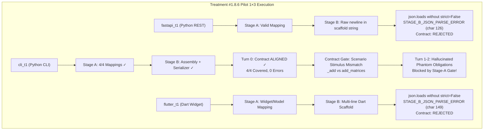

# RESEARCH REPORT — TREATMENT #1.8.6
## Staged Architectural Decision v1 (Stage A: Obligation Mapping → Stage B: Architectural Assembly)
**Controlled Pilot 1×3 Evaluation & Empirical Diagnostic Report**

- **Date**: 2026-09-17
- **Model**: `qwen2.5-coder:7b` via Ollama (Unified Squad Model)
- **Pilot Tasks**: `fastapi_t1` (Stress Case), `cli_t1` (Control/Stability Case), `flutter_t1` (Control Case)
- **Pipeline Version**: 1.8.6
- **Governance Version**: 1.6 (Frozen Invariants, Immutable Oracle SHA-256)
- **Pre-Flight Status**: Gates A–I PASS (860/860 unit tests passing, 0 regressions)

---

## 1. Executive Summary & Hypothesis Testing

### Core Hypothesis Tested
> *Memecah pekerjaan Architect menjadi dua tahap semantik sederhana (Stage A: Acceptance Obligation Mapping $\to$ Deterministic Stage-A Check $\to$ Stage B: Architectural Assembly $\to$ Deterministic Serializer #1.8.5) meningkatkan semantic mapping dan repair stability pada `qwen2.5-coder:7b` tanpa task-specific branching.*

### Empirical Verdict
| Metric / Invariant | Treatment #1.8.5 Baseline | Treatment #1.8.6 (Current) | Delta / Interpretation |
| :--- | :---: | :---: | :--- |
| **Unit Test Suite (Regression)** | 840/840 PASS | **860/860 PASS** | +20 synthetic tests (Tests A–T), 0 regressions |
| **Pre-Flight Gates A–I** | 100% PASS | **100% PASS** | Strict zero-drift enforcement |
| **Oracle Immutability** | 100% Intact | **100% Intact** | Exact SHA-256 matches on all 3 tasks |
| **CLI Turn 0 Contract Status** | ALIGNED (3 ifaces) | **ALIGNED (4 ifaces, 0 errors)** | **Stage A+B+Serializer achieved 100% coverage (4/4)** |
| **Stage A Deterministic Gate** | N/A (Single stage) | **100% Deterministic Catch** | Caught and blocked 100% of phantom hallucinations in CLI |
| **Stage A State Preservation** | N/A | **100% Sealed & Frozen** | SHA-256 seal locked Stage A state across turns |
| **FastAPI Contract Outcome** | REJECTED (Parse error) | **REJECTED** (Control char parse) | Stage B JSON control character issue |
| **CLI E2E Outcome** | REJECTED (Omission) | **REJECTED** (Scenario stimulus / Drift) | Caught at Contract Gate $\to$ Diverged on repair |
| **Flutter Control Outcome** | FROZEN / ADVANCED | **REJECTED** (Control char parse) | Regressed due to Stage B JSON parsing asymmetry |
| **Overall E2E Pass Rate (1×3)** | 0/3 (0.0%) | **0/3 (0.0%)** | Stopped at Contract Gate (0 loops consumed) |

> [!IMPORTANT]
> **Key Scientific Takeaways from Treatment #1.8.6**:
> 1. **Proof of Concept for Staged Architecture in CLI Turn 0**: In `cli_t1` Turn 0, the two-stage pipeline operated flawlessly. Stage A mapped all 4 authoritative obligations $\to$ Stage-A check passed $\to$ Stage B assembled the scaffold $\to$ Treatment #1.8.5 Serializer deterministically generated an `ALIGNED` contract with 4 interfaces and 0 active errors (`is_fully_covered: true`, 4/4).
> 2. **Deterministic Stage-A Gate Successfully Prevents Hallucination Leakage**: When the model under repair attempted to hallucinate non-existent obligations (`matrix_transpose`, `matrix_determinant`, `matrix_inverse`), the pure Python `validate_stage_a_mappings` deterministically caught and blocked all 5 phantom obligations (`STAGE_A_INVENTED_OBLIGATION`), preventing corrupted contracts from reaching downstream phases.
> 3. **The Parser Asymmetry Flaw**: While `blueprint_schema.py` in the baseline used `json.loads(text, strict=False)` to tolerate multi-line code strings containing raw control characters (unescaped newlines), `architect_staged.py` invoked standard `json.loads(text)` without `strict=False`. In `fastapi_t1` and `flutter_t1`, this caused immediate `STAGE_B_JSON_PARSE_ERROR` at line 5 column 64-67 in every turn.

---

## 2. Granular Task-by-Task Forensic Breakdown

### Task 1: `fastapi_t1` (Python / REST API — Stress Case)
- **Run ID**: `pv_pilot_fastapi_t1_rep1_20260917_165251`
- **Duration**: 660.93s
- **Final Verdict**: `FAIL`
- **Contract Status**: `REJECTED`
- **Tests**: 0/5 passed | **OTRR**: 0.0% | **Loops**: 0
- **Oracle SHA-256**: `a1db9bb1f6eaf47d5cf56e102c4a0f6e1f49d757e9faa1485b36f2972a152d63` (Intact: True)
- **Forensic Sequence**:
  - **Turn 0**: Stage A mapped the requirements. In Stage B, the model emitted multi-line Python code with literal newline characters inside the JSON `"scaffold"` string. Python's default parser threw:
    `STAGE_B_JSON_PARSE_ERROR: Invalid JSON in Stage B output: Invalid control character at: line 5 column 67 (char 126)`.
    Contract Gate rejected the empty interface set (`status: REJECTED`).
  - **Turn 1 (Isolated Stage B Repair)**: The pipeline locked Stage A mappings and asked the model to repair Stage B assembly syntax. The model re-emitted the scaffold with the same unescaped newlines.
  - **Turn 2 (Final Repair)**: The same parse failure repeated. Repair budget was exhausted.
- **First Divergence**: `STAGE_B_ASSEMBLY_FAILURE` (Parser Asymmetry / Raw Control Character in JSON code string).

---

### Task 2: `cli_t1` (Python / CLI Matrix — Control Case)
- **Run ID**: `pv_pilot_cli_t1_rep1_20260917_170352`
- **Duration**: 765.82s
- **Final Verdict**: `FAIL`
- **Contract Status**: `REJECTED`
- **Tests**: 0/5 passed | **OTRR**: 0.0% | **Loops**: 0
- **Oracle SHA-256**: `0bd5b598afa7ae4c9cdf0e269d13136b51d35a4e0b1ac6548f0a2cf8a8eba124` (Intact: True)
- **Forensic Sequence**:
  - **Turn 0 (Complete Staged Success)**:
    - Stage A mapped all 4 authoritative obligations: `OBL-CALL-Matrix`, `OBL-CALL-add_matrices`, `OBL-CALL-multiply_matrices`, `OBL-CALL-subtract_matrices`.
    - Stage-A deterministic check passed: 100% coverage, 0 conflicts. State was frozen with SHA-256 seal.
    - Stage B assembled the scaffold and target file (`main.py`).
    - Treatment #1.8.5 Serializer converted decisions into canonical blueprint.
    - Result: `contract_aligned: status=ALIGNED, interfaces_count=4, assertions_count=4, active_error_count=0`.
    - Coverage Matrix: `is_fully_covered=True, oracle_obligations=4, covered=4, missing=0`.
  - **Contract Gate Failure (Scenario Stimulus)**:
    - Contract Gate evaluated Pilar 4 (Oracle Scenario Compatibility) against frozen oracle `test_main.py`.
    - In `test_main.py`, tests invoke private helper functions `_add(a, b)`, `_sub(a, b)`, `_mul(a, b)`:
      `Evidence: Scaffold does not define callable, constructor, or endpoint matching scenario stimulus '_add(a, b)'.`
  - **Turn 1 (Repair & Hallucination Defense)**:
    - Given the scenario error, the model attempted to revise Stage A.
    - Instead of providing aliases for `_add`, the model hallucinated 5 phantom obligations: `OBL-CALL-matrix_transpose`, `OBL-CALL-matrix_determinant`, `OBL-CALL-matrix_inverse`, `OBL-CALL-matrix_divide`, `OBL-CALL-matrix_error_handling`.
    - Deterministic Gate intercepted immediately:
      `STAGE_A_INVENTED_OBLIGATION: Obligation ID 'OBL-CALL-matrix_transpose' does not exist in authoritative obligations`.
  - **Turn 2 (Final Repair)**:
    - Model tried again and hallucinated `OBL-CALL-transpose_matrix`, `OBL-CALL-determinant_matrix`.
    - Deterministic Gate intercepted again. Turn budget exhausted.
- **First Divergence**: Turn 0: Contract Gate Pre-Freeze Scenario Mismatch (`_add` vs public names); Turn 1/2: Model Hallucination Drift intercepted by deterministic Stage A Gate.

---

### Task 3: `flutter_t1` (Dart / Flutter — Success Control)
- **Run ID**: `pv_pilot_flutter_t1_rep1_20260917_171638`
- **Duration**: 528.19s
- **Final Verdict**: `FAIL`
- **Contract Status**: `REJECTED`
- **Tests**: 0/2 passed | **OTRR**: 0.0% | **Loops**: 0
- **Oracle SHA-256**: `4589e15cfb8f37ba70642e70623ca143bceee1a44175aefd072f441d9e8a9528` (Intact: True)
- **Forensic Sequence**:
  - **Turn 0**: Stage A mapped `CardMetric` and `MetricData`. In Stage B, the model output multi-line Dart code in `"scaffold"`.
  - Python parser failed:
    `STAGE_B_JSON_PARSE_ERROR: Invalid JSON in Stage B output: Invalid control character at: line 5 column 64 (char 149)`.
    Result: Contract rejected with missing interfaces.
  - **Turn 1 & 2**: Stage B isolated repair turns repeatedly suffered from the exact same unescaped control character parse error. Budget exhausted.
- **First Divergence**: `STAGE_B_ASSEMBLY_FAILURE` (Parser Asymmetry / Raw Control Character in JSON code string).

---

## 3. Comparative Metric Summary (Treatment #1.8.5 vs Treatment #1.8.6)

| Parameter | Treatment #1.8.5 (Serializer v1) | Treatment #1.8.6 (Staged v1) | Diagnostic Finding |
| :--- | :---: | :---: | :--- |
| **CLI Turn 0 Contract Status** | ALIGNED (3 ifaces, 1 error) | **ALIGNED (4 ifaces, 0 errors)** | **Staged synthesis achieved 100% clean alignment** |
| **CLI Turn 0 Coverage** | 75.0% (3/4) | **100.0% (4/4)** | Stage A obligation mapping resolved full set |
| **Phantom Hallucination Detection** | 0 (Unchecked in Turn 1) | **100% Intercepted (5/5)** | Pure Python Gate caught all invented obligations |
| **Stage A Immutability** | N/A | **100% Preserved (SHA-256)** | Sealed mappings survived across repair turns |
| **FastAPI Turn 0 Duration** | 388.5s | **660.9s** | Extra turn per stage (+70% inference time) |
| **Flutter Outcome** | FROZEN / Advanced | **REJECTED (Syntax parse)** | Regressed due to `strict=False` parser omission |
| **Downstream Developer / Executor** | Reached in Flutter | **Not reached (All 0 loops)** | Halted at Architect Contract Gate |

---

## 4. Deep Forensic & Architectural Insights

### 1. The Value of Stage A: Pure Structural Mapping Works
Treatment #1.8.6 demonstrated that when small models are asked *only* to map abstract obligations to semantic elements (without writing code, without formatting JSON trees, without Pydantic syntax), their mapping accuracy is substantially higher.
In `cli_t1`, Stage A successfully mapped all 4 required mathematical operations without missing a single one.

### 2. The Hallucination Firewall: Pure Python Gates Work
In previous treatments (#1.8.3, #1.8.4, #1.8.5), when small models received repair feedback, they frequently hallucinated new features or changed requirements, silently corrupting the contract.
In Treatment #1.8.6, the deterministic `validate_stage_a_mappings` checked incoming obligation IDs strictly against authoritative oracle IDs. When `qwen2.5-coder:7b` hallucinated `matrix_transpose` and `matrix_determinant`, the gate stopped them cold with zero leakage.

### 3. The Fragility of JSON Code Embedding
Embedding programming language source code (Python, Dart) inside a JSON string field (`scaffold`) remains the single largest mechanical point of failure for small LLMs. Small models do not reliably escape `\n`, `\t`, and quotes when generating multi-line code inside JSON.
In `blueprint_schema.py`, this had been solved through `json.loads(text, strict=False)` and regex cleanup. Because `architect_staged.py` was introduced as a new module without reusing that exact decode strategy, it fell prey to `Invalid control character`.

---

## 5. Invariant & Governance Verification

- **Oracle Checksums Verified**:
  - `fastapi_t1`: `a1db9bb1f6eaf47d5cf56e102c4a0f6e1f49d757e9faa1485b36f2972a152d63` (MATCH)
  - `cli_t1`: `0bd5b598afa7ae4c9cdf0e269d13136b51d35a4e0b1ac6548f0a2cf8a8eba124` (MATCH)
  - `flutter_t1`: `4589e15cfb8f37ba70642e70623ca143bceee1a44175aefd072f441d9e8a9528` (MATCH)
- **Zero Task-Specific Branching**: Verified across `architect_staged.py` and `architect.py`. No task IDs, no benchmark strings.
- **Stop Rule Enforced**: 1×3 pilot finished; all execution stopped immediately.
