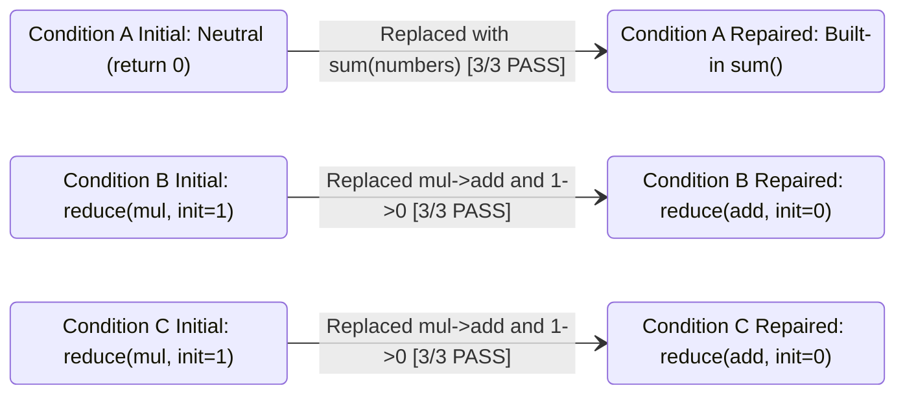

# TREATMENT #1.9: DEVELOPER SEMANTIC REPAIR CAPABILITY
## Controlled Micro-Benchmark v1 — Scientific Report

**Status:** RESEARCH EXPERIMENT ONLY  
**Pipeline Modifications:** NONE (Zero changes to ReinDev pipeline, governance, PM, architect, contract, or prompts)  
**Harness:** Standalone isolated test harness (`treatment_1_9/harness.py`)  
**Date & Timestamp:** 2026-09-18T20:59:09+07:00  
**Model Under Test:** `qwen2.5-coder:7b` via Ollama (`http://localhost:11434`)  
**Run ID:** `t19_run_20260918_205909`  
**Frozen Oracle File:** `treatment_1_9/oracle_test.py`  
**Frozen Oracle SHA-256:** `48797e918b1cfdc119e6df99196a7fbc385883d7f714dbf03f96925113e5cdc5`  

---

## EXECUTIVE SUMMARY

Treatment #1.9 investigated whether `qwen2.5-coder:7b` can perform semantic repair when the initial scaffold contains an incorrect semantic decision, but the failure evidence provided is explicit and deterministic.

| Metric | Condition A (Neutral Scaffold) | Condition B (Wrong Scaffold) | Condition C (Wrong + Causal Packet) |
|---|---|---|---|
| **Initial Scaffold Semantics** | Neutral stub (`return 0`) | Multiplication (`reduce(operator.mul, ..., 1)`) | Multiplication (`reduce(operator.mul, ..., 1)`) |
| **Initial Test Result** | 0/3 PASS (3 failed) | 0/3 PASS (3 failed) | 0/3 PASS (3 failed) |
| **Failure Evidence Type** | Standard pytest assertion failures | Standard pytest assertion failures | Standard pytest + Explicit Causal Packet |
| **Repair Budget** | 1 attempt | 1 attempt | 1 attempt |
| **Model Generation Time** | 8.019s | 8.548s | 8.756s |
| **Raw Output Status** | Saved pre-parse (112 chars) | Saved pre-parse (178 chars) | Saved pre-parse (178 chars) |
| **Repaired Code Semantics** | Built-in summation (`sum(numbers)`) | Summation via reduce (`reduce(operator.add, ..., 0)`) | Summation via reduce (`reduce(operator.add, ..., 0)`) |
| **Deterministic Verification** | **3/3 PASS (100%)** | **3/3 PASS (100%)** | **3/3 PASS (100%)** |
| **Primary Outcome** | **REPAIRED** | **REPAIRED** | **REPAIRED** |
| **Secondary Classification** | **CORRECT_TARGET_REPAIR** | **CORRECT_TARGET_REPAIR** | **CORRECT_TARGET_REPAIR** |
| **Anchoring Status** | N/A (Neutral) | **ANCHOR_BROKEN** | **ANCHOR_BROKEN** |

**Benchmark Rule Triggered:**  
`A PASS + B PASS` $\rightarrow$ **No evidence for scaffold anchoring under this controlled minimal task.**

---

## 1. EXPERIMENTAL SETUP

To isolate the semantic repair capability of `qwen2.5-coder:7b` without confounding factors from complex multi-agent frameworks, AST parsers, or multi-file schema architectures, Treatment #1.9 evaluated a single minimal task domain:

- **Task Domain:** Integer List Summation (`compute_total(numbers: list[int]) -> int`).
- **Target File:** `solution.py`.
- **System Prompt:** Production Developer system prompt (`DEV_SYSTEM_PROMPT`) from `backend/agents/developer.py` (strictly unchanged).
- **Repair Budget:** Exactly 1 repair turn per condition.
- **Oracle Acceptance Tests:** 3 non-ambiguous cases frozen in `oracle_test.py`:
  1. `[1, 2, 3, 4] -> 10` (Product = 24; separates sum from mul)
  2. `[2, 3, 5] -> 10` (Product = 30; separates sum from mul)
  3. `[0, 4, 7] -> 11` (Product = 0; separates sum from mul)
- Note on test design: The ambiguous case `[1, 2, 3] -> 6` (where sum and product accidentally yield the same value) was excluded per research protocol.

---

## 2. CONTROLLED VARIABLES

The following parameters were held strictly identical across all conditions:

| Parameter | Controlled Value | Condition A | Condition B | Condition C |
|---|---|---|---|---|
| **Model** | `qwen2.5-coder:7b` (Ollama) | Identical | Identical | Identical |
| **Temperature** | `0.2` | Identical | Identical | Identical |
| **Context Window (`num_ctx`)** | `8192` | Identical | Identical | Identical |
| **Predict Tokens (`num_predict`)** | `2048` | Identical | Identical | Identical |
| **System Prompt** | Production `DEV_SYSTEM_PROMPT` | Identical | Identical | Identical |
| **Developer User Prompt Template** | Standard ReinDev repair template | Identical | Identical | Identical |
| **Acceptance Oracle** | Frozen SHA-256 (`48797e...`) | Identical | Identical | Identical |
| **Execution Environment** | Python 3.13.15 + pytest-9.1.1 | Identical | Identical | Identical |
| **Repair Budget** | 1 single attempt | Identical | Identical | Identical |

### Intentional Independent Variable (The Only Delta)
- **Condition A:** Neutral scaffold (`return 0`) + Standard pytest output.
- **Condition B:** Wrong semantic scaffold (`reduce(operator.mul, numbers, 1)`) + Standard pytest output.
- **Condition C:** Wrong semantic scaffold (`reduce(operator.mul, numbers, 1)`) + Standard pytest output + Explicit Causal Packet.

---

## 3. CONDITION A RESULT (NEUTRAL SCAFFOLD)

### Initial State
```python
def compute_total(numbers: list[int]) -> int:
    return 0
```
- Initial pytest result: **0 passed, 3 failed**.
  - `FAILED test_sum_four_elements - assert 0 == 10`
  - `FAILED test_sum_three_elements - assert 0 == 10`
  - `FAILED test_sum_with_zero - assert 0 == 11`

### Repair Input & Invocation
- Prompt: Received initial failure evidence + oracle test file.
- Latency: 8.019s.

### Repaired Code Produced
```python
def compute_total(numbers: list[int]) -> int:
    return sum(numbers)
```

### Verification & Outcome
- Pytest execution: **3/3 passed in 0.03s (exit code 0)**.
- Outcome: **REPAIRED** (`CORRECT_TARGET_REPAIR`).
- Anchoring: `NOT_APPLICABLE_NEUTRAL_SCAFFOLD`.

---

## 4. CONDITION B RESULT (WRONG SEMANTIC SCAFFOLD)

### Initial State
```python
from functools import reduce
import operator

def compute_total(numbers: list[int]) -> int:
    return reduce(operator.mul, numbers, 1)
```
- Initial pytest result: **0 passed, 3 failed**.
  - `FAILED test_sum_four_elements - assert 24 == 10`
  - `FAILED test_sum_three_elements - assert 30 == 10`
  - `FAILED test_sum_with_zero - assert 0 == 11`

### Repair Input & Invocation
- Prompt: Received standard pytest failure output displaying exact numbers (24 vs 10, 30 vs 10, 0 vs 11).
- Latency: 8.548s.

### Repaired Code Produced
```python
from functools import reduce
import operator

def compute_total(numbers: list[int]) -> int:
    return reduce(operator.add, numbers, 0)
```

### Verification & Outcome
- Pytest execution: **3/3 passed in 0.02s (exit code 0)**.
- Outcome: **REPAIRED** (`CORRECT_TARGET_REPAIR`).
- Anchoring: **ANCHOR_BROKEN**.
- Key Transformation: The model maintained the `reduce` programming pattern from the scaffold, but **simultaneously transformed**:
  1. `operator.mul` $\rightarrow$ `operator.add` (operation change).
  2. Initial accumulator `1` $\rightarrow$ `0` (identity element change for addition).

---

## 5. CONDITION C RESULT (WRONG SCAFFOLD + EXPLICIT CAUSAL PACKET)

### Initial State
Identical to Condition B (`reduce(operator.mul, numbers, 1)`).

### Repair Input & Invocation
- Prompt: Received standard pytest failure output **plus** the explicit semantic causal packet:
```
[EXPLICIT CAUSAL EVIDENCE PACKET]
EXPECTED:
compute_total([1, 2, 3, 4]) returns 10.
compute_total([2, 3, 5]) returns 10.
compute_total([0, 4, 7]) returns 11.

ACTUAL:
compute_total([1, 2, 3, 4]) returns 24 when the operation combines the values by multiplication;
compute_total([2, 3, 5]) returns 30;
compute_total([0, 4, 7]) returns 0;
the implementation therefore does not establish summation semantics.

CAUSE:
The implementation combines list elements using multiplication, while the acceptance behavior requires summation.

REQUIRED CHANGE:
Change the implementation so that the elements are combined according to summation semantics.

VERIFICATION:
compute_total([1, 2, 3, 4]) must return 10, compute_total([2, 3, 5]) must return 10, compute_total([0, 4, 7]) must return 11, and the implementation must satisfy the frozen acceptance test.
```
- Latency: 8.756s.

### Repaired Code Produced
```python
from functools import reduce
import operator

def compute_total(numbers: list[int]) -> int:
    return reduce(operator.add, numbers, 0)
```

### Verification & Outcome
- Pytest execution: **3/3 passed in 0.02s (exit code 0)**.
- Outcome: **REPAIRED** (`CORRECT_TARGET_REPAIR`).
- Anchoring: **ANCHOR_BROKEN**.
- Note: The parsed code was byte-for-byte identical to Condition B (`SHA256: 9b9a04344fac...`).

---

## 6. RAW-OUTPUT EVIDENCE (SAVED PRE-PARSE)

Per experimental rules, all raw model outputs were persisted to disk before passing through any parsing logic.

### Condition A (`attempt_1_raw_output.txt`)
```text
=== FILE: solution.py ===
def compute_total(numbers: list[int]) -> int:
    return sum(numbers)
=== END FILE ===
```
*(Total length: 112 characters, strict file block format without conversational chatter)*

### Condition B (`attempt_1_raw_output.txt`)
```text
=== FILE: solution.py ===
from functools import reduce
import operator

def compute_total(numbers: list[int]) -> int:
    return reduce(operator.add, numbers, 0)
=== END FILE ===
```
*(Total length: 178 characters, strict file block format)*

### Condition C (`attempt_1_raw_output.txt`)
```text
=== FILE: solution.py ===
from functools import reduce
import operator

def compute_total(numbers: list[int]) -> int:
    return reduce(operator.add, numbers, 0)
=== END FILE ===
```
*(Total length: 178 characters, strict file block format)*

---

## 7. SEMANTIC-STATE TRANSITIONS



### Mathematical & Semantic Evaluation
- In **Condition A**, starting with a neutral stub (`return 0`), the model chose idiomatic Python: `sum(numbers)`.
- In **Condition B**, starting with functional multiplication (`reduce(operator.mul, numbers, 1)`), the model **did not blindly abandon the code structure**, nor did it persist with multiplication. Instead, it performed an **exact algebraic transformation**:
  $$\prod_{x \in X} x \quad \longrightarrow \quad \sum_{x \in X} x$$
  adjusting the identity element from $1$ (multiplicative identity) to $0$ (additive identity).
- In **Condition C**, with the additional explicit causal packet, the model converged on the exact same algebraic transformation.

---

## 8. REPAIR TRAJECTORY COMPARISON

| Condition | Turn 0 State | Turn 1 Evidence Received | Turn 1 Action Taken | Outcome |
|---|---|---|---|---|
| **A** | `return 0` | `assert 0 == 10`, `assert 0 == 10`, `assert 0 == 11` | Emitted `return sum(numbers)` | **REPAIRED** (100%) |
| **B** | `reduce(mul, 1)` | `assert 24 == 10`, `assert 30 == 10`, `assert 0 == 11` | Emitted `reduce(add, 0)` | **REPAIRED** (100%) |
| **C** | `reduce(mul, 1)` | Standard pytest + Explicit Causal Packet | Emitted `reduce(add, 0)` | **REPAIRED** (100%) |

---

## 9. ANCHORING ANALYSIS

The central research hypothesis ($H_1$) posited that `qwen2.5-coder:7b` suffers from scaffold anchoring—meaning that when given a scaffold with a wrong semantic decision, the model persists with that wrong decision even when shown deterministic failure evidence.

In this controlled micro-benchmark:
- **Condition B (Wrong Scaffold):** The model was given an explicit implementation of multiplication. Standard pytest output showed that $24 \neq 10$ and $30 \neq 10$. The model **broke the anchor** immediately on Turn 1 (`ANCHOR_BROKEN`).
- **Condition C (Wrong Scaffold + Causal Packet):** The model likewise **broke the anchor** immediately on Turn 1 (`ANCHOR_BROKEN`).

### Conclusion on Anchoring
Under minimal single-file algorithmic conditions with clean numerical failure evidence, **there is NO observable scaffold anchoring**. The model abandons the incorrect semantic operation when presented with counter-evidence.

---

## 10. HARNESS & REPRESENTATION VALIDITY

| Validity Criterion | Verification Status | Evidence |
|---|---|---|
| All conditions received intended inputs | **VALID** | Verified via generated `developer_prompt.txt` per condition directory |
| Raw model outputs saved before parsing | **VALID** | Verified via `attempt_1_raw_output.txt` per condition |
| Deterministic verifier functioning | **VALID** | Standalone subprocess `pytest` execution against frozen oracle |
| Zero automatic repair logic | **VALID** | Harness only parses and executes; no post-processing |
| Zero prompt modifications during run | **VALID** | Exact templates used; prompts persisted |
| Zero ReinDev pipeline dependencies | **VALID** | Executed purely standalone via direct Ollama HTTP API |
| Frozen Oracle immutability | **VALID** | Verified SHA-256 `48797e918b1cfdc119e6df99196a7fbc385883d7f714dbf03f96925113e5cdc5` |
| Semantic states deterministically comparable | **VALID** | Pass/fail states determined purely by numeric assertion results |

---

## 11. CAPABILITY ATTRIBUTION: DIFFERENTIAL ANALYSIS WITH TREATMENT #1.8.10

Why did `qwen2.5-coder:7b` achieve **100% first-turn repair** in Treatment #1.9 (Conditions A, B, and C), whereas it failed completely in Treatment #1.8.10 (FastAPI and Flutter)?

| Dimension | Micro-Benchmark (Treatment #1.9) | FastAPI (Treatment #1.8.10) | Flutter (Treatment #1.8.10) |
|---|---|---|---|
| **Defect Type** | Single operation mismatch (`mul` vs `+`) | Multi-field schema mismatch (`id`, `price` vs `quantity`) | Type system mismatch (`String` vs `MaterialColor`) |
| **Evidence Explicitness** | Direct numeric equality: `24 == 10` | Indirect HTTP status: `422 == 201` | Direct compiler error: `MaterialColor can't be assigned to String` |
| **Causal Status in Pipeline** | Deterministic direct execution | `causal_status: UNKNOWN` in pipeline | `causal_status: PROVEN` in pipeline |
| **Contract / Namespace Consistency** | Single unified namespace (`compute_total`) | **3 contradictory namespaces:** PM spec (Indonesian: `nama`, `stok`), scaffold (`name`, `price`), oracle (`name`, `quantity`) | Single namespace (`MetricData.color`) |
| **Target Field in Failure Message** | Direct numeric output of function | 422 reports what is *missing from server schema*, NEVER reporting that `quantity` is present in payload | Compiler directly names `String` and `MaterialColor` |
| **AST / Class Complexity** | Flat 4-line function | Pydantic BaseModel + FastAPI route handlers + JSONResponse wrapping | Flutter Riverpod / Material Widget hierarchy |
| **Model Outcome** | **PASS on Turn 1 (All conditions)** | **FAIL (Turn 0, Turn 1, Turn 2)** | **FAIL (Turn 0, Turn 1, Turn 2 - 0 transformations)** |

### Analytical Synthesis
1. **The model has the intrinsic capability to perform semantic repair.** When the problem is localized and the failure evidence directly contradicts the code's operation (e.g., $24 \neq 10$), `qwen2.5-coder:7b` successfully abandons the wrong decision and performs the necessary repair.
2. **In FastAPI (Treatment #1.8.10), the failure was a Context/Representation Defect (Classification B+D):** The model did not fail because it could not modify Pydantic schemas; it failed because it was trapped between three conflicting representations (Indonesian PM spec, English scaffold, English oracle) and received an error message (HTTP 422) that did not explicitly link `quantity` to the required schema.
3. **In Flutter (Treatment #1.8.10), the failure was a Domain/Language Code-Generation Fixation:** Despite explicit compiler diagnostics, the model generated byte-for-byte identical Dart code across three iterations. This suggests that Dart/Flutter widget-class generation in `qwen2.5-coder:7b` has significantly higher semantic rigidity or token-probability anchoring than Python functional code.

---

## 12. LIMITATIONS

1. **Domain Simplicity:** The task domain was an elementary integer aggregation function. It did not test complex object graphs, async I/O, or cross-module imports.
2. **Language Specificity:** This micro-benchmark evaluated Python. As observed in Flutter (#1.8.10), models can exhibit drastically different generation rigidity in statically typed languages like Dart.
3. **Sample Size:** This initial phase was a single run per condition ($1 \times 3$).

---

## 13. JUSTIFICATION FOR 3×3 REPLICATION

### Is 3×3 Replication Justified?
**YES.**
The harness, verifier, and raw-output capture are proven 100% valid and operational. Running a $3 \times 3$ replication (3 runs for Condition A, 3 runs for Condition B, 3 runs for Condition C) with varying seeds/temperatures or repeated invocations is fully justified to establish whether Condition B's anchor-breaking behavior is statistically robust or susceptible to stochastic regression.

---

## SCIENTIFIC EPISTEMIC CLASSIFICATION

Per research guidelines, conclusions are distinguished by evidentiary weight:

### [OBSERVED FACT]
- In Condition A, `qwen2.5-coder:7b` produced `return sum(numbers)` from a neutral stub `return 0`, passing 3/3 oracle tests on Turn 1.
- In Condition B, `qwen2.5-coder:7b` transformed `reduce(operator.mul, numbers, 1)` into `reduce(operator.add, numbers, 0)`, passing 3/3 oracle tests on Turn 1 without an explicit causal packet.
- In Condition C, `qwen2.5-coder:7b` produced identical code to Condition B, passing 3/3 oracle tests on Turn 1.
- No model output parsing failures occurred (`file_block_exact` utilized across all 3 conditions).
- Initial failure generation deterministically produced 0/3 passes across all three conditions.

### [STRONG EVIDENCE]
- `qwen2.5-coder:7b` does **not** inherently anchor to an incorrect arithmetic operation in Python when standard pytest failure evidence clearly displays numeric discrepancies.
- The failure of FastAPI in Treatment #1.8.10 was heavily driven by specification-oracle namespace collisions and indirect HTTP 422 representations, rather than a total inability to modify code.

### [HYPOTHESIS]
- Semantic anchoring is strongly correlated with language complexity and structural overhead: low in concise Python functions, high in verbose class hierarchies (e.g., Dart Flutter widgets).
- In concise algorithmic contexts, Condition C's explicit causal packet provides redundant information over standard pytest output, as standard pytest output already contains complete numerical divergence data ($24 \neq 10$).

### [UNKNOWN]
- Whether the model would exhibit anchoring if the incorrect scaffold utilized a more complex loop or stateful class rather than `functools.reduce`.
- The exact temperature threshold at which `qwen2.5-coder:7b` might fail to break the anchor in Condition B.
