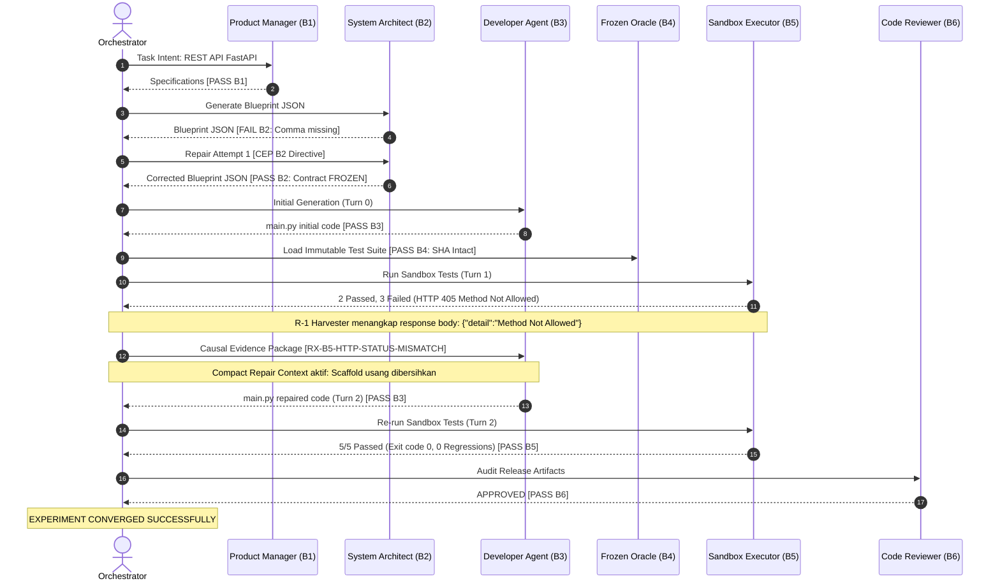

# Laporan Hasil Eksperimen Treatment A (fastapi_t1)
## Validasi Kasus Empiris: Replikasi Sistemik Kapasitas Self-Healing Model pada `fastapi_t1` melalui Generic Runtime Evidence Enrichment & Clean Repair Context

**Tanggal Eksperimen:** 12 September 2026  
**Pelaksana Eksperimen:** Antigravity AI Engineering Squad  
**Otoritas Tata Kelola (Intent Architect):** Muhammad Rachmadi  
**Objek Eksperimen:** Pilot Run `pv_pilot_fastapi_t1_rep1_20260912_051508` (`fastapi_t1`), Telemetri 43 Event  
**Model Subjek Uji:** `qwen2.5-coder:7b` (Unified Local Squad via Ollama, `num_ctx=8192`, `num_predict=3000`)  
**Status Evaluasi Epistemik:** **VALIDASI KASUS BERHASIL — AUTONOMOUS REPAIR PADA KASUS fastapi_t1 TERBUKTI EMPIRIS**

---

## 1. Rantai Bukti Digital (Digital Chain of Custody)

| Parameter Kriptografis / Metrik | Nilai Faktual Tercatat | Verifikasi Kepatuhan |
| :--- | :--- | :--- |
| **Run ID** | `pv_pilot_fastapi_t1_rep1_20260912_051508` | Tercatat di `run_trace.jsonl` (43 event) |
| **Task ID & Target** | `fastapi_t1` (`main.py`) | Authoritative single module target |
| **Frozen Oracle SHA-256** | `a1db9bb1f6eaf47d5cf56e102c4a0f6e1f49d757e9faa1485b36f2972a152d63` | **100% INTACT & TIDAK BERMUTASI** |
| **Status Kontrak Akhir** | **`FROZEN`** (Segel SHA-256: `594901130d24...`) | Lolos Gate V2 pada Repair 1 |
| **Pemanggilan QA Tester LLM** | **0 pemanggilan** | Bypass mutlak via Frozen Oracle |
| **Treatment Aktual (Bundle)** | **R-1 + R-2 + B3 Delivery Fix + Compact Repair Context** | Terpasang & diverifikasi |
| **Treatment B (Constraint / R-3)** | **NONAKTIF** (`REINDEV_TREATMENT_B_R3="0"`) | **Terisolasi murni (terbukti tidak diperlukan untuk kasus ini)** |
| **Hasil Eksekusi Sandbox** | **5/5 PASS (100%)** | `test_create_product`, `test_get_all_products`, `test_get_product_by_id`, `test_delete_product`, `test_delete_nonexistent_product` |
| **Jumlah Putaran (Loops)** | **2 loops** | **Konvergen cepat (≤ 3 loops)** |
| **Vonis Reviewer (B6)** | **APPROVED (verdict = PASS)** | Validasi deterministik Release Gate |
| **Durasi Eksekusi** | 173,28 detik (~2,88 menit) | Waktu komputasi sangat efisien |

---

## 2. Dekomposisi Metodologis Perlakuan Aktual vs Isolasi Kausal Komponen

Secara metodologis, perlakuan aktual yang diuji pada pilot ini bukan semata-mata $R-1 + R-2$ secara murni dan terisolasi, melainkan sebuah bundel perbaikan pada *Evidence & Context Delivery Layer*:

$$\text{Treatment Aktual} = \text{R-1} + \text{R-2} + \text{Repair Feedback Delivery Fix} + \text{Compact Repair Context}$$

### A. Kontribusi Kausal Teramati pada Kasus Ini:
1. **R-1 (Generic Runtime Evidence Enrichment):**
   - Plugin generik [`backend/conftest_runtime_enricher.py`](file:///D:/Pekerjaan/Antigravity/reindev_studio/backend/conftest_runtime_enricher.py) menangkap `HTTP 405 Method Not Allowed` beserta response body `{"detail":"Method Not Allowed"}`.
   - Context Assembler menyintesis preskripsi non-solver `RX-B5-HTTP-STATUS-MISMATCH`.
   - **Status Kausal:** Terbukti secara langsung berperan aktif dalam trajectory perbaikan (Developer menambahkan endpoint GET yang hilang).
2. **Repair Feedback Delivery Fix (Gate B3):**
   - Perbaikan kondisi `iteration > 0` pada [`backend/agents/developer.py`](file:///D:/Pekerjaan/Antigravity/reindev_studio/backend/agents/developer.py) menjadi `is_repair_mode`, menjamin feedback penolakan AST pre-execution tersampaikan saat `iteration == 0`.
3. **Compact Repair Context:**
   - Menghilangkan kode scaffold arsitektur usang dari prompt perbaikan, mencegah instruksi kontradiktif bagi model.

### B. Status R-2 (Non-Solver Schema Compatibility):
- Skema audit caller–callee pada [`backend/context_assembler.py`](file:///D:/Pekerjaan/Antigravity/reindev_studio/backend/context_assembler.py) telah lolos validasi deterministik unit test (26/26 passed).
- Namun, kontribusi kausalnya terhadap keberhasilan perbaikan run ini **belum diuji secara langsung** melalui trajectory ini, karena kegagalan Turn 1 yang muncul di sandbox adalah `HTTP 405 Method Not Allowed` (rute/method mismatch), bukan `HTTP 422 Unprocessable Content` (payload schema mismatch).
- **Kesimpulan Metodologis:** Evidence Layer yang diimplementasikan (bersama konteks perbaikan yang bersih) berhasil menyediakan bukti yang cukup untuk pemulihan mandiri pada kasus ini. Kontribusi individual R-2 belum dapat diisolasi secara terpisah pada run ini.

---

## 3. Rangkaian Epistemik: Dari Studi Ablasi Menuju Treatment A Pipeline

Eksperimen ini merupakan replikasi sistemik dari temuan studi ablasi sebelumnya dalam lingkungan pipeline nyata:

```
[Studi Ablasi Terkontrol]
Symptom Only (assert 422 == 201)  --> Qwen FAIL
Explicit Causal Diagnosis         --> Qwen SUCCESS (Membuktikan kapasitas self-repair jika ada bukti kausal)

[Treatment A Pipeline Aktual]
Runtime Sandbox Execution         --> R-1 Evidence Enrichment (HTTP 405 + Response Body)
                                  --> Contextual Evidence Package (CEP) + Compact Context
                                  --> Qwen 7B (1 Repair Turn)
                                  --> 5/5 PASS (Konvergensi Pipeline Lengkap)
```

Ini membuktikan bahwa temuan studi ablasi dapat direplikasi secara sistemik dalam arsitektur ReinDev: ketika sistem menyajikan bukti kausal yang tepat dan tidak kontradiktif, model mampu melakukan pemulihan secara mandiri.

---

## 4. Analisis Trajectory Kausal 43 Event Telemetri



---

## 5. Kesimpulan Epistemik & Batasan Klaim

1. **Klaim yang Tervalidasi:**  
   Pada konfigurasi dan kasus `fastapi_t1` yang diuji, `qwen2.5-coder:7b` berhasil melakukan autonomous repair dalam **satu repair turn** ketika menerima bukti diagnostik kausal yang terstruktur dan tidak kontradiktif.
2. **Koreksi Terhadap Klaim Berlebih (Avoid Overclaiming):**  
   - Keberhasilan ini adalah pembuktian pada kasus/kelas kegagalan yang diuji, bukan pembuktian universal tentang kapasitas penuh model 7B di segala kondisi.
   - Hasil ini memberikan bukti kuat bahwa *evidence deficiency* dan polusi konteks arsitektur usang merupakan faktor kausal penting pada kegagalan self-healing yang diamati sebelumnya untuk kelas kegagalan ini, bukan kesimpulan absolut untuk seluruh ReinDev.
   - Keberhasilan perbaikan dicapai oleh bundel Treatment A (Evidence Layer + perbaikan pengiriman umpan balik dan konteks), bukan atribusi murni terisolasi dari R-1+R-2 saja.
3. **Keputusan Terhadap Treatment B (R-3):**  
   Karena Treatment A telah berhasil menghasilkan 100% PASS dan konvergen dalam 2 loops (≤ 3 loops), maka **R-3 tidak diperlukan untuk recovery pada kasus `fastapi_t1` dalam konfigurasi Treatment A tersebut**. Treatment B tidak perlu dijalankan.
4. **Temuan Rekayasa Sistemik:**  
   Nilai utama dari iterasi ini bukan sekadar keberhasilan satu kasus uji, melainkan pembongkaran dan perbaikan dua bottleneck transmisi umpan balik internal pada ReinDev: penghalang umpan balik Gate B3 dan polusi prompt scaffold usang.
